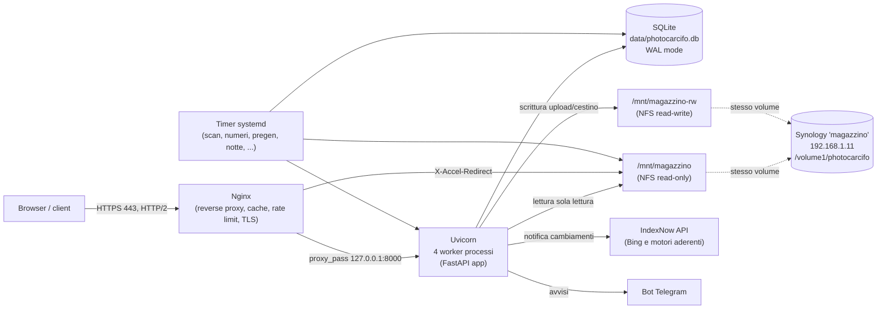
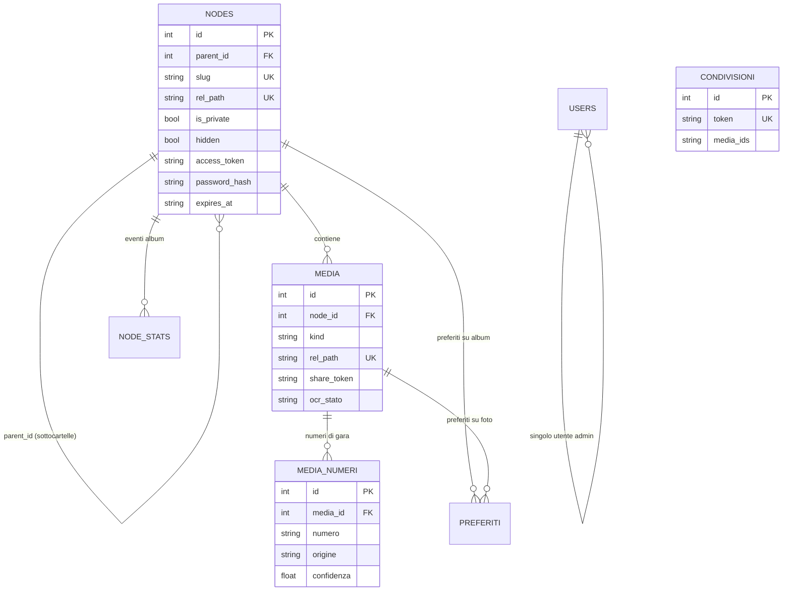
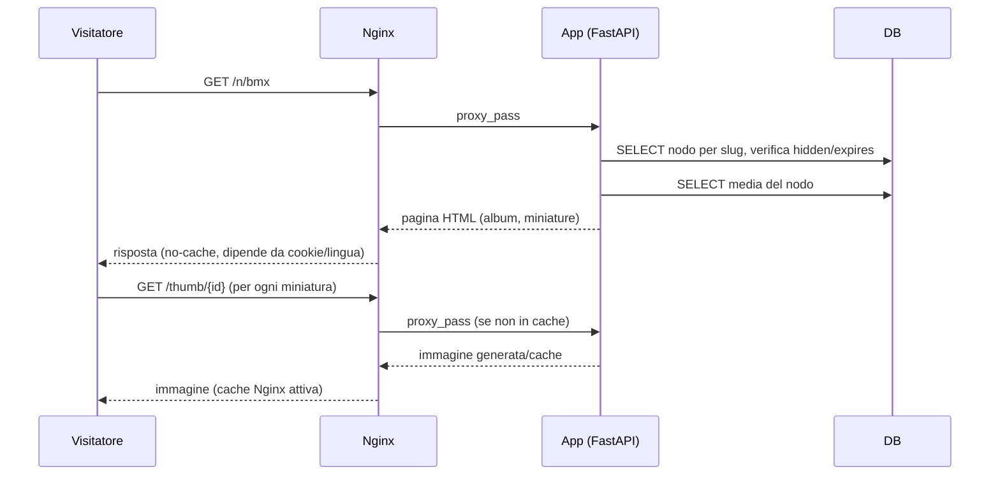
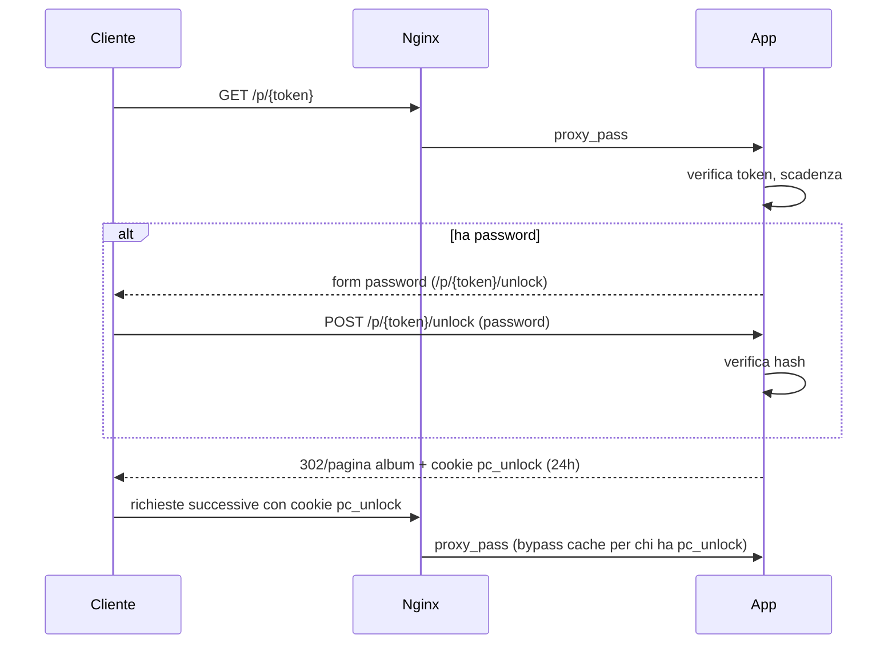
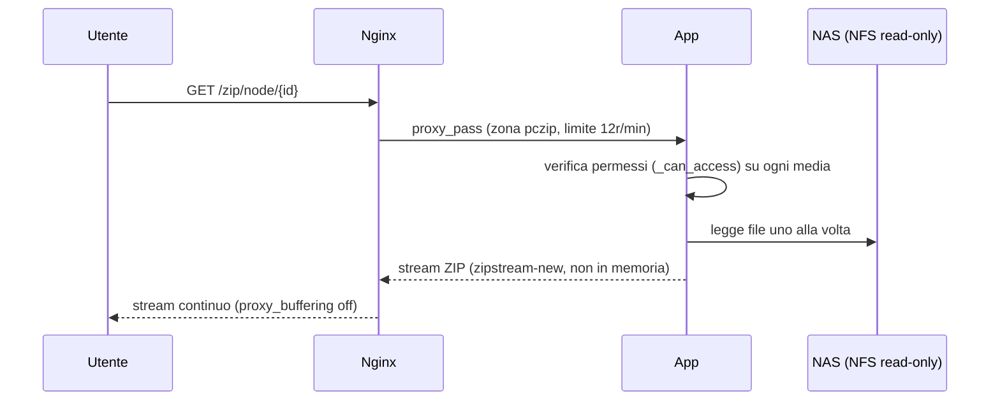
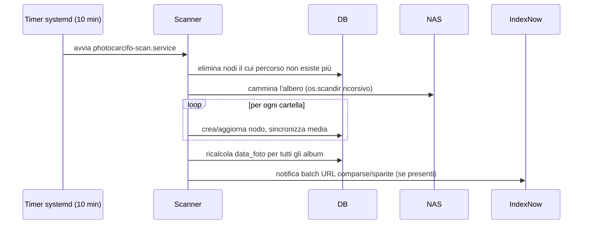

# PHOTOCARCIFO.MD — Documentazione unificata del progetto

> Creato: 16/09/2026

> Autore: Nathan Pollini

> Progetto: PHOTOCARCIFO

> GitHub: https://github.com/carcifosupr3mo/photocarcifo

---

# PARTE I — Visione, infrastruttura e operatività (da docs/PHOTOCARCIFO.md)

Portfolio fotografico self-hosted. Serve fotografie sportive da un NAS
Synology attraverso un'applicazione FastAPI in un container Proxmox.

Ultimo aggiornamento: agosto 2026

---

## 1. A cosa serve

Il sito ha due pubblici distinti.

**I clienti** arrivano da un link privato dopo uno shooting: guardano le
proprie fotografie, le scaricano singolarmente o in blocco. Non cercano un
fotografo, hanno già lavorato con lui.

**I visitatori** arrivano dai motori di ricerca o dai social e sfogliano il
portfolio pubblico diviso per disciplina sportiva.

Di conseguenza l'esperienza delle gallerie ha la precedenza su tutto il
resto, e i richiami commerciali restano discreti.

---

## 2. Dove gira

| Cosa | Dove |
|---|---|
| Host virtuale | Proxmox, nodo `pve`, 192.168.1.200 |
| Container | LXC 206 `SITO-PHOTOCARCIFO`, 192.168.1.206, Ubuntu, disco 64 GB |
| Archivio fotografie | Synology `magazzino`, 192.168.1.11 |
| Meteo (servizio separato) | Container 204, porta 8000 |

Il container 206 fa **sia da sito sia da proxy**: riceve le porte 80 e 443
dal router e smista i domini. Il vecchio container 203, che faceva da
proxy con Apache, è stato eliminato.

### Domini

| Dominio | Destinazione |
|---|---|
| `photocarcifo.ch` | il sito (dominio principale) |
| `www.photocarcifo.ch` | il sito |
| `gallery.photocarcifo.ch` | il sito (usato nei vecchi link privati) |
| `meteo.photocarcifo.ch` | proxy verso 192.168.1.204:8000 |
| qualsiasi altro nome | risposta 410, pagina rimossa |

Certificati Let's Encrypt per tutti e quattro, rinnovo automatico
verificato.

### Le fotografie

Stanno **solo** sul NAS, in `/volume1/photocarcifo`. Il container le vede
attraverso due montaggi:

- `/mnt/magazzino` — **sola lettura**, usato per servire il sito
- `/mnt/magazzino-rw` — **lettura e scrittura**, usato solo da upload e cestino

La separazione è voluta: quasi tutto il codice non può modificare nulla.
Solo `upload.py` e `trash.py` usano il secondo percorso, e nessuno dei due
contiene istruzioni di cancellazione — spostano soltanto.

Cartelle ignorate dalla scansione (confronto in minuscolo):
`@eadir`, `pwg_representative`, `#recycle`, `@tmp`, `@sharesnap`,
`_cestino`, `_backup_sito`.

---

## 3. Com'è fatto

### Struttura
### Il database

Due tabelle portanti.

**`nodes`** — ogni cartella del NAS è un nodo dell'albero.

| Campo | Significato |
|---|---|
| `parent_id` | nodo superiore, vuoto per le categorie |
| `slug` | indirizzo web, es. `bmx` |
| `rel_path` | percorso reale sul NAS |
| `title` | nome mostrato (modificabile senza toccare il NAS) |
| `is_private` | album riservato, raggiungibile solo col link |
| `access_token` | codice del link privato |
| `password_hash` | password opzionale dell'album |
| `expires_at` | scadenza del link, vuoto = illimitato |
| `hidden` | escluso dal sito, resta gestibile dal pannello |
| `downloads_enabled` | permette o blocca il download |
| `cover_media_id` | fotografia di copertina |
| `direct_media` / `total_media` | conteggi, diretti e dell'intero sottoalbero |

**`media`** — ogni fotografia o filmato, legato al suo nodo.

Poi `users` (con i campi per la verifica in due passaggi), `settings`,
`logs`, `stats`.

Modalità WAL attiva: letture e scritture non si bloccano a vicenda.

---

## 4. Chi può vedere cosa

È la parte più delicata del progetto. La regola sta in `_can_access()`
dentro `media.py` e vale per **ogni** contenuto: miniature, anteprime,
download, filmati, archivi ZIP.

1. **L'amministratore** vede sempre tutto.
2. **I contenuti nascosti** non sono mai accessibili al pubblico.
3. **I link scaduti** non danno più accesso a nulla.
4. **Gli album privati** richiedono il lasciapassare, che si ottiene
   aprendo il link (e superando la password, se impostata).
5. **Tutto il resto** è pubblico.

Il lasciapassare è un cookie firmato che vale ventiquattro ore e copre
l'album **e tutte le sue sottocartelle** — senza questo, le gallerie con
sottocartelle mostrerebbero riquadri vuoti.

> **Attenzione per il futuro.** Se aggiungi una rotta che serve un file,
> deve chiamare `_can_access()`. Le due falle trovate in passato nascevano
> entrambe da questa dimenticanza: bastava indovinare un numero per
> scaricare le fotografie di uno shooting privato.

Nginx esclude dalla cache condivisa chi possiede il lasciapassare,
altrimenti la prima risposta verrebbe servita a chiunque.

---

## 5. Cosa succede da solo

| Orario | Cosa fa |
|---|---|
| 01:00 – 04:15 | prepara le miniature mancanti (tre misure) |
| 04:33 | aggiorna il sistema, salva il database, rilegge il NAS, ottimizza, riavvia e verifica |
| 05:00 | cambia le copertine degli album pubblici |
| variabile | rilettura incrementale del NAS |

La preparazione delle miniature si ferma da sola se lo spazio libero
scende sotto i 6 GB. Il salvataggio del database resta 14 giorni nel
container e 60 sul NAS.

---

## 6. Se qualcosa va storto

### Il sito non risponde

```bash
systemctl status photocarcifo
journalctl -u photocarcifo -n 40 --no-pager
systemctl restart photocarcifo
```

Se non riparte, quasi sempre è `.env`: `config.py` rifiuta le variabili
non dichiarate. `PHOTO_ROOT_RW` in particolare **non va messo lì** — i
moduli lo leggono dall'ambiente con un valore predefinito.

### Errore 502

L'applicazione è caduta, Nginx è in piedi. Guarda il registro sopra: di
solito è un errore di sintassi o un import sbagliato dopo una modifica.

### Chiuso fuori dal pannello

```bash
sqlite3 /opt/photocarcifo/data/photocarcifo.db \
  "UPDATE users SET totp_enabled=0, totp_secret=NULL;"
```

Disattiva la verifica in due passaggi. Entri con la sola password e la
riattivi.

### Le foto private non caricano

Controlla che aprire il link rilasci il lasciapassare:

```bash
curl -sk -c /tmp/ck.txt -o /dev/null https://photocarcifo.ch/p/TOKEN
grep -c pc_unlock /tmp/ck.txt   # deve dare 1
```

### Verifica generale

```bash
/usr/local/bin/photocarcifo-diagnosi.sh
```

Prova ogni tipo di contenuto dal punto di vista di chi ha diritto e di chi
no. Da lanciare dopo ogni modifica.

### Ripristinare il database

```bash
systemctl stop photocarcifo
cp /opt/photocarcifo/backup/db-AAAA-MM-GG.sqlite \
   /opt/photocarcifo/data/photocarcifo.db
chown photocarcifo:photocarcifo /opt/photocarcifo/data/photocarcifo.db
systemctl start photocarcifo
```

Le fotografie non sono nel database: si perde solo l'indice, che si
ricostruisce rileggendo il NAS.

---

## 7. Regole di lavoro

Queste nascono da errori realmente commessi.

**Svuota sempre la cache di Python** prima di riavviare, altrimenti gira
il codice vecchio:

```bash
find /opt/photocarcifo/app -name '__pycache__' -type d -exec rm -rf {} +
```

**Verifica la sintassi prima di riavviare:**

```bash
cd /opt/photocarcifo
./venv/bin/python -c "import ast; ast.parse(open('app/routers/tree.py').read())"
```

**Riscrivi i file interi invece di applicare correzioni parziali.** Le
sostituzioni di testo falliscono in silenzio quando il file è già stato
modificato, e non te ne accorgi finché qualcosa non si rompe.

**Il terminale trasforma `www.` in un link.** Se incolli configurazioni
che lo contengono, il file si riempie di parentesi quadre. Usa uno script
Python che lo scriva, senza digitarlo.

**Prova sempre da fuori casa.** Molti router non permettono di
raggiungere il proprio indirizzo pubblico dall'interno: usa i dati mobili
del telefono.

**`curl -I` restituisce 405.** L'applicazione non accetta richieste HEAD:
usa `curl -o /dev/null`.

---

## 8. Salvataggi

| Cosa | Dove | Ogni quanto |
|---|---|---|
| Container 206 | Proxmox | automatico |
| Fotografie | Synology verso disco esterno | automatico |
| Database | container e NAS | ogni notte |

> Un salvataggio non provato non è un salvataggio. Almeno una volta
> recupera una singola fotografia dal backup e verifica che si apra.

Copia completa del progetto:

```bash
tar -czf /root/photocarcifo-$(date +%F).tar.gz -C /opt photocarcifo \
  --exclude='venv' --exclude='__pycache__' --exclude='data/cache' --exclude='backup'

tar -czf /root/config-sistema-$(date +%F).tar.gz \
  /etc/nginx/sites-available /etc/systemd/system/photocarcifo* \
  /usr/local/bin/photocarcifo-*
```

---

## 9. Cosa non c'è, e perché

**Rinomina delle cartelle sul NAS.** Il pannello cambia solo il nome
mostrato. Rinominare i percorsi reali da un'applicazione web è un rischio
che non vale il comodo: si fa da File Station.

**Riconoscimento dei numeri di gara.** Su fotografie d'azione si
riconoscerebbe circa metà dei numeri, e chi cerca senza trovare se ne va
più insoddisfatto di prima.

**Riconoscimento dei volti.** Si tratterebbero dati biometrici di minori
in contesto sportivo: gli obblighi legali superano il beneficio.

**Vendita di stampe.** Aggiungerebbe pagamenti e fatturazione a un sistema
gestito da una persona sola.

**Miniature WebP.** Il guadagno non giustifica la rigenerazione delle
141.000 immagini già pronte.

---

## 10. Cosa manca davvero

In ordine di utilità.

**Preferiti del cliente.** Il cliente segna le fotografie che vuole, tu
vedi la lista nel pannello. Elimina lo scambio di messaggi con i nomi dei
file, che è l'attrito reale del lavoro quotidiano.

**Statistiche del link privato.** Sapere se il cliente ha aperto la
galleria, quante volte, quante fotografie ha scaricato. I dati sono già
registrati: manca solo mostrarli.

**Condivisione della singola fotografia.** Oggi si condivide solo l'album
intero. Poter mandare a un atleta il suo scatto è il modo naturale in cui
il lavoro si diffonde.

---

## Riferimenti rapidi

```bash
# stato generale
/usr/local/bin/photocarcifo-diagnosi.sh

# avanzamento miniature
cd /opt/photocarcifo && ./venv/bin/python -c "
import sqlite3, shutil
from pathlib import Path
c = sqlite3.connect('data/photocarcifo.db')
foto = c.execute('SELECT COUNT(*) FROM media m JOIN nodes n ON n.id=m.node_id WHERE n.hidden=0').fetchone()[0]
fatti = sum(1 for _ in Path('data/cache/thumbnails').rglob('*.jpg'))
print(f'{fatti} su {foto*3} ({fatti*100//max(foto*3,1)}%) — liberi {shutil.disk_usage(\"/\").free/1024**3:.1f} GB')"

# quante fotografie
sqlite3 /opt/photocarcifo/data/photocarcifo.db "SELECT COUNT(*) FROM media;"

# rilettura del NAS
systemctl start photocarcifo-scan.service

# registro della manutenzione notturna
tail -40 /var/log/photocarcifo-update.log

# automatismi
systemctl list-timers 'photocarcifo*' --no-pager
```


---

# PARTE II — Guida sviluppo, struttura repository, ricerca per numero di gara, performance (da README.md)

Portfolio fotografico professionale self-hosted per Proxmox + Synology.
Le foto restano SEMPRE sul NAS (montato in sola lettura); il sito le indicizza
e le serve senza mai copiarle nel container.

## Infrastruttura
- Container Ubuntu Server 24.04 LTS — `192.168.1.206`
- Synology (hostname `magazzino`) — `192.168.1.11`, cartella foto `/volume1/Foto`
- Mount NFSv4 read-only in `/mnt/magazzino` (nessuna credenziale richiesta)
- Nginx davanti a FastAPI (uvicorn)

## Installazione rapida (Copy & Paste)

Carica l'intera cartella `photocarcifo/` nel container (es. in /root/), poi:

```bash
cd /root/photocarcifo
chmod +x deploy/install.sh
sudo ./deploy/install.sh
```

Lo script installa dipendenze, crea l'utente di servizio, il virtualenv,
configura il mount NFS, i servizi systemd e Nginx.

## Dopo l'installazione

1. Imposta la password admin:
   ```bash
   sudo nano /opt/photocarcifo/.env      # modifica ADMIN_PASSWORD
   sudo systemctl restart photocarcifo
   ```
2. Prima scansione del NAS:
   ```bash
   sudo systemctl start photocarcifo-scan.service
   ```

## Accesso
- Sito pubblico: http://192.168.1.206
- Dashboard admin: http://192.168.1.206/admin

## Struttura del progetto

```
photocarcifo/
├── app/
│   ├── main.py           # avvio, strati comuni (lingua, sicurezza, errori)
│   ├── config.py         # impostazioni lette da .env
│   ├── database.py       # SQLite: schema, migrazioni, statistiche
│   ├── security.py       # password, sessioni, CSRF, conteggio tentativi
│   ├── deps.py           # utente corrente, permessi, indirizzo del visitatore
│   ├── templating.py     # funzioni disponibili nelle pagine (t, lingua, asset…)
│   ├── lingue.py         # tutti i testi del sito in cinque lingue
│   ├── lingue_legale.py  # condizioni d'uso e privacy, per lingua
│   ├── scanner.py        # legge il NAS e aggiorna l'indice
│   ├── thumbnails.py     # miniature: misure, formati, copyright incorporato
│   ├── numeri.py         # ricerca per numero di gara
│   ├── ocr.py            # lettura automatica dei numeri dalle fotografie
│   ├── cli.py            # comandi da riga di comando
│   ├── routers/          # una per zona del sito (tree, media, admin, …)
│   ├── templates/        # pagine HTML
│   └── static/           # css, javascript, icone
├── tests/                # controlli automatici (vedi sotto)
├── data/                 # database e miniature: non finisce in git
├── deploy/               # installazione, nginx, unita di sistema
├── docs/                 # documentazione del progetto
├── requirements.txt      # librerie del sito
└── requirements-ocr.txt  # librerie della lettura numeri (pesanti, opzionali)
```

## Mettere in servizio una modifica

Non riavviare a mano. C'e' un comando che controlla prima e riavvia dopo:

```bash
photocarcifo-applica.sh            # controlla, riavvia, verifica
photocarcifo-applica.sh --prova    # controlla soltanto
```

Esegue nell'ordine: sintassi del codice, avanzi inutilizzati, sintassi del
JavaScript, caricamento dell'applicazione, tutti i test, configurazione di
nginx. Solo se passa tutto riavvia, e poi verifica dal vivo che dodici
indirizzi rispondano. Se qualcosa non torna il sito resta com'era.

Serve a un errore preciso, gia' successo: i modelli di pagina si rileggono
dal disco a ogni richiesta, il codice solo al riavvio. Modificare un
modello prima del codice che gli serve manda in errore *tutte* le pagine
per il tempo che passa fra le due cose.

## Come gira

Il sito e' servito da **quattro processi** in parallelo (`--workers 4` nel
servizio di sistema). Con un processo solo, una richiesta che si mette a
lavorare — generare un'anteprima a schermo intero costa circa 680
millisecondi — occupava l'unica corsia e chi arrivava aspettava il suo
turno. Misurato: otto anteprime nuove richieste insieme passano da 5,09 a
2,12 secondi.

La conseguenza, che vale la pena ricordare prima di aggiungere codice:
**niente stato nella memoria del processo**. Le richieste di una stessa
persona finiscono su processi diversi. Cio' che deve essere visto da tutti
va nel database (i tentativi di accesso falliti, tabella `tentativi`) o su
file (l'avanzamento della lettura numeri, `data/numeri.stato`). C'e' un
test che se ne accorge se qualcuno riapre quella porta.

## Controlli automatici

```bash
venv/bin/python -m pytest tests -q
```

Girano contro il database vero, in sola lettura: nessun test scrive o
cancella. Coprono le pagine in tutte e cinque le lingue, gli indirizzi
tradotti, i permessi del pannello, gli album riservati, le pagine di
errore, i modelli e le librerie dichiarate.

Il controllo piu' utile e' strutturale: nessuna rotta che modifica dati
puo' esistere senza verifica dei permessi e del token anti-falsificazione.
Una rotta nuova copiata da una vecchia dimenticando il controllo fa
fallire i test subito.

## Note
- Gli album privati non compaiono in homepage, ricerca o sitemap.
- Le miniature si generano quando servono e restano in cache; la
  preparazione notturna anticipa quelle della griglia.
- I caratteri sono quelli di sistema: nessun font da scaricare, quindi
  nessuna attesa e nessuna richiesta a server di terzi.

## Ricerca per numero di gara

Un pilota che corre con la tabella 198 scrive `198` nella barra di ricerca e
ottiene tutte le fotografie in cui quel numero compare. Funzionano anche
`#198` e `n. 198`; gli zeri davanti non contano, quindi `007` e `7` danno lo
stesso risultato. Scrivendo del testo (`verona`, `2024`) la ricerca resta
quella di prima, per cartelle.

Valgono le solite regole di riservatezza: le cartelle nascoste non escono
mai, quelle private solo a chi possiede il link, e i link scaduti non aprono
piu' nulla.

### Da dove arrivano i numeri

1. **Lettura automatica.** RapidOCR legge le tabelle nelle fotografie. Parte
   dalla miniatura grande gia' in cache quando c'e', altrimenti
   dall'originale sul NAS. Gira sui timer di sistema
   (`photocarcifo-numeri.timer`, ogni 15 minuti) e tocca solo le foto nuove
   o modificate.
2. **Correzione a mano.** Nel pannello: Album, si apre una cartella, pulsante
   *Correggi i numeri*. Una casella sotto ogni foto. Quello che si scrive li'
   non viene mai sovrascritto dalle letture successive.

### Come vengono scelti i numeri

In una foto di gara c'e' testo ovunque: striscioni, sponsor, marchi sui
caschi. Le tabelle si riconoscono perche' sono fatte di **sole cifre**:
"heusden", "alecycling.com", "2024 BMX EUROPEAN CUP" contengono lettere e
vengono scartate. Si scartano anche gli anni (1900-2099) e le cifre singole,
che nell'archivio corrispondono ai numeri di corsia sui blocchi di partenza
dell'atletica e ai gradini del podio, non a tabelle.

La dimensione invece conta poco: nelle foto d'azione un pilota lontano ha la
tabella alta l'1% dell'immagine, e una soglia alta le eliminerebbe tutte.

Su un campione di 30 foto BMX vere il riconoscimento trova un numero in circa
6 foto su 10. Le altre sono premiazioni, riprese da dietro, primi piani o
piloti troppo lontani: li' il numero si mette a mano.

### Comandi

```bash
cd /opt/photocarcifo
sudo -u photocarcifo venv/bin/python -m app.cli numeri          # una passata
sudo -u photocarcifo venv/bin/python -m app.cli numeri --all    # tutta la coda
sudo -u photocarcifo venv/bin/python -m app.cli numeri --reset  # rilegge tutto
```

Le soglie si regolano dal `.env` (vedi `.env.example`). Dopo averle cambiate
serve un `--reset` perche' abbiano effetto sulle foto gia' lette.

Il motore di lettura e' opzionale (`requirements-ocr.txt`): senza, il sito
funziona identico e i numeri si scrivono solo a mano.

### Precisione e taratura

Le soglie sono state tarate guardando le fotografie vere, non a intuito:

- **`OCR_MIN_CONFIDENCE=0.95`** — sotto questo valore le letture sono quasi
  tutte sbagliate: un 377 letto come 371, numeri inventati su foto di
  premiazione dove non c'e' nessuna tabella, cifre pescate dalle scritte
  delle maglie. Sopra 0.95 sono affidabili. Un numero sbagliato fa doppio
  danno: sporca la ricerca di un pilota e nasconde quella di un altro.
- **`OCR_MIN_HEIGHT_RATIO=0.008`** — deve restare bassa: nelle foto d'azione
  i piloti lontani hanno tabelle alte l'1% dell'immagine.
- **`OCR_MIN_DIGITS=1`** — le tabelle da 1 a 9 esistono e vanno trovate.
- **`OCR_NIENTE_CIFRE_SINGOLE=ATLETICA`** — nelle cartelle elencate qui le
  cifre singole vengono ignorate: nell'atletica sono i numeri di corsia
  stampati sui blocchi di partenza, letti con sicurezza 0.98-1.00, che
  nessuna soglia riesce a distinguere da una tabella. Li' i pettorali sono
  comunque a tre cifre, quindi non si perde nulla.
- **`OCR_PRIORITA=BMX`** — si parte dalle gare con le tabelle invece di
  seguire l'ordine dell'archivio, e dentro ogni gruppo dalle foto piu'
  recenti.

Cambiando le soglie serve `python -m app.cli numeri --reset` per rileggere
tutto con i nuovi valori.


### Ripartenza automatica

L'avanzamento della lettura sta nel database (colonna `media.ocr_stato`),
non in memoria. Se il container si riavvia o viene aggiornato, il lavoro
riprende esattamente da dove era arrivato:

- `photocarcifo-numeri.service` parte da solo all'avvio del container
  (`WantedBy=multi-user.target`) e non prima che l'archivio sia montato
  (`RequiresMountsFor=/mnt/magazzino`);
- `photocarcifo-numeri.timer` ricontrolla ogni 15 minuti se sono arrivate
  foto nuove, e riparte anche dopo uno spegnimento prolungato
  (`Persistent=true`);
- le fotografie rimaste a meta' vengono rimesse in coda appena il lavoro
  riparte, senza aspettare alcuna scadenza;
- un lucchetto su file impedisce che due letture girino insieme: la
  seconda si accorge della prima ed esce subito, invece di dimezzare la
  memoria disponibile.

### Risultati completi

La ricerca per numero e' impaginata (120 fotografie per pagina), non
troncata: anche un numero presente in migliaia di scatti resta consultabile
per intero.

### Cartelli degli impianti

In certi impianti i settori delle tribune sono numerati con cifre grandi e
nitide. L'OCR le legge con la stessa sicurezza di una tabella (0.98-1.00) e
nessuna soglia riesce a distinguerle. Si distinguono pero' da come si
distribuiscono: la tabella di un pilota compare in poche foto della gara,
quelle in cui c'e' lui; un cartello inquadrato di continuo compare in una
grossa fetta delle foto della stessa cartella.

A lettura conclusa, cartella per cartella, viene quindi scartata la cifra
singola presente in piu' del 15% delle fotografie che hanno un numero
(purche' i casi siano almeno 5). Il controllo gira solo sulle cartelle
lette per intero, perche' a meta' i conteggi ingannerebbero, e non tocca
mai i numeri corretti a mano. Nel registro resta scritto cosa e' stato
scartato e perche'.

## Prestazioni

Misure prese sul posto, non a intuito.

- **La home ordinava gli album ricalcolando ogni volta la data dello scatto
  piu' recente**, con una sottoquery su tutte le fotografie: 68 ms a ogni
  visita. Ora la data e' salvata in `nodes.data_foto`, aggiornata dalla
  scansione e dal cestino. La home e' passata a 3,6 ms.
- **La copertina di ogni cartella veniva cercata con un confronto sul
  percorso**, che nessun indice puo' aiutare: SQLite leggeva tutte le
  48.000 fotografie e le ordinava in una tabella temporanea, 8,5 ms per
  cartella mostrata. Ora si guarda prima dentro la cartella stessa, che e'
  una lettura sull'indice: la pagina delle novita' e' passata da 14 ms a
  0,13. Le copertine mostrate sono rimaste le stesse, verificate una per
  una su tutti i nodi.
- **Il foglio di stile viaggiava dentro ogni pagina**, 67 KB che il browser
  non poteva riutilizzare. Ora la prima pagina lo riceve dentro (si disegna
  subito) e lascia un segno; dalla seconda in poi riceve il collegamento,
  che il browser ha in cache per trenta giorni. Una pagina d'album e'
  passata da 16,5 KB a 3,9 KB per chi torna.
- **Le miniature venivano preparate una alla volta**, riaprendo e
  ridecodificando lo stesso originale da 14 MB per ogni copia: sei letture
  dal NAS per sei file. Ora si legge una volta sola: da 3.066 a 1.696 ms a
  fotografia, con i file prodotti identici punto per punto.
- **Il JPEG occupava il 59% della cache** (16,4 GB) e lo riceve solo chi
  non dichiara ne' WebP ne' AVIF, cioe' browser anteriori al 2020. Non si
  prepara piu' in anticipo: chi lo chiede se lo vede generare in mezzo
  secondo. Con l'AVIF aggiunto e l'anteprima grande generata su richiesta,
  la cache e' passata da 27,7 a 6,7 GB.

### Formato delle immagini

Le miniature vengono servite in **WebP** ai browser che lo dichiarano
(intestazione `Accept`) e in JPEG a tutti gli altri: a parita' di resa
visiva il WebP pesa circa il 40% in meno. Sulla home significa 176 KB
scaricati invece di 106.

Due dettagli che rendono la cosa sicura:

- le due scale di qualita' non coincidono. WebP 82 e' indistinguibile da
  JPEG 88 (verificato al doppio dell'ingrandimento sulle fotografie del
  sito) ma pesa il 40% in meno; usare 88 anche sul WebP annullerebbe quasi
  tutto il guadagno;
- la stessa richiesta puo' restituire due file diversi, quindi la risposta
  porta `Vary: Accept` e la cache di Nginx include il formato nella propria
  chiave. Senza, a chi non legge il WebP verrebbero servite immagini vuote.

Le miniature JPEG gia' in cache restano valide: il WebP ha una chiave
propria e i due file convivono. La preparazione notturna li genera
entrambi.

### L'immagine piu' grande della home

La prima scheda della home e' l'elemento su cui i browser misurano il tempo
di caricamento percepito (LCP). Due accorgimenti la riguardano:

- **si carica subito**, con `src` e `fetchpriority="high"`, invece di
  aspettare che parta il JavaScript come le altre. Caricarla in modo pigro
  ritardava proprio l'immagine che conta di piu';
- **usa `/cover/`**, la versione alleggerita gia' prevista dal progetto ma
  mai collegata: stesse dimensioni della miniatura normale, 19 KB invece di
  29. Al doppio dell'ingrandimento le due sono indistinguibili.

Le altre schede restano differite: si caricano mentre il visitatore guarda
la prima.

## Storia delle modifiche

Il progetto e' sotto controllo di versione dal 17/08/2026, sul ramo
`principale`. I comandi si danno come utente del sito, che e' quello che
possiede i file:

```bash
sudo -u photocarcifo git status
sudo -u photocarcifo git log --oneline
sudo -u photocarcifo git diff
```

Restano fuori dal repository, di proposito: `.env` (segreti), `data/`
(database e miniature: stanno nelle copie notturne, non qui), `venv/`, e
tutto cio' che si rigenera da solo — `style.min.css` e `docs/CODICE.md`.

Le copie notturne e il controllo di versione fanno due mestieri diversi e
servono tutti e due: le copie riportano indietro **i dati**, la storia
spiega cosa e' cambiato **nel codice** e perche'.

## I copioni di sistema

Dal 21/08/2026 i copioni che tengono in piedi il sito — messa in servizio,
manutenzione notturna, diagnosi, riparazione, bot Telegram — stanno in
`script/` e non piu' sparsi in `/usr/local/bin`. Li' e' rimasto un
collegamento per ognuno, cosi' i servizi e i timer che li richiamano per
indirizzo assoluto continuano a funzionare senza sapere nulla del
cambiamento.

Il motivo e' semplice: erano fuori dal repository, quindi non avevano
storia. Le copie notturne li salvavano, ma "com'era prima di quella
modifica" non lo sapeva nessuno — proprio per i file che, se si rompono,
portano giu' tutto.

    script/photocarcifo-applica.sh     mette in servizio una modifica
    script/photocarcifo-notte.sh       manutenzione notturna
    script/photocarcifo-diagnosi.sh    i 66 controlli di funzionamento
    script/photocarcifo-ripara.sh      cerca i guasti e ripara i noti
    script/photocarcifo-bot.py         il bot Telegram che risponde

Si modificano qui dentro. Il collegamento in `/usr/local/bin` punta al
file vero: non serve ricopiare niente.

## La configurazione di nginx

Dal 22/08/2026 sta in `config/nginx/`, come i copioni. In `/etc/nginx` e'
rimasto un collegamento, quindi nginx la trova dov'e' sempre stata.

    config/nginx/photocarcifo.conf              il sito
    config/nginx/snippets/photocarcifo-sicurezza.conf   le protezioni
    config/nginx/snippets/photocarcifo-automi.conf      chi passa e chi no

E' il file che decide come viene servito tutto, cambia spesso, e finora
non aveva storia: le copie notturne lo salvavano, ma "cos'e' cambiato
ieri" non lo sapeva nessuno. Si modifica qui dentro, poi
`photocarcifo-applica.sh` lo verifica e lo mette in servizio.

Il `nginx.conf` generale resta dov'e': e' un file della distribuzione,
condiviso con tutto il resto della macchina, e non appartiene a questo
progetto.


---

# PARTE III — Project Knowledge tecnico completo (architettura, database, sicurezza, deploy, storia delle decisioni)

> Documento generato tramite analisi reale del repository, del filesystem del server, dei servizi systemd, della configurazione nginx, del database e della suite di test, in data 2026-09-02. Non contiene password, token, chiavi private, hash o altre credenziali. Dove un'informazione non è stata verificabile con certezza, è dichiarato esplicitamente.

---

## 1. Panoramica generale

**Photo Carcifo** (nome interno del progetto: `photocarcifo`) è un portfolio fotografico professionale **self-hosted**, sviluppato e gestito da una singola persona, che serve fotografie e video sportivi (prevalentemente BMX, ciclismo, atletica, motociclismo/raduni) da un NAS Synology attraverso un'applicazione web Python (FastAPI).

**Obiettivo dichiarato** (dal README e da `docs/PHOTOCARCIFO.md`): le fotografie restano sempre sul NAS, montato in sola lettura dal container che esegue il sito; l'applicazione le indicizza e le serve senza mai copiarle localmente.

**Due pubblici distinti:**
- **Clienti**: arrivano da un link privato dopo uno shooting fotografico, guardano/scaricano le proprie foto (singolarmente o in blocco). Non cercano il fotografo: hanno già lavorato con lui.
- **Visitatori**: arrivano da motori di ricerca o social, sfogliano il portfolio pubblico organizzato per disciplina sportiva.

**Funzionalità principali** (verificate nel codice):
- Galleria pubblica organizzata ad albero (categorie → album → sottocartelle → media)
- Album privati con link tokenizzato, password opzionale, scadenza
- Ricerca testuale per cartella e ricerca per numero di gara (lettura automatica via OCR)
- Download singolo e ad archivio ZIP (album interi o selezioni)
- Condivisione di singola foto o di selezioni multiple tramite link dedicato
- Sito multilingua (5 lingue: italiano, inglese, francese, tedesco, spagnolo)
- Pannello di amministrazione con autenticazione, 2FA (TOTP), gestione album/media/utenti
- Preferiti (i visitatori possono segnare foto preferite senza registrarsi)
- Recensioni pubbliche moderate
- Modulo di contatto
- Pagina "raduni moto" con gestione eventi
- Notifica automatica ai motori di ricerca (IndexNow) quando cambia un contenuto pubblico
- Sitemap XML e sitemap immagini per SEO
- Scansione automatica e incrementale del NAS
- Lettura automatica (OCR) dei numeri di gara sulle fotografie sportive

**Architettura generale**: applicazione monolitica FastAPI (Python), servita da Uvicorn dietro Nginx, con SQLite come database, filesystem NAS montato via NFS per i file originali, e una batteria di servizi/timer systemd per manutenzione, scansione, notifiche e monitoraggio.

**Stack** (sintesi, dettagli in sezione 3): Python 3.12, FastAPI, Uvicorn, Jinja2, SQLite (WAL), Nginx (con HTTP/3), Pillow, RapidOCR (opzionale), Argon2, systemd, NFS.

---

## 2. Struttura del progetto

Root del progetto sul server: **`/opt/photocarcifo`**.

```
photocarcifo/
├── app/
│   ├── main.py            # entry point FastAPI, middleware, error handler
│   ├── config.py          # impostazioni da .env (pydantic-settings)
│   ├── database.py        # schema SQLite, migrazioni, funzioni di supporto
│   ├── security.py        # password (Argon2), sessioni, CSRF, rate limit
│   ├── deps.py             # dependency injection: utente corrente, IP client
│   ├── templating.py      # helper Jinja2 (traduzioni, asset, ecc.)
│   ├── lingue.py          # testi del sito in 5 lingue
│   ├── lingue_legale.py   # testi legali (privacy, condizioni) per lingua
│   ├── scanner.py         # scansione del NAS e sincronizzazione con il DB
│   ├── thumbnails.py      # generazione/cache miniature (small/card/medium/cover/social)
│   ├── numeri.py          # ricerca per numero di gara
│   ├── ocr.py              # lettura automatica dei numeri (RapidOCR)
│   ├── cli.py              # comandi da riga di comando (scan, numeri, seed, initdb)
│   ├── indexnow.py         # notifica a IndexNow/Bing
│   ├── telegram_avvisi.py # invio avvisi via bot Telegram
│   ├── stile_diviso.py    # gestione CSS "diviso" (inline prima pagina / link dopo)
│   ├── zip_lock.py         # lock su file per evitare ZIP concorrenti sullo stesso album
│   ├── routers/             # una route-file per area del sito
│   │   ├── tree.py          # home, pagine album pubbliche (/n/, /p/), ricerca, novità
│   │   ├── media.py         # miniature, anteprime, video, download, ZIP, condivisioni
│   │   ├── auth.py          # login/logout admin
│   │   ├── admin.py         # dashboard, manutenzione, log, ricerche, richieste
│   │   ├── admin_nodes.py   # gestione alberatura album dal pannello (API)
│   │   ├── twofa.py         # 2FA (TOTP) del pannello
│   │   ├── upload.py        # caricamento nuove foto/cartelle dal pannello
│   │   ├── trash.py         # cestino (spostamento, non cancellazione definitiva)
│   │   ├── preferiti.py     # preferiti pubblici (visitatori)
│   │   ├── pref_admin.py    # vista admin dei preferiti
│   │   ├── raduni.py        # sezione raduni moto
│   │   ├── recensioni.py    # recensioni pubbliche + moderazione
│   │   ├── contattami.py    # modulo di contatto
│   │   ├── seo.py           # robots.txt, sitemap.xml, sitemap immagini, chiave IndexNow
│   │   ├── lingua.py        # cambio lingua
│   │   └── legacy.py        # compatibilità vecchi indirizzi (index.php, picture.php)
│   ├── templates/            # pagine Jinja2 (admin/, public/, errors/)
│   └── static/                # CSS, JS, icone, favicon, pagina 429
├── tests/                     # 21 file di test, pytest
├── data/                       # database SQLite, cache miniature, log, lock file (esclusa da git)
├── deploy/                     # script di installazione, nginx.conf, unit systemd (versioni "canoniche" per un nuovo deploy)
├── config/nginx/               # configurazione nginx effettivamente in uso (linkata da /etc/nginx)
├── script/                     # script di sistema (manutenzione, diagnosi, bot Telegram, riparazione)
├── docs/                        # documentazione interna (PHOTOCARCIFO.md, CODICE.md generato)
├── backup/                      # backup del database e copie pre-modifica (esclusa da git)
├── MAPPA/                       # mappa generata del sito (txt + pdf)
├── requirements.txt             # dipendenze principali
├── requirements-ocr.txt         # dipendenze opzionali per l'OCR
├── .env / .env.example          # configurazione (il primo non è in git)
├── INSTALLA.sh                  # script di installazione rapida
└── README.md                    # documentazione introduttiva, molto dettagliata
```

**Entry point applicativo**: `app/main.py` (oggetto FastAPI `app`), avviato da Uvicorn tramite il servizio systemd `photocarcifo.service`.

**Cartella dati** (`data/`) e **backup** (`backup/`) sono escluse dal repository Git (vedi `.gitignore`), così come `venv/` e i file generati (`style.min.css`, `docs/CODICE.md`).

---

## 3. Stack tecnologico

Versioni **verificate direttamente da `requirements.txt` e `requirements-ocr.txt`**:

| Componente | Versione | Ruolo |
|---|---|---|
| fastapi | 0.115.6 | Framework web |
| starlette | 0.41.3 | Base di FastAPI |
| uvicorn[standard] | 0.34.0 | Server ASGI |
| jinja2 | 3.1.6 | Templating HTML |
| python-multipart | 0.0.32 | Parsing form/upload |
| pydantic | 2.10.4 | Validazione dati |
| pydantic-settings | 2.7.1 | Configurazione da `.env` |
| argon2-cffi | 25.1.0 | Hashing password (Argon2id) |
| itsdangerous | 2.2.0 | Firma cookie di sessione |
| pyotp | 2.10.0 | TOTP (2FA) |
| qrcode | 8.2 | Generazione QR per 2FA e per gli album |
| Pillow | 12.3.0 | Elaborazione immagini/miniature |
| zipstream-new | 1.1.8 | Creazione ZIP in streaming (senza tenerlo tutto in memoria) |
| pytest | 9.1.1 | Test |
| httpx | 0.28.1 | Client HTTP usato nei test |
| pyflakes | 3.4.0 | Controllo statico del codice (usato da `photocarcifo-applica.sh`) |
| rapidocr-onnxruntime | 1.4.4 | OCR per numeri di gara (opzionale) |
| numpy | 2.5.2 | Supporto a `ocr.py` |

**Runtime Python**: 3.12 (verificato da `venv/lib/python3.12` e dai file `.pyc` compilati `cpython-312`).

**Database**: SQLite in modalità WAL (Write-Ahead Logging), file singolo `data/photocarcifo.db`.

**Web server / reverse proxy**: Nginx, HTTP/2 attivo sul dominio principale, certificati Let's Encrypt (rinnovo automatico non verificato in questa sessione ma dichiarato nella documentazione interna). HTTP/3 rimosso il 14/09/2026 — vedi sezione 46.

**Sistema operativo host**: Ubuntu Server (container LXC Proxmox), secondo `docs/PHOTOCARCIFO.md`; non riverificato con `/etc/os-release` in questa sessione — vedi sezione 37.

**Filesystem remoto**: NFS v4.1 (non SMB, nonostante il nome del file di credenziali `/etc/photocarcifo-smb.cred` e le variabili di mount storiche — verificato con `mount`, che mostra esplicitamente `type nfs4`).

**Controllo di versione**: Git, repository locale (nessun remote configurato — verificato con `git remote -v`, output vuoto), branch unico `principale`, 14 commit, iniziato il 17/08/2026.

---

## 4. Architettura



**Flusso di una richiesta tipica (pagina HTML):**
1. Il browser contatta `photocarcifo.ch` su HTTPS (443, HTTP/2; HTTP/3 rimosso il 14/09/2026, vedi sezione 46).
2. Nginx applica rate limiting, gestisce la cache (per miniature), applica gli header di sicurezza e instrada la richiesta al processo Python su `127.0.0.1:8000`.
3. Uno dei 4 processi Uvicorn gestisce la richiesta: FastAPI instrada al router competente, legge dati da SQLite, eventualmente legge/genera miniature dal filesystem NAS montato.
4. La risposta HTML viene passata a un middleware che gestisce la localizzazione dell'indirizzo (prefisso lingua) e riscrive i link interni.
5. Nginx restituisce la risposta al browser (senza cache per le pagine HTML, che dipendono da cookie/sessione/lingua).

**Flusso di un download di file originale:** l'applicazione verifica i permessi e delega il trasferimento vero e proprio a Nginx tramite `X-Accel-Redirect` (location interna `/_originals/`), così il processo Python non tiene occupata memoria/banda per il trasferimento del file.

---

## 5. Routing

Elenco delle route registrate nell'applicazione (estratte da `app/routers/*.py`; prefissi di router riportati dove presenti). L'applicazione espone **121 route totali** (verificato importando `app.main:app` e contando `app.routes`; aggiornato dopo l'aggiunta del router `statistiche.py`, 2026-09-02).

### Pubblico / navigazione
| Metodo | Percorso | File | Descrizione |
|---|---|---|---|
| GET | `/` | tree.py | Home pubblica |
| GET | `/n/{slug}` | tree.py | Pagina di un album/nodo pubblico |
| GET | `/p/{token}` | tree.py | Accesso a un album privato tramite token |
| POST | `/p/{token}/unlock` | tree.py | Sblocco album privato (password) |
| GET | `/search` | tree.py | Ricerca (testo o numero di gara) |
| GET | `/novita` | tree.py | Pagina "novità" |
| GET | `/chi-sono` | tree.py | Pagina "chi sono" |
| GET | `/privacy` | tree.py | Privacy policy |
| GET | `/contattami` / POST | contattami.py | Modulo di contatto |
| GET | `/recensioni` / POST | recensioni.py | Recensioni pubbliche |
| GET | `/radunimoto` | raduni.py | Pagina pubblica dei raduni, raggiungibile dalla barra di navigazione (voce "RADUNI", chiave `nav.raduni`). Nessuna autenticazione richiesta dal 2026-09-02 (rimosso il precedente gate domanda/risposta con rate-limit). Mostra data/ora/luogo/note/link mappa di ogni raduno e, sotto ciascuno, le card degli album pubblici collegati tramite `raduni_albums` |
| GET | `/lingua/{codice}` | lingua.py | Cambio lingua |
| GET | `/index.php`, `/picture.php` | legacy.py | Compatibilità vecchi indirizzi |

### Media, download, condivisioni
| Metodo | Percorso | File | Descrizione |
|---|---|---|---|
| GET | `/thumb/{media_id}`, `/thumb2x/{media_id}` | media.py | Miniature |
| GET | `/cover/{media_id}` | media.py | Copertina alleggerita |
| GET | `/social/{media_id}` | media.py | Anteprima per social/chat |
| GET | `/preview/{media_id}` | media.py | Anteprima grande |
| GET | `/video/{media_id}` | media.py | Streaming video |
| GET | `/download/{media_id}` | media.py | Download file originale |
| GET | `/zip/node/{node_id}` | media.py | Download ZIP di un intero album |
| GET | `/zip/select` | media.py | Download ZIP di una selezione |
| POST | `/condividi/{media_id}` | media.py | Crea link di condivisione singola foto |
| POST | `/condividi/selezione` | media.py | Crea link di condivisione multipla |
| GET | `/f/{token}` e sotto-percorsi (`/download`, `/anteprima`, `/miniatura`, `/social`, `/video`) | media.py | Pagina e asset della condivisione di una singola foto |
| GET | `/fs/{token}` e sotto-percorsi (`/miniatura/{id}`, `/anteprima/{id}`, `/download/{id}`, `/zip`) | media.py | Pagina e asset della condivisione multipla |

### Autenticazione
| Metodo | Percorso | File | Descrizione |
|---|---|---|---|
| GET/POST | `/admin/login` | auth.py | Login pannello |
| POST | `/admin/login/2fa` | auth.py | Verifica codice 2FA al login |
| POST | `/admin/logout` | auth.py | Logout |
| GET | `/admin/2fa` | twofa.py | Stato 2FA |
| POST | `/admin/2fa/enable`, `/disable`, `/dimentica-dispositivi` | twofa.py | Gestione 2FA e revoca dispositivi ricordati |

### Admin / gestione album
| Metodo | Percorso | File | Descrizione |
|---|---|---|---|
| GET | `/admin` | admin.py | Dashboard |
| POST | `/admin/maintenance/scan`, `/clear-cache`, `/aggiunta-foto`, `/numeri`, `/numeri-reset` | admin.py | Operazioni di manutenzione dal pannello |
| GET | `/admin/numeri/{node_id}` / POST | admin.py | Correzione manuale numeri di gara |
| GET | `/admin/ricerche`, `/admin/logs`, `/admin/richieste`, `/admin/condivisioni` | admin.py | Viste diagnostiche/gestionali |
| GET | `/admin/stato-sistema` | admin.py | Dashboard salute sistema (NAS lettura/scrittura, scanner, monitor, backup, restore check, export config, spazio disco CT, servizi) — vedi sezione 18 (aggiunto 2026-09-07) |
| GET | `/admin/statistiche` | statistiche.py | Dashboard analytics: top album per apertura/download/zip (storico), andamento mensile, ricerche più frequenti/senza risultati, totale preferiti. Legge solo `node_stats`/`ricerche`/`preferiti`, nessuna tabella nuova (aggiunto 2026-09-02) |
| GET | `/admin/tree` (prefix `/admin/tree`) + `/api/children`, `/api/cerca`, `/api/node`, `/api/media`, `/{id}/qr` | admin_nodes.py | Navigazione e gestione alberatura |
| POST | `/admin/tree/{id}/rename`, `/hide`, `/privacy`, `/bulk`, `/regen-link`, `/password`, `/downloads`, `/copertina`, `/scadenza` | admin_nodes.py | Modifica proprietà album |
| POST | `/admin/tree/media/{id}/share`, `/share/revoke`, `/condivisioni/{id}/revoca` | admin_nodes.py | Gestione condivisioni dal pannello |
| GET/POST | `/admin/upload` (prefix) + `/file`, `/folder`, `/rescan` | upload.py | Caricamento nuove foto |
| GET/POST | `/admin/trash` (prefix) + `/media`, `/node/{id}`, `/restore` | trash.py | Cestino |
| GET | `/admin/preferite` (prefix) | pref_admin.py | Vista admin dei preferiti |
| GET/POST | `/admin/preferiti/{node_id}`, `/rimuovi` | preferiti.py | Preferiti per album (admin) |
| GET/POST | `/admin/raduni`, `/aggiungi`, `/{id}/elimina`, `/{id}/mappa`, `/avviso` | raduni.py | Gestione raduni |
| POST | `/admin/raduni/{id}/album/collega`, `/admin/raduni/{id}/album/{node_id}/rimuovi` | raduni.py | Collega/scollega un album esistente al raduno (tabella `raduni_albums`; "rimuovi dal raduno" toglie solo l'associazione, l'album e i suoi file non vengono toccati) |
| GET/POST | `/admin/recensioni`, `/{id}/rifiuta`, `/approva`, `/nascondi`, `/elimina` | recensioni.py | Moderazione recensioni |
| GET/POST | `/admin/richieste/{id}`, `/stato`, `/elimina` | admin.py | Gestione richieste di contatto |

### Preferiti pubblici
| Metodo | Percorso | File |
|---|---|---|
| POST | `/preferiti/{media_id}` | preferiti.py |
| GET | `/preferiti/album/{node_id}` | preferiti.py |
| POST | `/preferiti-nome` | preferiti.py |
| GET | `/mie-preferite` | preferiti.py |

### SEO / infrastruttura
| Metodo | Percorso | File | Descrizione |
|---|---|---|---|
| GET | `/robots.txt` | seo.py | Direttive per crawler |
| GET | `/{chiave}.txt` | seo.py | Verifica chiave IndexNow |
| GET | `/novita.xml` | seo.py | Feed novità |
| GET | `/sitemap.xml`, `/sitemap-immagini.xml`, `/sitemap-immagini-{pagina}.xml` | seo.py | Sitemap |
| GET | `/healthz` | main.py | Health check (risponde `ok`) |

Tutte le route GET rispondono anche a HEAD (aggiunto esplicitamente in `main.py` per i bot di anteprima social).

---

## 6. Album e filesystem

**Discovery album**: eseguita dallo `Scanner` (`app/scanner.py`), che percorre ricorsivamente `PHOTO_ROOT` (`/mnt/magazzino`) partendo dalle cartelle di primo livello (categorie). Ogni cartella diventa un **nodo** (`nodes`) nel database, con relazione genitore/figlio che rispecchia l'albero reale del filesystem.

**Cartelle ignorate** (case-insensitive): `@eadir`, `pwg_representative`, `#recycle`, `_cestino`, `_backup_sito`, `@tmp`, `@sharesnap`.

**Album privati**: qualunque cartella di nome `SHOOTING_PRIVATI` (costante `PRIVATE_TOP`) rende privato l'intero sottoalbero. La proprietà `is_private` si eredita automaticamente da genitore a figlio durante la scansione.

**Album nascosti** (`hidden`): impostabili dal pannello; una sottocartella nuova creata dentro un album nascosto nasce nascosta di default (comportamento corretto in seguito a un bug storico documentato nel codice, vedi sezione 30).

**Copertine**: campo `cover_media_id` sul nodo; ruotate automaticamente ogni notte per gli album pubblici (`photocarcifo-covers.timer`, alle 05:00).

**Ordinamento**: gli album in home sono ordinati per `data_foto` (data dello scatto più recente nel sottoalbero), calcolata durante la scansione e non ad ogni richiesta (ottimizzazione descritta nel README).

**Conteggi**: ogni nodo mantiene `direct_media` (file diretti) e `total_media` (incluso sottoalbero), aggiornati dallo scanner.

**Cartelle vuote**: se una cartella risulta priva di contenuti *e* non è stata configurata a mano (nessun token, password, copertina, hidden, is_private o descrizione), viene rimossa dall'indice. Se invece è "configurata", viene mantenuta anche se temporaneamente vuota, per non perdere link di condivisione già distribuiti ai clienti.

**Sincronizzazione con il filesystem**: la scansione (`photocarcifo-scan.timer`, ogni 10 minuti) confronta lo stato di `nodes`/`media` con quello reale su disco; aggiunge, aggiorna o rimuove le righe di conseguenza; alla fine di ogni scansione ricalcola `data_foto` per tutti gli album e invia una notifica IndexNow in batch per gli album che sono comparsi/spariti dai risultati pubblici.

---

## 7. Immagini e video

**Formati supportati** (da `scanner.py`):
- Immagini: `.jpg .jpeg .png .webp .tif .tiff`
- Video: `.mp4 .mov .m4v`

**Miniature** (`app/thumbnails.py`): tre misure — `small` (griglia), `card` (doppio di small, per schermi ad alta densità), `medium` (anteprima a schermo intero) — più le varianti `cover` (copertina alleggerita) e `social` (1200×630, per anteprime su chat/social). Le miniature vengono generate on-demand e mantenute in cache su disco (`data/cache/thumbnails`, verificato ~20 GB al momento dell'analisi).

**Formato servito**: WebP ai browser che lo dichiarano via header `Accept`, JPEG agli altri; AVIF supportato come terza opzione più recente (verificato in `media.py:_formato_per`, con priorità AVIF > WebP > JPEG). La cache Nginx include il formato nella chiave di cache (`$formato_immagine`) per non servire il formato sbagliato.

**Copyright incorporato**: le miniature generate incorporano automaticamente autore/diritti (menzionato nel codice di `photocarcifo-rinfresca-miniature.sh` e nei commenti di `thumbnails.py`); dettaglio implementativo non riletto riga per riga in questa sessione.

**Streaming video**: servito tramite la route `/video/{media_id}`, non riletta in dettaglio riga per riga in questa sessione (vedi sezione 37).

**Metadata**: dimensioni (`width`/`height`), durata (`duration`, per i video, letta con `ffprobe`), dimensione file, data di modifica — estratti dallo scanner al momento dell'indicizzazione.

**Cache**: sia lato applicazione (file su disco in `data/cache/thumbnails`) sia lato Nginx (`proxy_cache_path`, zona `pcache`, max 6 GB, contenuti scaduti dopo 30 giorni di inattività).

**Gestione errori**: non è stato riletto in dettaglio il comportamento in caso di file mancante/corrotto sul NAS in questa sessione (vedi sezione 37); lo scanner gestisce eccezioni di I/O (`OSError`) durante la lettura delle dimensioni immagine restituendo `(0, 0)`.

---

## 8. Download

**Singolo**: `/download/{media_id}` — verifica i permessi (`_can_access`), poi delega il trasferimento a Nginx tramite `X-Accel-Redirect` verso la location interna `/_originals/` (alias di `/mnt/magazzino/`).

**Multiplo / ZIP**: 
- `/zip/node/{node_id}` — scarica un intero album come archivio ZIP.
- `/zip/select` — scarica una selezione di foto come ZIP.
- Generato in streaming con `zipstream-new`, senza tenere l'intero archivio in memoria (necessario per album da diversi gigabyte).

**Lato browser** (`app/static/js/app.js`, aggiornato 06/09/2026 — il backend non è stato toccato):
- Il download parte da un `<a download>` vero, cliccato da codice (`scaricaVero`). Prima partiva da un iframe invisibile: nessun motore WebKit tratta come download una risposta arrivata dentro un iframe, quindi su iPhone il file non si salvava mai pur arrivando intero (il biscottino `pc_zip` scattava lo stesso e la pagina diceva "Scaricamento avviato").
- **Browser interno delle app su iOS** (Instagram, Facebook, Threads, TikTok…): sono WKWebView senza gestore di download, e a differenza di Android iOS non offre alle app un modo automatico di passare il file a un browser vero. Verificati come inutili sia il `<a download>` sia l'indirizzo speciale `x-safari-https://` (Instagram intercetta di proposito i tentativi di uscire verso un'altra app). La via che funziona è il **pannello di condivisione di iOS** (`navigator.share` con dei file): API web standard, non un tentativo di fuga, e "Salva su File"/"Salva immagine" salva davvero.
- Percorso in due tocchi (`percorsoWebview`): il primo scarica l'archivio in memoria, il secondo apre il pannello. Serve perché `navigator.share()` vuole un gesto recente della persona e la finestra di WebKit dura pochi secondi: dopo un fetch di decine di megabyte sarebbe già scaduta.
- Limiti prudenziali: oltre 30 fotografie o 200 MB non si tiene niente in memoria e si va direttamente alle istruzioni per Safari, invece di rischiare che la webview venga uccisa a metà.
- Riconoscimento del contesto: iOS (`iPhone|iPad|iPod`, più iPadOS che si spaccia per Macintosh con `maxTouchPoints > 1`) **e** assenza dei segni di un browser proprio (`Version/` di Safari, `CriOS`, `FxiOS`, `EdgiOS`, `OPiOS`). Solo iOS: su Android la webview di Instagram non sa salvare file ma il sistema operativo offre da solo di aprire Chrome, e il download arriva — lì non c'è niente da correggere.
- Ripiego quando il pannello non c'è: riquadro `.iosdl` con "Apri in Safari" (tentativo `x-safari-`), "Copia link" e "Annulla", più la strada a mano (menu ⋯ → Apri in Safari). Mai un errore generico.
- Vale anche per la condivisione multipla `/fs/{token}`: il suo "Scarica tutte" era un semplice link e ora ha `id="dlTutto"`, quindi passa dallo stesso percorso.
- Test: `tests/browser/test_ios_webview.js` — sette scenari su WebKit (desktop, Android, Android+Instagram, Safari iOS, Chrome iOS, Instagram iOS, Facebook iOS, foto singola, `/fs/{token}`) più la verifica del riquadro a 390x844 e 430x932. Nei test il pannello di condivisione è simulato: è un'API di sistema, WebKit su Linux non ce l'ha. I test dimostrano che il percorso ci arriva e gli consegna l'archivio giusto e integro, non che iOS lo salvi.
- **Verifica su dispositivo reale, 06/09/2026**: iPhone dentro Instagram, download multiplo funzionante attraverso il pannello di condivisione di iOS. È la prova che mancava ai test qui sopra, e chiude la questione: la funzione è confermata sul campo, non solo in laboratorio.

**Sicurezza**:
- Tutte le route di download passano da `_can_access()` prima di servire qualunque file.
- Rate limiting dedicato lato Nginx: zona `pcfile` (120 richieste/minuto, burst 40, con "delay" per non respingere bruscamente) per i download singoli; zona `pczip` (12 richieste/minuto, burst 6) e limite di connessioni concorrenti (`pczipconn`, 3 per IP) per gli ZIP, che sono l'operazione più costosa del sistema.
- Header `X-Robots-Tag: noindex, nofollow` su tutte le risposte di download/zip, per evitare che i file finiscano indicizzati.
- Esiste una variabile nginx `$rete_senza_scarico` che può bloccare (403) i download per certe reti/IP — la logica esatta di questa mappa non è stata riletta in dettaglio in questa sessione (definita in uno degli snippet inclusi, non aperto riga per riga).

**Gestione album grandi**: architettura pensata esplicitamente per grandi volumi — streaming ZIP, `client_max_body_size 0` sull'upload, `proxy_read_timeout 3600s` su download/zip.

---

## 9. Condivisioni

Due meccanismi distinti, verificati nel database e nel codice:

**Condivisione di una singola foto** (colonna `media.share_token`, `media.share_created_at`):
- Generata dalla route `POST /condividi/{media_id}`.
- Accessibile pubblicamente via `/f/{token}` e i relativi sotto-percorsi (download, anteprima, miniatura, social, video).
- Scadenza opzionale (`media.share_expires_at`, aggiunta 02/09/2026): NULL = nessuna scadenza (comportamento di sempre); impostabile dal pannello Condivisioni (7/30/90 giorni).
- Se la foto appartiene a un album privato, il link della foto vale come lasciapassare **solo per quella foto**, non per l'intero album — ma solo se l'album non è nascosto né scaduto (controlli che restano prioritari, vedi `_can_access` in sezione 5/16).

**Condivisione multipla** (tabella `condivisioni`: `token`, `media_ids` come lista separata da virgole, `created_at`):
- Generata da `POST /condividi/selezione`.
- Accessibile via `/fs/{token}` e sotto-percorsi, inclusa una route ZIP dedicata (`/fs/{token}/zip`).
- La selezione di ID viene filtrata per accessibilità al momento della creazione.
- Scadenza opzionale (`condivisioni.expires_at`, aggiunta 02/09/2026), stesso meccanismo del link singolo.
- Revocabile dal pannello (`POST /admin/tree/condivisioni/{id}/revoca`).

**Album privati** (diversi dalla condivisione di singola foto):
- Basati su `nodes.access_token` (generato con `secrets.token_urlsafe(16)`).
- Password opzionale (`nodes.password_hash`).
- Scadenza opzionale (`nodes.expires_at`); un link scaduto non concede più accesso a nulla.
- L'accesso si ottiene aprendo `/p/{token}` (con eventuale form password su `/p/{token}/unlock`), che rilascia un **cookie firmato** (`pc_unlock`, valido 24 ore) che copre l'album e tutte le sue sottocartelle.
- Revoca: rigenerazione del token (`POST /admin/tree/{id}/regen-link`) invalida i link già distribuiti.

**Password e scadenza** sono gestite via pannello (`admin_nodes.py`: route `/password`, `/scadenza`).

---

## 10. Autenticazione e admin

**Login** (`app/routers/auth.py`): form su `/admin/login`, verifica username/password con Argon2id (`app/security.py`). Se l'utente ha il 2FA attivo, viene richiesto un secondo passaggio su `/admin/login/2fa` (codice TOTP).

**Sessioni**: cookie firmato (`itsdangerous.URLSafeTimedSerializer`, cookie `pc_session`) contenente `user_id`, un token CSRF casuale e il timestamp di emissione. Due durate possibili:
- normale: `SESSION_MAX_AGE` (default 86400 s = 24 ore);
- "resta collegato": `SESSION_MAX_AGE_LUNGO` (default 7.776.000 s = 90 giorni), attivabile con una spunta al login.

**Revoca globale dei dispositivi**: colonna `users.fidati_dal` — spostando questo timestamp in avanti (funzione `dimentega_dispositivi` / route `/admin/2fa/dimentica-dispositivi`), tutte le sessioni emesse prima di quel momento smettono di essere valide, senza dover cambiare la chiave di firma globale del sito.

**2FA**: TOTP (libreria `pyotp`), attivabile/disattivabile dal pannello (`/admin/2fa`), con generazione di QR code (`qrcode`) per la configurazione nell'app authenticator.

**CSRF**: token sincronizzato con la sessione, verificato con confronto a tempo costante (`hmac.compare_digest`).

**Rate limiting sul login/2FA**: implementato **nel database** (tabella `tentativi`), non in memoria — scelta esplicita per reggere correttamente con più processi worker in parallelo (altrimenti il limite verrebbe moltiplicato per il numero di processi). Limite configurabile (`RATE_LIMIT_LOGIN`, default 50 tentativi/5 minuti) — alzato da 5 a 50 il 01/09/2026 su richiesta esplicita, la difesa reale contro il brute-force restando l'hashing lento (Argon2id) più il limite Nginx di 8 richieste/minuto per IP sulla zona `pclogin`.

**Autorizzazioni**: un solo ruolo amministratore effettivo (`users.is_admin`, sempre 1 nello schema attuale — un solo utente presente nel database al momento dell'analisi). Non esiste un sistema di ruoli multipli verificato nel codice.

**Testato strutturalmente**: il README menziona un test che verifica che nessuna rotta che modifica dati possa esistere senza controllo di permessi e token CSRF — coerente con `tests/test_sicurezza.py`.

---

## 11. Database

SQLite, file `data/photocarcifo.db` (circa 6.8 MB al momento dell'analisi), modalità **WAL** attiva. Schema definito in `app/database.py`.

### Tabelle principali

**`nodes`** — ogni cartella del NAS è un nodo dell'albero.
| Colonna | Scopo |
|---|---|
| `id`, `parent_id` | Identificativo e nodo padre (albero, `ON DELETE CASCADE`) |
| `slug` (UNIQUE) | Indirizzo web (es. `bmx`) |
| `rel_path` (UNIQUE) | Percorso reale relativo al NAS |
| `name`, `title` | Nome cartella / nome mostrato (modificabile senza toccare il NAS) |
| `depth` | Profondità nell'albero |
| `description` | Descrizione opzionale |
| `cover_media_id` | Foto di copertina |
| `is_private`, `hidden` | Flag di visibilità |
| `access_token`, `password_hash`, `expires_at` | Link privato, password opzionale, scadenza |
| `downloads_enabled` | Abilita/disabilita il download |
| `sort_order` | Ordinamento manuale |
| `direct_media`, `total_media` | Conteggi diretti e di sottoalbero |
| `data_foto` | Data dello scatto più recente nel sottoalbero (cache calcolata) |
| `created_at`, `updated_at` | Timestamp |

**`media`** — ogni foto/video, agganciato a un nodo.
Colonne principali: `id`, `node_id` (FK, cascade), `kind` (`image`/`video`), `rel_path` (UNIQUE), `filename`, `width`, `height`, `duration`, `size_bytes`, `mtime`, `sort_order`, `created_at`, `ocr_stato`, `ocr_at`, `share_token`, `share_created_at`.

**`media_numeri`** — numeri di gara letti sulle foto (OCR o manuale). Vincolo `UNIQUE(media_id, numero)`. Colonne: `numero` (normalizzato, senza zeri iniziali), `origine` (`ocr`|`manuale`), `confidenza`, `pos_x`, `pos_y`, `altezza`.

**`users`** — utenti admin. `username` (UNIQUE), `password_hash`, `is_admin`, `totp_secret`, `totp_enabled`, `fidati_dal`.

**`preferiti`** — foto preferite dai visitatori (senza registrazione). `ospite` (id casuale in cookie), `media_id`, `node_id`, `instagram` (opzionale). `UNIQUE(ospite, media_id)`.

**`raduni`** — eventi della sezione raduni moto. `data`, `ora`, `luogo`, `note`, `mappa` (URL esterno, verificato: link Google Maps tipo `https://goo.gl/maps/...`, non coordinate — la pagina pubblica lo usa come link "apri mappa", non come embed).

**`raduni_albums`** — associazione fra un raduno e gli album fotografici gia' esistenti collegati ad esso (aggiunta 2026-09-02). Colonne: `id`, `raduno_id` (FK -> `raduni.id`, `ON DELETE CASCADE`), `node_id` (FK -> `nodes.id`, `ON DELETE CASCADE`), `sort_order`, `creato`. Vincolo `UNIQUE(raduno_id, node_id)`: non duplica la stessa coppia. Non copia ne' sposta l'album: e' solo un riferimento, l'album resta lo stesso nodo raggiungibile dalla sua categoria originale con lo stesso slug/URL. La pagina pubblica /radunimoto mostra solo gli album collegati che risultano `is_private=0 AND hidden=0`, non scaduti (stessa funzione `scaduto()` centrale di tree.py) E con `total_media>0` (aggiunto 06/09/2026, vedi commit relativo) — un album privato/nascosto/scaduto puo' essere collegato dal pannello admin ma non compare mai pubblicamente, e allo stesso modo un album collegato ma ancora senza foto (`total_media=0`) resta invisibile al pubblico finche' lo scanner non trova almeno un media al suo interno. Questo permette di collegare l'album di un raduno futuro in anticipo, prima di caricare le fotografie, senza doverlo scollegare/ricollegare o toccare `hidden`: la visibilita' pubblica e' derivata dal conteggio media reale (`total_media`, lo stesso usato per mostrare N FOTO ovunque nel sito), non da uno stato manuale dedicato. Il pannello admin (`_album_admin()`, senza questo filtro) mostra sempre tutti gli album collegati, con l'indicazione discreta in attesa di foto per quelli ancora vuoti e non gia' privati/nascosti. La relazione `raduni_albums` non cambia mai in base al conteggio media: resta finche' un admin non la rimuove esplicitamente.

**Due bug reali corretti il 2026-09-02, dopo il rilascio iniziale**: (1) la card album sotto un raduno mostrava un titolo enorme sovrapposto — non era CSS rotto ma la cache in-memory `_cache_stile` di `templating.py`, che rigenera `style-pubblico.min.css` solo quando cambia l'hash del sorgente e non si invalida da sola: bastava un riavvio del servizio dopo la modifica al CSS, mai eseguito. (2) la copertina dell'album non si caricava (404 reale su `/thumb/...`): `_album_pubblici()` in `raduni.py` verificava che il media di copertina esistesse ancora, ma nella mappa di verifica usava `rel_path` invece di `id` come valore di `cover` — il template genera `/thumb/{{ a.cover }}` aspettandosi un id numerico, come ovunque altrove nel sito. Fix in `app/routers/raduni.py`, verificato con screenshot reali (Playwright, 4 viewport) e `curl` sull'URL della copertina (200, image/jpeg).

**`recensioni`** — recensioni pubbliche. `nome`, `voto`, `testo`, `evento`, `lingua`, `approvata` (moderazione), `ip`.

**`settings`** — coppie chiave/valore generiche.

**`logs`** — log applicativi strutturati (`level`, `category`, `message`).

**`stats`** — eventi generici (`event`, `ref`).

**`tentativi`** — tentativi falliti di login/2FA per rate limiting condiviso fra i processi worker. `ambito` (`login`|`totp`), `chiave` (IP), `quando`. (Lo scope `raduni` e' stato rimosso il 2026-09-02 insieme al gate domanda/risposta di /radunimoto, ora pubblica senza autenticazione.)

**`ricerche`** — cosa cerca la gente e se lo trova. Chiave primaria `testo` (normalizzato). `numero`, `risultati`, `volte`, `primo_at`, `ultimo_at`. Non registra l'IP di chi cerca.

**`node_stats`** — apertura/download per album (pubblico o privato). `node_id`, `event` (`open`|`download`|`zip`). Non registra IP.

**`condivisioni`** — condivisioni multiple. `token` (UNIQUE), `media_ids` (lista CSV), `created_at`.

**`richieste_contatto`** — richieste dal modulo `/contattami`. Campi anagrafici, `motivo`, `messaggio`, `stato` (`Nuova`|`Letta`|`In lavorazione`|`Chiusa`|`Archiviata`), `ip`.

### Indici (estratti da `app/database.py`)
`idx_nodes_parent`, `idx_nodes_private`, `idx_nodes_token`, `idx_media_node`, `idx_media_kind`, `idx_media_ocr`, `idx_stats_event`, `idx_numeri_numero`, `idx_numeri_media`, `idx_pref_node`, `idx_pref_ospite`, `idx_raduni_data`, `idx_nodes_data`, `idx_rec_pub`, `idx_ricerche_vuote`, `idx_tentativi`, `idx_node_stats_node`, più due indici UNIQUE: `idx_media_share` (su `media.share_token`) e `idx_condivisioni_token` (su `condivisioni.token`).

### Migrazioni
Il file mantiene un elenco esplicito di colonne aggiunte dopo la prima versione dello schema (`MIGRAZIONI`), applicate con `ALTER TABLE` idempotente all'avvio, perché `CREATE TABLE IF NOT EXISTS` non modifica tabelle già esistenti.
### Backup (aggiunto 03/09/2026)
Backup giornaliero automatico e verificato, indipendente dalla copia che `photocarcifo-notte.sh` fa già prima di ogni aggiornamento di sistema (quella tiene solo 3 giorni e si ferma se l'aggiornamento fallisce prima di arrivarci).

- **Metodo**: `sqlite3 "$DB" ".backup 'file'"` — API di backup SQLite, sicura con WAL attivo e con l'app in esecuzione (non una copia raw del file `.db`).
- **Script**: `/usr/local/bin/photocarcifo-db-backup.sh`.
- **Destinazione**: `/opt/photocarcifo-db-backup/` — fuori dal repository, permessi `700` sulla directory e `600` sui file (solo root).
- **Retention**: 14 backup giornalieri rolling, rimossi solo dopo che il nuovo backup è stato creato E verificato.
- **Verifica automatica ad ogni run**: `PRAGMA integrity_check`, conteggi `nodes`/`media` non nulli, confronto dimensione logica (byte via `stat`, non `du` — il DB è un file sparse dopo VACUUM, `du` lo sottostima) contro l'originale.
- **Timer**: `photocarcifo-db-backup.timer`, ogni notte alle 03:00 (tra `pregen` alle 01:00 e `notte` alle 04:32, per catturare lo stato prima del VACUUM notturno).
- **Alert**: solo su fallimento, via lo stesso meccanismo Telegram di `photocarcifo-mensile.sh` (`/etc/photocarcifo-telegram.conf`) — nessun messaggio sui successi.
- **Restore** (mai eseguito sul DB live in questa sessione, solo verificato su copia): fermare il servizio, copiare il file di backup su `data/photocarcifo.db` (rimuovendo eventuali `-wal`/`-shm` residui del vecchio file), riavviare. Verificato che un backup si apra e risponda a query reali senza toccare il database in produzione.

### Salute dei backup, monitorata automaticamente (aggiunto 07/09/2026)
Il backup si verifica da solo al momento della creazione (sopra), ma nessuno controllava che continuasse a esistere, restare recente e restare apribile *nei giorni dopo* — un timer disabilitato per errore, o un NAS irraggiungibile la notte dell'export, sarebbero passati inosservati fino al giorno del bisogno. Integrato in `script/photocarcifo-monitor.py` (gira già ogni 5 minuti): **nessun timer nuovo**, riusa `_transizione()` per l'anti-spam (un alert al cambio di stato, silenzio se resta invariato, un recovery al ritorno alla normalità) esattamente come gli altri controlli.

- **Ad ogni giro (solo filesystem, economico)**: `controlla_backup_db_recente()` — esiste un file `photocarcifo-*.sqlite` in `/opt/photocarcifo-db-backup/`, non è vuoto, non ha più di **30 ore** (soglia scelta apposta sopra le 24h del timer giornaliero: assorbe `RandomizedDelaySec`/un riavvio nella finestra notturna senza nascondere un backup davvero saltato, che a quel punto avrebbe quasi due giorni). `controlla_export_config()` — stessa logica sull'ultimo export della configurazione sul NAS (`_backup_sito/configurazione/env-chiavi.txt`, riscritto ad ogni run riuscita), stessa soglia di 30h. `controlla_nas(NAS_BACKUP_PATH)` — `/mnt/magazzino-rw` (scrittura), uno stato **separato** dal NAS di sola lettura già monitorato (`/mnt/magazzino`): possono cadere indipendentemente. Se il NAS backup non risponde, il controllo sull'export si salta invece di aggiungere un secondo alert sopra a quello del NAS — restituendo `None` (non `True`): un export già segnalato come scaduto che smette di essere verificabile perché nel frattempo cade anche il NAS non deve produrre un falso "tornato operativo", solo perché ha smesso di essere osservato. Anche questo trovato dalla code review, non da un test iniziale.
- **Una volta al giorno (pesante — è anche il test di restore)**: `controlla_backup_db_integrita()`, stesso principio di cache di `controlla_db_integrita_completa()` esistente (`backup_db_integrity_quando` in `monitor-stato.json`). Copia il backup più recente in un file temporaneo — **mai** il backup originale, **mai** la produzione — lo apre in sola lettura, `PRAGMA integrity_check`, verifica che le tabelle `nodes`/`media` esistano e non siano vuote, poi cancella la copia (compresi `-wal`/`-shm`: lasciati indietro nella prima versione, trovato provando il test non leggendo il codice). Se riesce, il backup non è "un file che esiste": è un database che si è appena dimostrato realmente ripristinabile. Confronto extra molto prudente con la produzione (sola lettura, `mode=ro`): un alert solo se il backup ha **meno della metà** delle foto della produzione — un database svuotato per errore, non la normale oscillazione quotidiana.
- **Verificato sul sistema reale**, non solo nei test: eseguito contro il backup vero della notte (156 nodi, 49.373 foto) senza toccare `data/photocarcifo.db` (hash identico prima/dopo) e senza lasciare file temporanei.


### Conteggi reali (verificati con query dirette al DB, 2026-09-02)
| Tabella/metrica | Valore |
|---|---|
| nodes (album/cartelle indicizzate) | 154 |
| di cui privati | 11 |
| di cui nascosti | 55 |
| media totali | 48.987 |
| — immagini | 48.884 |
| — video | 103 |
| users | 1 |
| preferiti | 0 |
| recensioni | 6 |
| condivisioni multiple | 1 |
| numeri di gara letti (media_numeri) | 37.342 |
| richieste di contatto | 2 |

### Diagramma ER (semplificato)



---

## 12. Scanner

Componente: `app/scanner.py`, classe `Scanner`. Eseguito sia manualmente (`python -m app.cli scan [--full]`) sia dal timer `photocarcifo-scan.timer`.

**Avvio**: `photocarcifo-scan.service` (oneshot), attivato da `photocarcifo-scan.timer` con `OnBootSec=2min`, `OnUnitActiveSec=10min`, `Persistent=true` (recupera l'esecuzione mancata dopo uno spegnimento prolungato).

**Scansione del NAS**: parte dalle cartelle di primo livello di `PHOTO_ROOT` e ricorre in profondità (`_walk`). Per ogni cartella:
1. Crea o recupera il nodo corrispondente nel DB.
2. Sincronizza i file media diretti (`_sync_media`): confronta i file su disco con le righe DB per `rel_path`, rilevando nuovi, modificati (per `mtime`/`size_bytes` diversi) e rimossi.
3. Ricorre nelle sottocartelle.
4. Aggiorna `direct_media`/`total_media`.
5. Se la cartella risulta vuota e non "configurata" (nessun token/password/copertina/hidden/private/descrizione), il nodo viene eliminato.

**Rilevamento modifiche**: basato sul confronto di `mtime` e `size_bytes` per ogni file; se cambiati, la riga viene aggiornata e i numeri OCR esistenti vengono azzerati (la foto va riletta), preservando però eventuali correzioni manuali (gestito in `numeri.py`, funzione `azzera_ocr`).

**Nuovi album / album rimossi**: gestiti automaticamente — un nodo il cui percorso non esiste più sul NAS viene rimosso a inizio di `run()`; una cartella nuova sul NAS genera un nuovo nodo alla prima scansione che la incontra.

**Cartelle vuote**: rimosse dall'indice se non configurate (vedi sopra), altrimenti mantenute per non perdere link di condivisione già distribuiti.

**Restart / persistenza**: lo scanner non mantiene stato in memoria tra un'esecuzione e l'altra — ogni run riparte da zero confrontando DB e filesystem; non c'è "avanzamento" da riprendere (a differenza dell'OCR, che invece persiste lo stato per foto in `media.ocr_stato`).

**Deduplicazione slug**: `_unique_slug` legge in una sola query tutti gli slug che iniziano con la stessa base e calcola in Python il primo libero (`bmx`, `bmx-2`, `bmx-3`, ...), invece di interrogare il DB una volta per tentativo.

**Log**: stampa su stdout con prefisso `[scan]` (catturato da `journalctl -u photocarcifo-scan`), più un evento strutturato nella tabella `logs` (`log_event("INFO", "scan", ...)`) a fine esecuzione.

**Notifica IndexNow post-scansione**: gli slug degli album che sono comparsi o spariti dai risultati pubblici durante la scansione vengono raccolti in un insieme (`_slug_da_notificare`) e notificati in un'unica chiamata batch a fine `run()`.

### Resilienza a NAS offline (aggiunto 03/09/2026)

**Il bug che questo fix previene**: un NFS che cade lascia il mountpoint locale al suo posto, come una normale cartella (spesso vuota) — `Path.exists()` la vede comunque come presente. Uno scanner che si fidasse solo di `.exists()` interpreterebbe un NAS irraggiungibile come tutte le cartelle sono state cancellate e procederebbe a cancellare da `nodes`/`media` tutto cio' che pensava di trovarci: un NAS offline non deve mai poter sembrare un NAS vuoto.

**Health check** (`_nas_disponibile(root)`, in `app/scanner.py`): vero solo se `os.path.ismount(root)` e' vero (guarda il device/mount reale, non il contenuto) **e** una lettura di prova (`os.scandir`) riesce. Usato: (1) come primo controllo in `Scanner.run()`, prima di toccare qualunque riga del DB; (2) ri-verificato prima di ogni singola cancellazione nei tre punti del file che eseguono `DELETE` in base alla presenza sul filesystem — il ciclo di pulizia nodi orfani in `run()`, `_walk()`, `_sync_media()`.

**Fail-safe**: se il NAS non e' disponibile all'avvio, lo scan si annulla subito (log `ERROR`, nessuna scrittura). Se cade **a meta'** di uno scan gia' iniziato, viene sollevata l'eccezione dedicata `NASNonDisponibile`, catturata a livello di `run()`: lo scan si interrompe, non notifica IndexNow (la lista di slug raccolta rifletterebbe solo la parte di albero vista prima della caduta, non lo stato reale del sito) e ritorna senza completare il resto del ciclo.

**Limite onestamente residuo**: se un `conn.commit()` e' gia' avvenuto prima che il NAS cada, quel commit non e' retroattivamente annullabile. Il fix minimizza la finestra di rischio ri-verificando prima di ogni singola cancellazione (non solo una volta a inizio funzione), ma non elimina il rischio residuo di un batch gia' scritto su disco in una finestra dove l'health check era passato un istante prima.

**Alert**: `script/photocarcifo-monitor.py`, funzione `controlla_nas()` (stessa logica di `_nas_disponibile`), integrata nel ciclo esistente di `_transizione()`: un solo alert Telegram alla caduta, uno al ripristino, silenzio se lo stato NAS resta invariato fra un giro e l'altro — nessun sistema di notifica nuovo, riusa quello gia' in produzione per disco/servizi.

**Test**: `tests/test_scanner_nas.py` — mount reale, path inesistente, cartella locale vuota (il caso critico: non deve leggersi come disponibile solo perche' `.exists()` e' vero), cartella illeggibile, scan end-to-end su root non montata (zero righe toccate), e caduta simulata del NAS a meta' del ciclo di pulizia orfani (un nodo certamente assente non viene cancellato, ne' lo e' alcun altro).

---

## 13. IndexNow e indicizzazione

Componente: `app/indexnow.py`.

**Trigger**: chiamato dallo scanner a fine esecuzione (batch di URL cambiate) e, secondo i commenti del codice, potenzialmente da altre operazioni che cambiano la visibilità pubblica di un album (non riverificato riga per riga in ogni router in questa sessione — vedi sezione 37).

**Deduplicazione**: `notify_indexnow` usa `dict.fromkeys()` sulle URL per rimuovere duplicati mantenendo l'ordine, prima di inviare.

**Filtraggio**: solo URL dello stesso dominio (confronto host, non prefisso stringa, per evitare falsi positivi tipo `photocarcifo.ch.evil.example`), senza query string, e il cui percorso (al netto del prefisso lingua) non rientra in una lista di segmenti esclusi: `/admin`, `/api/`, `/login`, `/logout`, `/2fa`, `/p/`, `/f/`, `/fs/`, `/download/`, `/zip/`, `/video/`, `/thumb/`, `/thumb2x/`, `/cover/`, `/preview/`, `/preferiti/`, `/mie-preferite`, `/radunimoto`, `/lingua/`, `/healthz`, `/search`.

**Stato persistente**: non risulta uno stato persistente dedicato a IndexNow nel database (nessuna tabella specifica) — ogni chiamata è "fire and forget", con solo un log su esito (`logs`, categoria `indexnow`).

**Errori**: qualunque errore (chiave assente, timeout di rete, rifiuto HTTP) viene catturato e tradotto in un log di livello WARNING; la funzione non solleva mai eccezioni verso il chiamante (progettata per non far fallire mai un'operazione utente/scanner).

**Restart**: nessun impatto — non c'è coda persistente da riprendere.

**Chiave**: `INDEXNOW_KEY` in `.env` (stringa esadecimale di 32 caratteri); se vuota, IndexNow è disattivato. Come richiesto dallo standard, la chiave è resa pubblicamente leggibile su `https://photocarcifo.ch/<chiave>.txt` (route `GET /{chiave}.txt` in `seo.py`) — non è quindi trattata come segreto nel codice, ma la sua *presenza/assenza effettiva* nel `.env` del server non viene riportata in questo documento.

**Comportamento reale**: invio HTTP POST verso `https://api.indexnow.org/indexnow`, con timeout di 5 secondi, corpo JSON `{host, key, keyLocation, urlList}`; accetta HTTP 200/202 come successo.

---

## 14. SEO

Componente principale: `app/routers/seo.py`.

**Sitemap**: `/sitemap.xml` genera l'elenco delle sole cartelle pubbliche e visibili; `/sitemap-immagini.xml` e `/sitemap-immagini-{pagina}.xml` elencano le fotografie (con didascalia/titolo) per l'indicizzazione su Google Immagini, paginate (`IMG_PER_SITEMAP = 1000` per pagina).

**Robots.txt**: `/robots.txt` — permette esplicitamente solo home e album pubblici; il codice sorgente indica che pannello, link riservati, download, ricerche e cambio lingua sono esclusi (stessa logica concettuale di `_SEGMENTI_ESCLUSI` in `indexnow.py`).

**Audit SEO/Lighthouse (07/09/2026)**: due bug reali trovati e corretti in `robots.txt`, entrambi risalenti a modifiche del 02/09/2026 mai riallineate: `/radunimoto` era ancora in `Disallow` (retaggio del gate domanda/risposta rimosso quel giorno, commit e0f2cbf — la pagina è pubblica vera da allora, bloccarla non aveva più senso) ed è stata tolta; `/search` era invece sparita da `Disallow` per una svista nel commit `018a7fe` (il commento sopra la lista la descriveva ancora, il codice no) — riaggiunta, insieme a `Disallow: /*?q=` per i risultati di ricerca reali che vivono su `/?q=...` (`/search` stesso è solo un redirect 302 storico verso `/`, vedi `tree.py:search`). Verificato con Lighthouse reale: SEO passato da 69 a 100 su `/radunimoto`. Anche `indexnow.py` allineato (stessa lista concettuale).

**Canonical / URL lingua**: l'italiano non ha prefisso nell'indirizzo (es. `/n/bmx`); le altre 4 lingue usano un prefisso (`/en/n/bmx`, ecc.), gestito dal middleware `lingua_nell_indirizzo` in `main.py`. Un middleware separato (`barra_finale`) normalizza `/n/bmx/` → `/n/bmx` con redirect 301 per evitare contenuti duplicati agli occhi dei motori di ricerca. Canonical verificato reciproco e coerente con hreflang su home/categoria/album/raduno/privacy, ignora correttamente le query string (`?utm_source=`, `?ordine=`, `?page=`).

**Metadata / Open Graph**: esiste una route `/social/{media_id}` dedicata a generare l'anteprima ottimizzata (1200×630) per la condivisione su chat/social; verificato che i template includono title/description/canonical/hreflang/OG/Twitter card per pagina, tutti differenziati per contenuto e lingua (non genericamente duplicati).

**Structured data**: verificato il 07/09/2026 — JSON-LD presente e corretto: `ProfessionalService` sulla home (nome, area servita, contatti, social); `BreadcrumbList` su ogni pagina con percorso; `ImageObject` (con `license`/`copyrightNotice`) in un `@graph` su ogni album, coerente con le linee guida Google per la licenza immagini.

**Pagine indicizzabili**: home, album pubblici e visibili, pagine informative (`/chi-sono`, `/privacy`, `/recensioni`, `/radunimoto`, `/novita`) — `/radunimoto` verificata indicizzabile per davvero dal 07/09/2026 (vedi sopra).

**Pagine escluse**: pannello admin, album privati/nascosti, pagine di download/zip/miniatura, pagine di ricerca (`/search` e `/*?q=`), condivisioni singole (`/f/`, `/fs/`) — coerente sia con `robots.txt` sia con il filtro IndexNow.

**Audit indicizzazione completo (14/09/2026)**: verificata l'intera catena partendo da un rapporto Search Console reale (404/redirect/bloccate-da-robots). Confermato che i redirect segnalati sono i 301 permanenti voluti da `legacy.py` (vecchi indirizzi Piwigo `/index.php?/category/...` → album corrente, o 410 Gone deliberato per le categorie solo numeriche non ricostruibili — mai un 404 semplice, che farebbe ritentare Google per mesi) e che le pagine "bloccate da robots.txt" sono i path tecnici/riservati già esclusi di proposito (`/download/`, `/zip/`, `/p/`, ecc.), non un errore. Nessuna vulnerabilità di privacy: `/f/{token}` e `/fs/{token}` (condivisioni singole) hanno `noindex, nofollow` sul template; un album privato richiesto senza autorizzazione risponde 404 puro (nessun contenuto né meta tag rivelato). IndexNow verificato funzionante nei log applicativi (`Notificate N URL`, invii recenti andati a buon fine).
**Unico gap reale trovato e corretto**: `/radunimoto` è pubblica e indicizzabile dal 02/09/2026 ma non era mai stata aggiunta a `/sitemap.xml` (restava scopribile solo via link dalla navbar). Aggiunta come voce fissa in `seo.py:sitemap()`, priority 0.7, stesso trattamento hreflang delle altre pagine informative.

---

## 15. Frontend

**Template engine**: Jinja2, organizzati in `app/templates/{admin,public,errors}/` più `base.html` e `bandiere.html` (selezione lingua) in comune.

**CSS**: 
- `style.css` — sorgente.
- `style.min.css` — versione minificata (generata, non in git secondo `.gitignore`).
- `style-pubblico.min.css` — variante per le pagine pubbliche.
- Tecnica "stile diviso" (`app/stile_diviso.py`): la prima pagina vista da un browser riceve il CSS critico inline (rendering immediato), le successive ricevono solo il link al file (sfruttando la cache browser di 30 giorni) — tracciato con un cookie dedicato (`COOKIE_STILE`).

**JavaScript** (in `app/static/js/`, tutti file separati, nessun bundler/framework SPA rilevato):
`app.js`, `menu.js`, `vista.js` (galleria/lightbox, presumibilmente), `avvisi.js`, `cookie-avviso.js`, `moduli-invio.js`, `ospite-nav.js`, `preferiti.js`, `preferiti-nome.js`, `testi.js`, e lato admin: `admin-cestino.js`, `admin-condivisioni.js`, `admin-conferme.js`, `admin-menu.js`, `admin-preferite.js`, `admin-raduni.js`, `admin-tree.js`, `admin-upload.js`.

**Gallery / lightbox / player**: la logica esatta di apertura foto a schermo intero, navigazione fra le immagini di un album e riproduzione video non è stata riletta riga per riga in questa sessione (probabile presenza in `vista.js`, da verificare) — vedi sezione 37.

**Download dal frontend**: pulsanti/azioni presumibilmente collegati alle route `/download/{id}` e `/zip/...`, coerenti con `admin-upload.js`/template ma non tracciati riga per riga lato JS pubblico in questa sessione.

**Font**: nessuna cartella font trovata in `app/static/` (verificato con `ls`), coerente con quanto dichiarato nel README ("I caratteri sono quelli di sistema: nessun font da scaricare").

**Mobile / responsive**: dichiarato nel changelog Git ("Sul telefono le gallerie pesavano tre volte il necessario" — commit `f4d4302`) come area di intervento recente; non è stato verificato con test automatici di rendering in questa sessione.

**Condividi con cliente (album privati, 2026-09-02)**: nel pannello admin, scheda di condivisione album (`doShare()` in `admin-tree.js`, aperta dal menu "Condivisione" sulla card di un album privato) — nuovo blocco che compone un messaggio testuale (nome album, link `/p/{token}`, avviso se scaduto, scadenza residua se impostata; **mai la password**, che non è comunque mai presente nei dati letti dal frontend) con tre azioni: copia negli appunti, apri WhatsApp (`wa.me`), apri Telegram (`t.me/share/url`). Nessun backend nuovo, nessuna API WhatsApp Business, nessun invio automatico, nessun numero cliente salvato — solo deep-link e clipboard lato client, dati già disponibili dall'endpoint `/admin/tree/api/node` esistente.

**Video verticali nel lightbox (2026-09-02)**: la regola CSS `.lightbox .lb-video{width:100%}` forzava sempre la larghezza massima anche per i video portrait; rimossa perché `.lb-video` eredita già `max-width/max-height/object-fit:contain` condivisi con le `img` (riga precedente dello stesso foglio), ottenendo lo stesso comportamento (nessuno stretch, nessun crop) per portrait/landscape/square. Il dato `media.width`/`media.height` esisteva già; non è stato aggiunto nulla lato backend.

**Attenzione — due blocchi `:root{}` in `style.css`** (chiarito 07/09/2026, evita di scambiare il secondo per uno scoping admin-only): il file ha `:root{}` alla riga 4 (palette originale) e un secondo `:root{}` più avanti, intitolato nel commento "THEME 2.0 — palette accesa e moderna (override finale)", che ridefinisce `--bg`, `--ink`, `--ink-soft`, `--accent`, ecc. Essendo un secondo `:root` senza alcuna classe/scoping, per la cascata CSS **vince ovunque**, pannello e pubblico — è la palette davvero attiva sul sito, non un tema alternativo per l'admin. `app/stile_diviso.py` (`_divide()`) lo conferma: le regole senza classi nel selettore (elementi, `:root`, `*`) restano *sempre* nel foglio pubblico per scelta esplicita ("sono le fondamenta", commento nel codice) — quindi qualunque nuovo `:root{}` aggiunto in futuro finirà comunque in entrambi i fogli, mai isolato al solo pannello. Per uno scoping reale admin-only si usa `body.is-admin{...}` (classe presente solo in `templates/admin/base.html`), non un secondo `:root`. Due varianti "sicure per il testo" esistono già per gli accenti troppo accesi: `--accent-2-testo` (#cc1f4e) e `--accent-3-testo` (#008562), pensate per bianco-sopra ma valide anche come testo-su-chiaro (il contrasto è simmetrico).

**Audit accessibilità (07/09/2026)**: tre correzioni di contrasto colore WCAG AA trovate da Lighthouse e verificate a mano (formula di luminanza relativa), tutte causate da un'opacità o un colore-per-bordo riusato come colore-per-testo, mai da una scelta di design deliberata: nome pagina corrente nel breadcrumb (ereditava per errore l'`opacity:.4` pensata per il separatore "/"), sezione "raduni passati" (opacità `.6` ridondante sopra un testo già in `--ink-soft`), etichetta "AVVERTENZA" su `/radunimoto` (`--accent-2` usato come testo invece che come bordo/accento). Più due fix ARIA: `aria-label` del selettore lingua ora include la sigla visibile (WCAG 2.5.3, prima "Lingua" non conteneva mai "IT"/"EN"/ecc.), `role="img"` aggiunto alle stelline di voto in `/recensioni` (un `aria-label` su uno `<span>` senza ruolo viene ignorato dagli screen reader).

---

## 16. Sicurezza

Elementi **effettivamente implementati e verificati nel codice**:

- **Autenticazione**: Argon2id per l'hashing password (`argon2-cffi`), cookie di sessione firmato (`itsdangerous`), 2FA via TOTP opzionale.
- **Autorizzazione**: funzione centrale `_can_access()` in `media.py`, applicata a ogni contenuto (miniature, anteprime, download, video, ZIP): admin sempre autorizzato; contenuti nascosti mai pubblici; link scaduti bloccati; album privati richiedono unlock (cookie `pc_unlock`) o via_share; tutto il resto pubblico. Il codice contiene un commento esplicito che segnala questa come "la parte più delicata del progetto" e ricorda che due vulnerabilità storiche sono nate proprio dalla dimenticanza di questo controllo su nuove route.
- **Path traversal / sanitizzazione percorsi**: gli accessi al filesystem passano sempre per `rel_path` calcolati dallo scanner rispetto a `PHOTO_ROOT`; non è stato eseguito un audit riga-per-riga di ogni punto di input utente per input di path traversal in questa sessione (nessun penetration test eseguito, come da vincoli del task).
- **Token**: generati con `secrets.token_urlsafe(16)` (album privati) o inclusi in cookie firmati con `itsdangerous` (sessioni) — entrambi crittograficamente robusti secondo la libreria standard Python.
- **Cookie**: sessione (`pc_session`, HttpOnly presumibile da `itsdangerous`+FastAPI ma non confermato flag per flag in questa sessione), unlock album privato (`pc_unlock`), lingua (`pc_lang`), stile CSS (`pc_stile`) — impostati con `samesite="lax", secure=True` per il cookie di stile (verificato in `main.py`); gli altri cookie non sono stati riletti riga per riga per ogni flag in questa sessione.
- **HTTPS**: certificati Let's Encrypt per tutti i domini gestiti, HTTP/2 attivo (HTTP/3 rimosso il 14/09/2026, sezione 46); verificato con `nginx -t` (sintassi valida) — non verificata in questa sessione la data di scadenza/rinnovo effettivo dei certificati.
- **XSS**: mitigato da Jinja2 (autoescape di default) e da una Content-Security-Policy restrittiva impostata in `app/security.py` (`default-src 'self'`, niente inline script, `frame-ancestors 'none'`).
- **CSRF**: token sincronizzato, confronto a tempo costante.
- **SQL injection**: tutte le query osservate in `database.py`, `scanner.py`, `security.py` usano parametri posizionali (`?`) con `sqlite3`, non concatenazione di stringhe — nessuna query costruita per concatenazione diretta di input utente è stata rilevata nei file analizzati.
- **File privati**: mai serviti direttamente da Nginx senza passare dal controllo applicativo — la location `/_originals/` è marcata `internal` (non raggiungibile direttamente dall'esterno, solo via `X-Accel-Redirect` emesso dall'app dopo il controllo permessi).
- **Rate limiting**: doppio livello — Nginx (zone `pclogin`, `pcimg`, `pcfile`, `pczip` con limiti differenziati) e applicativo su DB per login/2FA (`RateLimiter` in `security.py`, condiviso fra i 4 processi worker).
- **Fail2ban**: attivo sul server, con 9 jail configurate (verificato con `fail2ban-client status`): `nginx-botsearch`, `nginx-limit-req`, `pannello-login`, `photocarcifo-login`, `photocarcifo-scansioni`, `photocarcifo-scansioni-attivita`, `sshd`, `photocarcifo-manuale` (aggiunta 06/09/2026), `photocarcifo-ban-escalation` (aggiunta 07/09/2026) — vedi sotto.
- **Ban manuale da bot Telegram** (`/banip <ip>`, `/unbanip <ip>` in `script/photocarcifo-bot.py`, aggiunto 06/09/2026): non un secondo sistema di blocco, una jail fail2ban in più nello stesso meccanismo delle altre (`photocarcifo-manuale`, definita in `/etc/fail2ban/jail.d/photocarcifo.local`, **non tracciata in git** come le altre 7 — solo configurazione di sistema). Nessun log la alimenta (il filtro `filter.d/photocarcifo-manuale.conf` non può avere corrispondenza per costruzione): l'unico modo di finirci dentro è il comando esplicito. `bantime = -1`: permanente finché non arriva `/unbanip`, a differenza dei ban automatici che scadono da soli.
  - **Autorizzazione**: nessun controllo dedicato nei due comandi — riusano il gate unico e centrale del bot (`autorizzato()`, chat privata + chat_id esattamente quello configurato), verificato PRIMA che `gestisci()` (e quindi qualunque comando) venga anche solo chiamato. Un estraneo che conosce perfettamente la sintassi non ottiene nulla (stesso test esaustivo di tutti gli altri comandi, in `test_bot_telegram_sicurezza.py`).
  - **Validazione IP**: `ipaddress.ip_address()`, mai una regex — accetta IPv4 e IPv6, rifiuta qualunque cosa non sia un indirizzo completo (porta, maschera, testo in più, tutto respinto).
  - **Protezione da self-ban — fatto verificato, non supposto**: `fail2ban-client set <jail> banip <ip>` **non applica `ignoreip`** a un ban dato da riga di comando (provato di persona: ha bannato 127.0.0.1 quando richiesto direttamente, poi tolto subito, sito verificato di nuovo raggiungibile). La protezione sta quindi nel bot stesso (`_ip_protetto()`): rifiuta `is_private` (copre già loopback e link-local), `is_multicast`, `is_unspecified`, `is_reserved` — più ampia della sola `ignoreip` di fail2ban (che coprirebbe solo 127.0.0.0/8, ::1, 192.168.0.0/16, 10.0.0.0/8, 172.16.0.0/12).
  - **Persistenza**: nel database interno di fail2ban stesso (`/var/lib/fail2ban/fail2ban.sqlite3`), non un file/tabella nuovi — verificato con un `systemctl restart fail2ban` reale: il ban di prova è sopravvissuto. Il blocco vive interamente fuori dal processo Python, quindi resta attivo anche ad app o bot fermi.
  - **`/bloccati` e `/sblocca`** vedono i ban manuali come tutti gli altri, senza codice dedicato: basta che `photocarcifo-manuale` sia nell'elenco `CARCERI` già esistente. Conseguenza esplicita e voluta: `/sblocca` (la via di scampo d'emergenza, libera-tutti) rilascia anche i ban manuali insieme al resto.
  - **Cosa vede chi è bannato**: dal 06/09/2026 la pagina `/bloccato` (vedi la voce sotto). Prima era un `reject` del firewall, cioè un errore di rete senza spiegazione.
  - **Nessuna doppia notifica**: i due comandi non chiamano `invia_telegram`/l'azione di alert — la sola risposta del bot (già la conferma del comando) è tutto quello che arriva in chat.
- **Pagina di blocco `/bloccato` — jail web contro jail non-web** (aggiunto 06/09/2026): chi è bloccato dal *sito* non trova più la porta chiusa, ma una pagina che glielo dice.
  - **Perché serviva**: le jail scrivevano una regola nel firewall (`iptables-multiport` → nftables `reject`): la connessione non si apriva nemmeno. Giusto per un attacco, pessimo per una persona che ha sbagliato la password di un album o ha sfogliato troppo in fretta — vedeva il browser girare a vuoto e concludeva che il sito fosse rotto.
  - **Come funziona adesso**: `fail2ban` (jail web) → azione `photocarcifo-nginx` → `script/photocarcifo-bloccati-nginx.py` → elenco in `/etc/nginx/photocarcifo-bloccati.d/*.conf` → `geo $pc_ip_bloccato` in `config/nginx/snippets/photocarcifo-bloccati.conf` → `if ($pc_da_fermare) { return 302 /bloccato; }` nel server block. Il controllo sta **prima** delle location, quindi prima di `/static`, `/thumb`, `/download`, `/zip`, `/admin` e di `X-Accel-Redirect`: l'applicazione non vede mai quelle richieste, e il costo è una ricerca in un albero di indirizzi (nessun database, nessun Python nemmeno per una miniatura).
  - **HTTP/3 non aggira i ban firewall** (07/09/2026): le azioni iptables mandano nella catena `f2b-<jail>` solo il traffico TCP, ma il sito parla anche HTTP/3 su UDP/443 e lo annuncia a ogni risposta (`Alt-Svc: h3=":443"; ma=86400`, cioè "per le prossime 24 ore preferisci HTTP/3"), quindi un indirizzo bannato restava bloccato per metà e continuava a navigare in QUIC. Chiuso in **entrambe le jail esposte a HTTP/3** — le altre che scrivono regole di firewall (`sshd`, `pannello-login`) non lo sono, perché quei siti hanno solo `listen 443 ssl`.
    - `photocarcifo-ban-escalation`: due azioni `iptables-multiport` complete, catene separate `f2b-pc-escalation` (tcp 80/443) e `f2b-pc-escalation-udp` (udp 443).
    - `photocarcifo-scansioni`: **una sola azione** con `protocol="tcp,udp"` — `iptables.conf` cicla già su un elenco separato da virgole (`_ipt_for_proto-iter`), quindi si ottengono due ingressi nella stessa catena con avvio, arresto, controllo e riparazione automatica per entrambi i protocolli. Qui non si poteva aggiungere una seconda azione di ban: la regola la scrive `photocarcifo-scansioni-decidi.py` dopo aver deciso se l'indirizzo è di un datacenter (che si segnala ma non si blocca), e una seconda azione l'avrebbe scritta da sola per tutti, scavalcando quella scelta. La regola resta una sola, senza protocollo (`-s <ip> -j REJECT`), e vale per tutto ciò che nella catena entra.
    - **Porte in cifre e non `http,https`**: i nomi di servizio li risolve `/etc/services` solo per il TCP, e con l'UDP iptables rifiutava la regola (`invalid port/service 'http'`) facendo fallire `actionstart` — la jail smetteva di scrivere qualunque regola, TCP compreso, mentre fail2ban continuava a dire "Banned". Fallimento silenzioso, trovato provando.
    - **Verificato sul filo e non solo nel ruleset**: con un indirizzo di documentazione bannato, un pacchetto UDP verso 443 fa salire il contatore della regola di reject; un indirizzo *non* bannato cade sulla `RETURN`, quindi la decisione sui datacenter resta intatta. Stop di fail2ban pulito, nessuna catena orfana.
    - **Nota operativa**: nei registri non risulta **nessuna** richiesta HTTP/3 mai arrivata (2140 righe più 36 registri ruotati, solo HTTP/1.1 e HTTP/2). nginx ascolta davvero su UDP/443, quindi il sospetto è che il router non inoltri quella porta. Finché è così il buco era teorico e la difesa è preventiva — ma vale la pena controllare il port forward, perché se un giorno l'UDP passasse la protezione servirebbe davvero.
  - **Jail web** (pagina di blocco): `photocarcifo-login`, `nginx-limit-req`, `nginx-botsearch`, `photocarcifo-manuale`. **Jail non-web** (blocco firewall vero, invariate): `sshd`, `pannello-login`, e — scelta consapevole — `photocarcifo-scansioni`: sono tentativi di eseguire codice sul server, non persone a cui spiegare qualcosa, e un `reject` costa zero mentre servire loro una pagina no. La sua logica speciale (`photocarcifo-scansioni-decidi.py`, che non blocca i datacenter) resta intatta.
  - **La pagina**: `config/nginx/bloccato.html`, servita da nginx dal disco (funziona anche ad applicazione ferma). Risponde **403**, con `X-Robots-Tag: noindex, nofollow, noarchive` e `Cache-Control: no-store`. È un vicolo cieco deliberato: **zero link**, niente navbar, CSS e logo SVG dentro il file — qualunque richiesta esterna (foglio di stile, immagine) tornerebbe a `/bloccato` e la pagina si vedrebbe nuda. L'unica cosa presa da fuori è l'IP di chi guarda, iniettato da nginx via SSI, perché possa citarlo se segnala un errore.
  - **Niente anello infinito**: `map $uri $pc_uri_esente` esenta `/bloccato` e `/.well-known/acme-challenge/` (perché un ban di troppo non deve poter impedire il rinnovo del certificato). Il confronto è su `$uri`, già normalizzato e decodificato da nginx: `//bloccato`, `/./bloccato`, percorsi con `%2e%2e` finiscono tutti nello stesso confronto. L'esenzione è **solo** per `acme-challenge`, servito da nginx dal disco (`root /var/www/html`): la prima versione esentava tutto `/.well-known/`, che non avendo una location propria finiva nell'applicazione — la security review l'ha trovato e provato, era un canale aperto verso uvicorn riservato proprio agli indirizzi bloccati.
  - **Vale su tutta la macchina, non solo sulla galleria**: `pannello.photocarcifo.ch` e `meteo.photocarcifo.ch` includono `snippets/photocarcifo-bloccati-altrove.conf` (un `403` secco, non la pagina: quella parla di fotografie e su un pannello di controllo non c'entra). Senza, il passaggio dal firewall a nginx avrebbe ristretto la portata del ban senza dirlo — un `/banip` permanente avrebbe smesso di coprire il pannello di amministrazione. Conseguenza: quei due file in `/etc/nginx/sites-available/` dipendono dalle variabili definite dalla configurazione di photocarcifo, e ora sono anch'essi nel backup DR.
  - **Spoofing impossibile per costruzione**: nginx non usa `real_ip` e non c'è nessun proxy/CDN davanti, quindi `$remote_addr` è il peer TCP e `X-Forwarded-For`/`X-Real-IP` mandati dal client non contano nulla. È anche lo stesso valore che finisce nel log che fail2ban legge: le due parti guardano per forza la stessa cosa.
  - **Non lasciare mai nginx rotto**: lo script scrive un file temporaneo, lo sposta in modo atomico, chiede `nginx -t`, e **solo allora** ricarica; se `nginx -t` rifiuta, rimette il file precedente byte per byte e non ricarica niente (verificato rompendo la configurazione di proposito). Il ripristino sta in un `finally` e `nginx_approva()` non solleva mai: un timeout di `nginx -t` lasciava al suo posto un file che nessuno aveva convalidato — trovato dalla code review.
  - **Stato e nginx non divergono mai in modo permanente**: se la sincronizzazione fallisce, un *blocco* viene dimenticato anche nello stato (non promettere un ban che non c'è) e uno *sblocco* viene rimesso nello stato (fail2ban non richiama mai `actionunban`: senza questo, una persona sarebbe rimasta sulla pagina di blocco per sempre). `actioncheck` riattiva la riparazione automatica di fail2ban.
  - **Una ricarica solo quando serve**: l'elenco generato non contiene un orario, così due elenchi uguali sono identici byte per byte e `rigenera()` salta `nginx -t` e la ricarica. All'avvio di fail2ban si passava da 5 ricariche identiche di fila a una sola (misurato nel log): ogni ricarica lascia in vita i worker vecchi finché non chiudono le connessioni, e qui si scaricano album interi. Un ban che non compare è un fastidio, il sito giù per tutti è un disastro. L'`include` usa una stella e non un nome preciso apposta: se il file manca (primo avvio, container ricostruito) nginx parte lo stesso con zero bloccati, invece di non partire affatto.
  - **Sorgente unica**: lo stato dei ban resta di fail2ban (scadenze, persistenza, `/bloccati`, `/sblocca`, `/banip`, `/unbanip`). Lo script non decide niente, rispecchia: tiene una cartella per jail sotto `/var/lib/photocarcifo/bloccati/` e all'avvio di ogni jail la svuota, perché fail2ban sta per riapplicare uno per uno i ban ancora validi e quelli scaduti nel frattempo devono sparire.
  - **Riavvii**: nginx riparte e l'elenco è già sul disco; fail2ban riparte e ricostruisce; il container riparte e valgono le regole di fail2ban. Tutti e tre verificati.
  - **Escalation al firewall quando la pagina non basta** (aggiunto 07/09/2026, jail `photocarcifo-ban-escalation`): il blocco con la pagina aveva accecato i filtri che leggono i codici di stato — `photocarcifo-scansioni` cerca `404|410`, `nginx-botsearch` cerca `404`, e un IP bloccato riceve `302`. Un programma già bloccato poteva quindi continuare a provare `/.env`, `wp-config`, `id_rsa` per tutta la durata del ban senza far scattare né il blocco firewall né l'avviso: non otteneva niente, ma nessuno lo cacciava davvero (riserva B3 della security review).
    - **Il segnale**: `/var/log/nginx/photocarcifo-bloccati.log`, scritto con `access_log … if=$pc_sondaggio`, contiene **solo** richieste già fermate. Niente parsing dei 302 del registro normale: di 302 legittimi ce ne sono (www→canonico, http→https, redirect dell'applicazione) e contarli tutti vorrebbe dire cacciare qualcuno per un redirect.
    - **Il criterio**: non "quello che il browser chiede da solo" ma il suo contrario — si conta **solo ciò che non è un indirizzo vero del sito**. Chiedere una pagina che esiste, da bloccati, non fa ottenere niente lo stesso (è sempre un 302), quindi contarla non aggiunge protezione e fa danno: dietro un CGNAT di un operatore mobile o al wifi di un bar ci sono decine di persone con lo stesso indirizzo, e venti visite normali sarebbero diventate un blocco firewall per tutte. Le esclusioni sugli asset sono ancorate alla **forma** e non al solo prefisso (`/thumb/{numero}`, `/static/*.css|js|png…`): altrimenti `/static/.env` e `/thumb/id_rsa` sarebbero passati per innocui — provato, contavano zero.
    - **Cosa non conta**, ed è la parte che protegge le persone: `/bloccato` **e `/bloccato-pagina.html`** (il registro si scrive alla fine, quando `error_page` ha già cambiato `$uri` — senza quella riga venticinque ricariche della pagina portavano dritte al firewall, trovato provandolo), favicon, apple-touch-icon, robots.txt, `/.well-known/`, e **miniature/anteprime/copertine/`/static/`**: misurato sul registro vero, una pagina di album chiede fino a 356 immagini in due minuti, e chi viene bloccato mentre ha un album già aperto continua a scorrere — senza questa esclusione si prendeva un blocco firewall senza aver cliccato niente.
    - **Soglia: 20 richieste contate in 2 minuti → ban firewall 24h**. Scelta sul traffico reale e non a intuito: nel registro degli accessi un indirizzo qualunque fa 1 richiesta ogni due minuti (mediana), 3 al 95° percentile. Venti è quasi sette volte tanto e, non contando le richieste automatiche del browser, significa venti tentativi deliberati — uno ogni sei secondi. Uno scanner ci arriva in pochi secondi. 24h e non 6: non è il primo blocco, è il secondo dato a chi ha insistito dopo il primo.
    - **Il ban firewall copre anche HTTP/3**: due regole, `tcp` su 80/443 e `udp` su 443. Il sito ascolta in QUIC e manda `Alt-Svc: h3` **anche sul 302 di blocco**, quindi ogni richiesta fermata rinnovava nel browser la preferenza per HTTP/3 per 24 ore — esattamente la durata del ban. Con la sola regola TCP, chi era appena stato escalato continuava a navigare su UDP come se niente fosse; il primo test era passato solo perché `curl` usava TCP. Trovato dalla security review. (Nota: `photocarcifo-scansioni` ha la stessa lacuna, fuori dall'ambito di questo lavoro.)
    - **`/unbanip` non tocca i ban SSH**: agisce solo su `CARCERI_SITO` (le jail della galleria), non su `sshd` né `pannello-login`. Sbloccare un indirizzo dal sito è una cosa; riaprirgli SSH perché per caso stava tentando anche le password è un'altra, e non deve succedere per sbaglio mentre si rimedia a un blocco della galleria. Il bot elenca **sempre** le jail da cui ha tolto il ban, anche quando è una sola.
    - **IPv6 confrontati come indirizzi, non come stringhe**: `2001:db8:0:0::1` e `2001:db8::1` sono lo stesso indirizzo scritto in due modi, e il confronto testuale faceva risultare libero un IPv6 bloccato. A `fail2ban-client` si passa la forma con cui lui l'ha memorizzato.
    - **Nome della catena**: `name=pc-escalation` e non il nome della jail — iptables non accetta catene oltre i 28 caratteri e `f2b-photocarcifo-ban-escalation` ne fa 31. Senza, fail2ban considerava l'IP bannato ma la regola non veniva mai scritta (`Failed to execute ban … Script error` nel suo log): bloccato sulla carta, libero nei fatti. Scoperto provandolo, non leggendolo.
    - **`/unbanip` sblocca da TUTTE le jail** (`_jail_che_tengono()` in `script/photocarcifo-bot.py`): chi ha insistito sta in due jail insieme, e togliergli il ban da una sola lo avrebbe lasciato fuori comunque, con un messaggio che diceva il contrario. Quando sono più di una il bot elenca da dove ha tolto il ban.
  - **Disaster recovery**: `deploy/photocarcifo-export-config.sh` ora copia sul NAS anche `/etc/fail2ban/` (jail, azioni, filtri del sito), e in `deploy/fail2ban/` c'è una copia versionata con il proprio `LEGGIMI.md`.
  - **Hairpin NAT e autoban del proprio IP WAN (trovato da un audit, corretto 11/09/2026)**: una richiesta fatta dalla LAN verso il dominio pubblico del sito, quando il router fa hairpin NAT, rientra a nginx con l'IP WAN del router come sorgente — indistinguibile da una vera richiesta esterna (verificato dal server stesso: `curl https://photocarcifo.ch/` da dentro la rete finisce nel log di nginx con l'IP WAN, non con un indirizzo privato). Durante un test interno questo ha fatto bannare l'IP WAN reale del sito dalla jail `photocarcifo-scansioni`, tolto poi a mano. Le reti private già in `ignoreip` (192.168.0.0/16, 10.0.0.0/8, 172.16.0.0/12) non risolvono il problema: il router presenta il proprio WAN, non un indirizzo privato.
    - **Soluzione**: `script/photocarcifo-ignoreip-wan.py` (nuovo, timer ogni 5 minuti) risolve l'IP WAN attuale via DNS del proprio dominio (l'unica fonte disponibile sul server per un IP dinamico gestito dal DDNS del router, fuori dal suo perimetro — TTL DNS di 16 secondi, tipico di un DDNS) e lo scrive esplicitamente in `ignoreip` di 4 jail "morbide": `photocarcifo-login`, `nginx-limit-req`, `nginx-botsearch`, `photocarcifo-scansioni-attivita`. Scrittura atomica (file temporaneo + `os.replace()`), validata con `fail2ban-client -t` prima di `fail2ban-client reload` — se la config non è valida, nessun reload, nessun impatto sul processo fail2ban già in esecuzione.
    - **Due jail restano deliberatamente escluse**: `photocarcifo-scansioni` (contenuto esplicitamente malevolo: credenziali, RCE, path traversal) e `photocarcifo-ban-escalation` (recidiva). Se un vero tentativo di intrusione arrivasse proprio dall'IP WAN del sito (es. router compromesso), queste due devono poter continuare a fermarlo.
    - **`/banip` non è toccato**: già prima di questo fix, `_ip_protetto()` in `script/photocarcifo-bot.py` non conosce l'IP WAN specifico del sito (protegge solo reti private/loopback/riservate) — un ban manuale esplicito `/banip <IP_WAN>` funziona come per qualunque altro IP pubblico, comportamento voluto e verificato, non modificato.
    - **`ignoreip = %(ignoreip)s <extra>` non funziona** (verificato, non assunto): dentro una sezione chiamata proprio `ignoreip`, questa sintassi causa ricorsione infinita in fail2ban (`Recursion limit exceeded in value substitution`). Anche `%(DEFAULT/ignoreip)s` non è una sintassi di interpolazione valida. La soluzione che funziona davvero è scrivere l'elenco completo esplicito (reti private + IP WAN) per ciascuna delle 4 jail, non un riferimento simbolico al blocco `[DEFAULT]`.
    - **Verificato dal vivo**: 6 tentativi di login falliti (oltre la soglia `maxretry=5` di `photocarcifo-login`) fatti tramite hairpin reale dal server verso il proprio dominio → `Currently failed: 0`, nessun ban. La stessa identica sequenza, prima del fix, avrebbe bannato il sito. `systemctl restart fail2ban` verificato: la protezione resta (scritta nel file di config, non solo a runtime).
    - **Copia versionata pubblica invariata nella sostanza**: `deploy/fail2ban/jail.d/photocarcifo.local` (destinata a GitHub pubblico) non contiene mai l'IP WAN reale — solo un commento che spiega che il file di sistema ha una riga `ignoreip` in più, gestita dallo script.
- **Security headers applicativi**: solo CSP impostata lato Python; gli altri header di sicurezza (nosniff, X-Frame-Options, Referrer-Policy, Permissions-Policy, HSTS) sono impostati lato Nginx (`config/nginx/snippets/photocarcifo-sicurezza.conf`), per evitare duplicazioni/contraddizioni — il contenuto esatto di questo snippet non è stato riletto riga per riga in questa sessione.

**Non eseguito**: nessun penetration test, scanning attivo di vulnerabilità o tentativo di sfruttamento, come richiesto esplicitamente dal task.

---

## 17. nginx / HTTPS

Verificato con `nginx -t`: **configurazione sintatticamente valida**.

**Siti abilitati** (`/etc/nginx/sites-enabled/`): `000-default-catchall`, `meteo`, `pannello`, `photocarcifo` (quest'ultimo linkato da `config/nginx/photocarcifo.conf`, secondo la convenzione descritta nel README).

**Domini gestiti dal sito Photocarcifo**:
- `photocarcifo.ch` — dominio canonico, unico servito con contenuto (443, HTTP/2; HTTP/3 rimosso il 14/09/2026, sezione 46).
- `www.photocarcifo.ch` — redirect 301 permanente verso il dominio senza `www`.
- `gallery.photocarcifo.ch` — redirect 301 verso il dominio principale (compatibilità vecchi link).
- Qualunque altro `Host` non gestito da questo file finisce sul sito di default (`000-default-catchall`, non ispezionato in dettaglio in questa sessione).

**TLS**: certificati Let's Encrypt (`/etc/letsencrypt/live/photocarcifo.ch/`), gestiti "by Certbot" secondo i commenti nel file. HTTP (porta 80) risponde solo con redirect 301 a HTTPS o 404 per host non riconosciuti.

**Cache Nginx**: `proxy_cache_path` dedicata (`pcache`, 20 MB di indice, max 6 GB di contenuti, inattivi rimossi dopo 30 giorni), usata per le miniature (`/thumb/`, `/thumb2x/`, `/preview/`, `/cover/`, `/social/`), con chiave che include il formato immagine negoziato e bypass automatico per chi ha un cookie di sessione o di sblocco album privato.

**Rate limiting** (zone `limit_req_zone` definite nel file):
| Zona | Limite | Ambito |
|---|---|---|
| `pclogin` | 8 richieste/minuto per IP | Login e accesso album privati |
| `pcimg` | 1800 richieste/minuto (con chiave dedicata `$chiave_limite`) | Miniature/anteprime |
| `pcfile` | 120 richieste/minuto | Download singoli |
| `pczip` | 12 richieste/minuto | Download ZIP |

Più due `limit_conn_zone` per limitare le connessioni concorrenti su download (`pcfileconn`, 8) e ZIP (`pczipconn`, 3).

**Log**: `access_log` doppio (generale + uno dedicato solo alle risposte 5xx, `photocarcifo-5xx.log`, usato dal controllo automatico ogni 15 minuti — sezione 21).

---

## 18. systemd / servizi

Elenco completo dei servizi/timer `photocarcifo*` rilevati (`systemctl list-units 'photocarcifo*' --all`), con stato al momento dell'analisi:

| Servizio | Scopo (da systemd Description) | Timer associato |
|---|---|---|
| `photocarcifo.service` | Applicazione web principale (Uvicorn, 4 worker) | — (avviato al boot, `WantedBy=multi-user.target`) |
| `photocarcifo-scan.service` | Scansione incrementale del NAS | `photocarcifo-scan.timer` (ogni 10 min) |
| `photocarcifo-numeri.service` | Lettura numeri di gara (OCR) | `photocarcifo-numeri.timer` (ogni 15 min) |
| `photocarcifo-pregen.service` | Preparazione anticipata delle miniature | `photocarcifo-pregen.timer` (notturno) |
| `photocarcifo-notte.service` | Manutenzione notturna completa | `photocarcifo-notte.timer` (04:30) |
| `photocarcifo-covers.service` | Rotazione copertine album pubblici | `photocarcifo-covers.timer` (05:00) |
| `photocarcifo-sentinella.service` | Verifica che il sito risponda | `photocarcifo-sentinella.timer` (ogni 5 min) |
| `photocarcifo-monitor.service` | Monitoraggio sito/backend/nginx/bot/DB/disco/RAM/5xx | `photocarcifo-monitor.timer` (ogni 5 min) |
| `photocarcifo-errori.service` | Avviso se pagine vanno in errore | `photocarcifo-errori.timer` (ogni 15 min) |
| `photocarcifo-bot-whitelist.service` | Sblocca crawler dei motori di ricerca bannati per errore | `photocarcifo-bot-whitelist.timer` (ogni 5 min) |
| `photocarcifo-rapporto.service` | Rapporto settimanale (via Telegram, dal 31/08/2026) | `photocarcifo-rapporto.timer` (lunedì 08:00) |
| `photocarcifo-mensile.service` | Controllo mensile di salute generale e sicurezza | `photocarcifo-mensile.timer` (1° del mese, 08:30) |
| `photocarcifo-bot.service` | Bot Telegram interattivo (in esecuzione continua) | — (`WantedBy=multi-user.target`) |

**Dashboard di stato `/admin/stato-sistema`** (aggiunto 2026-09-07): pagina admin (stessa autenticazione delle altre pagine `/admin/*`, `Depends(require_admin_user)`) che mostra lo stato di NAS lettura/scrittura, ultimo scanner, ultimo monitor, backup DB, restore check, export configurazione, spazio disco del container (`/opt/photocarcifo`, via `shutil.disk_usage`) e lo stato (`systemctl is-active`, sola lettura) dei 7 servizi/timer principali. Non rifà mai controlli pesanti ad ogni apertura: legge solo lo stato già calcolato dal timer `photocarcifo-monitor.service` (ogni 5 minuti) dal file `/var/lib/photocarcifo/monitor-stato.json` — quindi i dati mostrati possono avere fino a ~5 minuti di ritardo rispetto alla realtà, per design. Quel file, scritto da root, è ora leggibile anche dal gruppo `photocarcifo` (permessi `640`, invece di `600`) perché la pagina web (che gira come utente `photocarcifo`, non root) possa leggerlo senza bisogno di privilegi nuovi — nessun `sudo` concesso all'applicazione, nessuna scrittura sul NAS, nessun mount/unmount, nessun restart di servizi da questa pagina. Nessun endpoint JSON pubblico: solo questa pagina HTML, dietro la stessa autenticazione admin di tutto il resto del pannello.

**Dettaglio `photocarcifo.service`** (verificato con `systemctl cat`, unit + drop-in):
- `WorkingDirectory=/opt/photocarcifo`
- `ExecStart` effettivo (dopo il drop-in `processi.conf`): `venv/bin/uvicorn app.main:app --host 127.0.0.1 --port 8000 --workers 4 --proxy-headers --forwarded-allow-ips=127.0.0.1`
- `Restart=on-failure`, `RestartSec=5`
- Hardening: `NoNewPrivileges=true`, `PrivateTmp=true`, `ProtectSystem=full`, `ProtectHome=true`, `ReadWritePaths=/opt/photocarcifo/data` (unico percorso scrivibile dal processo, oltre a quanto concesso dai mount NAS)
- Limiti di memoria (dal drop-in): `MemoryHigh=3G`, `MemoryMax=4G`
- Utente/gruppo dedicato: `photocarcifo:photocarcifo`

**Dettaglio `photocarcifo-numeri.service`**: `RequiresMountsFor=/mnt/magazzino` (non parte se il NAS non è montato), `Nice=15` e `IOSchedulingClass=idle` (priorità bassa per non rallentare il sito), `TimeoutStartSec=infinity` (può girare a lungo).

**Log**: tutti i servizi loggano via `journalctl` (stdout/stderr catturati da systemd); alcuni script scrivono anche su file dedicati (es. `/var/log/photocarcifo-update.log` per la manutenzione notturna).

---

## 19. NAS / Synology

**Host**: Synology hostname `magazzino`, indirizzo `192.168.1.11` (secondo `docs/PHOTOCARCIFO.md`; IP non ri-pingato in questa sessione per non generare traffico non necessario, ma il mount attivo lo conferma).

**Protocollo di mount**: **NFSv4.1** (verificato con `mount`), nonostante il nome storico del file di credenziali (`/etc/photocarcifo-smb.cred`) suggerisca SMB — probabile retaggio di una configurazione precedente poi migrata a NFS; questa discrepanza di denominazione è **non ulteriormente indagata** in questa sessione (vedi sezione 37).

**Mount attivi** (verificato con `mount` e `/etc/fstab`):
| Mount point | Modalità | Uso |
|---|---|---|
| `/mnt/magazzino` | `ro` (sola lettura) | Lettura per servire il sito (quasi tutto il codice) |
| `/mnt/magazzino-rw` | `rw` (lettura/scrittura) | Solo `upload.py` e `trash.py`; nessuno dei due esegue cancellazioni dirette, solo spostamenti |

Entrambi con opzioni `_netdev,soft` in `/etc/fstab`.

**Struttura**: cartella radice condivisa `/volume1/photocarcifo` sul NAS, esposta come radice di entrambi i mount.

**Permessi**: la separazione read-only/read-write è la barriera principale contro modifiche accidentali o dolose al NAS dal lato applicativo — solo due file del codice (`upload.py`, `trash.py`) usano il percorso scrivibile.

**Comportamento offline**: `RequiresMountsFor=/mnt/magazzino` sul servizio OCR impedisce l'avvio se il NAS non è raggiungibile. Lo scanner ha un health check dedicato (`_nas_disponibile`, sezione 12) che si ferma prima di cancellare qualunque riga se il NAS non è un mount realmente attivo — non solo se `PHOTO_ROOT` non esiste come cartella, ma anche se esiste come mountpoint locale caduto. Le pagine web (thumbnail/download/ZIP) verificate con NAS offline in questa sessione tramite `_nas_disponibile`/mount reale: restano soggette ai normali errori di I/O (404/500) su richieste dirette ai file, ma non causano cancellazioni — solo lo scanner scrive nel DB in base alla presenza filesystem. Il mount `soft` in `/etc/fstab` fa sì che una richiesta su NAS lento/irraggiungibile fallisca con errore I/O dopo il timeout configurato (`timeo`/`retrans`) invece di bloccare indefinitamente il processo — comportamento verificato a livello di configurazione mount, non con un test di rete reale in questa sessione.

**Relazione con gli album**: ogni cartella di primo livello sotto `/volume1/photocarcifo` diventa una categoria; `SHOOTING_PRIVATI` è il nome speciale che rende privato l'intero sottoalbero (sezione 6).

---

## 20. Performance e cache

Dati e cifre citati direttamente dal README del progetto (misure dichiarate dagli autori, non ri-misurate in modo indipendente in questa sessione):

- **Ordinamento home**: da 68 ms/visita (sottoquery su tutte le foto) a 3,6 ms, spostando il calcolo della data più recente (`data_foto`) nello scanner invece che a runtime.
- **Copertine album**: da 8,5 ms per cartella (confronto su path, tabella temporanea SQLite su ~48.000 foto) a 0,13 ms, cercando la copertina direttamente nella cartella indicizzata.
- **CSS**: tecnica "stile diviso" — inline solo alla prima pagina vista, poi link con cache browser 30 giorni; una pagina d'album passata da 16,5 KB a 3,9 KB per chi torna.
- **Generazione miniature**: da 3.066 a 1.696 ms per fotografia, leggendo l'originale dal NAS una sola volta invece che una volta per formato/misura generata.
- **Cache disco**: passata da 27,7 GB a 6,7 GB introducendo AVIF e generando il JPEG solo on-demand (invece che pre-generato per tutti).
- **Formati immagine**: WebP/AVIF negoziati via header `Accept`, ~40% più leggeri del JPEG a parità di resa percepita.
- **Concorrenza applicativa**: passaggio da 1 a 4 processi worker Uvicorn — 8 anteprime nuove richieste in parallelo passano da 5,09 a 2,12 secondi (misura dichiarata nel README).

**Query**: uso sistematico di indici SQLite dedicati (sezione 11); WAL mode per non bloccare letture durante le scritture.

**Cache multilivello**: Nginx (`proxy_cache`, miniature) + filesystem applicativo (`data/cache/thumbnails`, ~20 GB verificati) + cache browser (Cache-Control su asset statici, 30 giorni, `immutable`).

**Grandi album / scanner / download**: gestiti con streaming (ZIP), priorità I/O bassa per i processi pesanti (OCR con `Nice=15`/`IOSchedulingClass=idle`), e limiti di rate/connessione differenziati per tipo di risorsa (sezione 17).

---

## 21. Logging e diagnostica

**Logger applicativo**: tabella `logs` nel database (`level`, `category`, `message`, timestamp) — funzione `log_event()` in `database.py`, usata da scanner, indexnow, cli e altri moduli.

**journalctl**: ogni servizio systemd (`photocarcifo`, `photocarcifo-scan`, `photocarcifo-numeri`, ecc.) è interrogabile con `journalctl -u <nome-servizio>`.

**File di log dedicati**:
- `/var/log/photocarcifo-update.log` — manutenzione notturna.
- `/var/log/nginx/photocarcifo-5xx.log` — solo risposte 5xx (usato dal controllo automatico ogni 15 minuti per rilevare pagine rotte).
- `data/logs/numeri.log` — avanzamento lettura OCR (verificato presente sul filesystem).

**Health check**: route `GET /healthz`, risponde testo semplice `ok` — usata presumibilmente dal monitoraggio (`photocarcifo-sentinella.timer`, ogni 5 minuti) e/o da verifiche esterne.

**Script di diagnosi**: `script/photocarcifo-diagnosi.sh` — descritto nel proprio commento come verifica che "ogni contenuto sia raggiungibile da chi ha diritto e bloccato per tutti gli altri", non modifica nulla; richiamabile anche come `/usr/local/bin/photocarcifo-diagnosi.sh` (link simbolico). Il numero esatto di controlli eseguiti (il README parla di "66 controlli") non è stato riverificato contando le righe dello script in questa sessione.

**Errori applicativi**: le eccezioni non gestite finiscono nei log di `journalctl -u photocarcifo` (stdout/stderr del processo Uvicorn).

---

## 22. Gestione errori

**404**: gestito da un handler dedicato (`app.exception_handler(404)`), che serve `errors/404.html` per richieste HTML e testo semplice per le altre; anche Nginx ha un `error_page 404 = @pagina_non_trovata` che rimanda comunque all'applicazione (non alla pagina di default di Nginx), per uniformità di stile e traduzione.

**403**: prodotto sia da Nginx (per crawler indesiderati o reti senza permesso di scarico — variabili `$automa_inutile`, `$rete_senza_scarico`, definite in snippet non riletti riga per riga) sia dall'applicazione (accesso negato da `_can_access()`); pagina di errore tradotta gestita centralmente in `main.py` (`_pagina_errore`).

**500**: handler dedicato che serve `errors/500.html`; non è stato verificato in questa sessione se vengano inviati avvisi automatici in tempo reale su un errore 500 (il monitoraggio via `photocarcifo-errori.timer` agisce comunque entro 15 minuti leggendo il log 5xx di Nginx).

**429 (rate limit superato)**: pagina statica servita direttamente da Nginx (`/static/errori/429.html`), senza coinvolgere l'applicazione Python — scelta esplicita per non caricare ulteriormente un sistema già sotto pressione da troppe richieste.

**NAS offline**: lo scanner rileva `PHOTO_ROOT` non accessibile e interrompe la scansione con un log di errore esplicito; il comportamento delle richieste web in tempo reale con NAS offline (es. tentativo di servire una miniatura non in cache) non è stato testato attivamente in questa sessione.

**Media mancanti**: non verificato nel dettaglio come reagisce `thumbnails.py`/`media.py` a un file presente nel DB ma assente sul NAS in questa sessione (probabile eccezione gestita a livello di route, da confermare leggendo il codice completo di `media.py` se necessario in futuro).

**Token errati**: gli endpoint che accettano un token (`/p/{token}`, `/f/{token}`, `/fs/{token}`) restituiscono presumibilmente 404 per token inesistenti (coerente con il pattern generale del progetto, ma non ri-testato con richieste dirette in questa sessione per non generare traffico non necessario sul sito in produzione).

**DB error**: `security.py` gestisce esplicitamente il caso di database non raggiungibile nel rate limiter (`RateLimiter.check`/`resta`), scegliendo di **non bloccare** l'utente in caso di errore di lettura (per non trasformare un guasto infrastrutturale in un blocco degli accessi).

Il progetto usa **pagine di errore tradotte e coerenti con lo stile del sito** invece delle risposte JSON grezze di FastAPI/Starlette per le richieste che si aspettano HTML (`RequestValidationError`, `StarletteHTTPException` 4xx) — scelta esplicita documentata nei commenti di `main.py` per non esporre dettagli tecnici (nomi di parametri, struttura interna) a chi guarda o sonda il sito.

---

## 23. Test

**Framework**: `pytest` (versione 9.1.1, da `requirements.txt`), con `httpx` per le richieste al client di test FastAPI.

**Directory**: `tests/`, 21 file (`conftest.py` + 20 file `test_*.py`).

**File di test presenti**:
`test_accesso.py`, `test_admin_tree_children.py`, `test_ban_alert.py`, `test_bot_bloccati.py`, `test_bot_health.py`, `test_bot_telegram.py`, `test_bot_telegram_sicurezza.py`, `test_contattami.py`, `test_indexnow.py`, `test_modelli.py`, `test_monitor.py`, `test_pagine.py`, `test_processi.py`, `test_progetto.py`, `test_qr_album.py`, `test_ricerca.py`, `test_ricerca_admin.py`, `test_richieste_filtri.py`, `test_scope_privato.py`, `test_sicurezza.py`, `test_zip_lock.py`.

**Categorie coperte** (per nome file, coerente col README): accesso/permessi, pagine in tutte le lingue, ricerca (pubblica e admin), sicurezza (CSRF/permessi strutturali), IndexNow, scope privato, condivisioni/QR, bot Telegram e relativa sicurezza, lock ZIP concorrenti, monitoraggio, modelli di pagina.

**Esecuzione reale in questa sessione** (comando: `venv/bin/python -m pytest tests -q`):
```
526 passed, 3 skipped, 5 warnings in 18.07s
```
Nessun fallimento. I warning sono `DeprecationWarning` di libreria (uso di `cookies=` per-request in `httpx`/Starlette TestClient, e uso di `os.fork()` in processi multi-thread nei test che simulano lock concorrenti) — non errori funzionali.

**Isolamento dal database di produzione (aggiornato 11/09/2026)**: pytest NON gira piu' contro il database vero, nemmeno in sola lettura. `tests/conftest.py` copia il DB reale (sanificato: nessun token/password/dato personale) in una cartella temporanea PRIMA di qualunque import applicativo (`DATA_DIR` impostata a livello di modulo), e sorveglia `sqlite3.connect` per l'intera sessione: qualunque tentativo di collegarsi al file di produzione — percorso nudo o URI `file:...?mode=ro`, quest'ultimo il caso reale trovato da un audit in `script/photocarcifo-bot.py::db()` — fallisce subito con un errore esplicito. Una lista dedicata (`TENTATIVI_BLOCCATI`) registra ogni blocco e fa fallire l'intera sessione a fine corsa se non e' vuota, anche se il codice chiamante avesse un `except Exception` che nasconde l'errore al singolo test. `TestClient`/`client`/`client_admin` (le fixture usate da quasi tutta la suite) leggono quindi sempre e solo il database isolato, mai quello vero. Verificato: `pytest -q` completo lascia invariati hash e conteggi (nodes/media/condivisioni) del database di produzione.

**Comando per eseguirli**:
```bash
cd /opt/photocarcifo
venv/bin/python -m pytest tests -q
```

---

## 24. Deploy

**Piattaforma di virtualizzazione**: Proxmox (nodo `pve`, secondo `docs/PHOTOCARCIFO.md`; non riverificato in questa sessione contattando l'host Proxmox).

**Container**: LXC, identificato come "206 / SITO-PHOTOCARCIFO" nella documentazione interna; hostname del sistema operativo confermato in sessione (`hostname` → `SITO-PHOTOCARCIFO`), IP `192.168.1.206`.

**Sistema operativo**: Ubuntu Server (dichiarato in `docs/PHOTOCARCIFO.md` e nel README come target di `INSTALLA.sh`/`deploy/install.sh`); versione precisa non riverificata con `/etc/os-release` in questa sessione.

**Directory applicativa**: `/opt/photocarcifo`.

**Virtualenv**: `/opt/photocarcifo/venv`, Python 3.12.

**Backend**: Uvicorn con 4 worker (sezione 18), utente di sistema dedicato `photocarcifo`.

**Nginx**: come reverse proxy e terminazione TLS sullo stesso container (il container "fa sia da sito sia da proxy", secondo la documentazione interna — un precedente container proxy separato, il 203, risulta dismesso secondo la stessa fonte, non riverificato indipendentemente).

**Dominio**: `photocarcifo.ch` (principale), `www.photocarcifo.ch` e `gallery.photocarcifo.ch` (redirect).

**NAS**: Synology `192.168.1.11`, montato via NFS come descritto in sezione 19.

**Installazione da zero**: documentata in README/`deploy/install.sh`/`INSTALLA.sh` — carica il progetto sul container, esegue `deploy/install.sh` che installa dipendenze, crea utente di servizio, virtualenv, mount NFS, servizi systemd e Nginx. Non eseguita/testata in questa sessione (il sistema è già in produzione).

**Aggiornamento in produzione**: procedura descritta nel README — non si riavvia mai manualmente il servizio; si usa `script/photocarcifo-applica.sh`, che esegue nell'ordine: controllo sintassi Python, ricerca di codice morto (pyflakes), controllo sintassi JavaScript, tentativo di caricamento dell'app, l'intera suite di test, verifica configurazione Nginx — e solo se tutto passa riavvia e verifica dal vivo che dodici indirizzi rispondano correttamente. Motivazione esplicita: i template Jinja2 si rileggono ad ogni richiesta, il codice Python solo al riavvio — modificare un template prima del codice correlato romperebbe temporaneamente tutte le pagine.

---

**Versionamento**: repository Git locale in `/opt/photocarcifo` (branch `principale`), **nessun remote configurato** (verificato con `git remote -v`, nessun output) — la storia vive solo su questo container. Fino al 2026-09-02 diverse sessioni di sviluppo avevano lasciato circa 90 file modificati/nuovi mai committati (rischio concreto di perdita in caso di `git reset`/`checkout` distruttivi); messi in sicurezza in quella data con backup del working tree in `/opt/backup-photocarcifo-precommit-<timestamp>` seguito da una serie di commit logici per area funzionale (sicurezza/2FA, IndexNow, admin/ricerca-QR-copertine, condivisioni foto, dashboard statistiche, raduni+album, contattami, monitoraggio/Telegram, test, chore/config). Nessun push effettuato (nessun remote). Si raccomanda di continuare a committare regolarmente invece di lasciare accumulare modifiche non versionate.

---

## 25. Configurazione

Le impostazioni sono centralizzate in `app/config.py` (classe `Settings`, `pydantic-settings`), lette da un file `.env` nella root del progetto. **Il file `.env` esiste sul server ma il suo contenuto non è stato letto né riportato in questo documento** (contiene, fra l'altro, `secret_key`, `admin_password` iniziale e la chiave IndexNow).

**Variabili dichiarate** (nomi ed effetto, senza valori — elenco completo estratto da `config.py`/`.env.example`):

| Variabile | Categoria | Effetto |
|---|---|---|
| `SECRET_KEY` | Sicurezza | Chiave di firma dei cookie di sessione. **Sensibile.** |
| `SESSION_MAX_AGE` | Sicurezza | Durata sessione normale (secondi) |
| `SESSION_MAX_AGE_LUNGO` | Sicurezza | Durata sessione "resta collegato" (secondi) |
| `RATE_LIMIT_LOGIN` | Sicurezza | Tentativi login/2FA consentiti per finestra di 5 minuti |
| `INDEXNOW_KEY` | SEO | Chiave IndexNow (pubblica per standard, ma comunque configurazione specifica del sito) |
| `PHOTO_ROOT` | Percorsi | Mount del NAS in lettura |
| `DATA_DIR` | Percorsi | Cartella dati locali (DB, cache, log) |
| `SITE_NAME` | Identità | Nome del sito |
| `SITE_URL` | Identità | URL base pubblico |
| `ADMIN_USERNAME` | Admin | Username admin iniziale (solo al primo seed) |
| `ADMIN_PASSWORD` | Admin | Password admin iniziale. **Sensibile** — usata solo al primo avvio, poi cambiata dal pannello |
| `THUMB_SMALL`, `THUMB_MEDIUM`, `THUMB_QUALITY` | Miniature | Dimensioni e qualità |
| `SCAN_INTERVAL_MINUTES` | Scanner | Intervallo di scansione dichiarato (il timer systemd effettivo è configurato separatamente, 10 minuti) |
| `USE_XACCEL` | Serving | Abilita `X-Accel-Redirect` per i download |
| `OCR_ENABLED` | OCR | Abilita/disabilita la lettura automatica dei numeri |
| `OCR_MAX_SIDE` | OCR | Lato lungo px per l'analisi immagine |
| `OCR_MIN_CONFIDENCE` | OCR | Soglia minima di affidabilità (0-1) |
| `OCR_MIN_HEIGHT_RATIO` | OCR | Altezza minima del numero rispetto alla foto |
| `OCR_MAX_DIGITS`, `OCR_MIN_DIGITS` | OCR | Lunghezza numeri accettati |
| `OCR_NIENTE_CIFRE_SINGOLE` | OCR | Cartelle dove le cifre singole sono ignorate |
| `OCR_BATCH_SIZE` | OCR | Foto lette per ogni passata del timer |
| `OCR_PRIORITA` | OCR | Cartella letta per prima |
| `OCR_WORKERS` | OCR | Processi paralleli (0 = automatico) |
| `OCR_MB_PER_WORKER` | OCR | Stima memoria per processo |

**Nota**: `PHOTO_ROOT_RW` (percorso di scrittura NAS) **non va messo in `.env`** secondo la documentazione interna — i moduli che ne hanno bisogno lo leggono dall'ambiente con un valore predefinito, per una scelta di sicurezza esplicita (`config.py` rifiuta variabili non dichiarate nello schema Pydantic, quindi una variabile extra in `.env` farebbe fallire l'avvio).

Esisteva un file separato `/etc/photocarcifo-smb.cred`, residuo storico della vecchia configurazione CIFS (mai letto, solo verificata l'esistenza): rimosso il 04/09/2026 dopo aver verificato che non fosse piu' referenziato da fstab, systemd, nginx, script o dal repository.

---

## 26. Dipendenze esterne

- **NAS Synology** (`192.168.1.11`): unica fonte dei file media originali; dipendenza critica per la maggior parte delle funzionalità (sezione 19).
- **IndexNow / Bing**: endpoint HTTPS esterno (`api.indexnow.org`) per la notifica di indicizzazione; opzionale (disattivabile lasciando `INDEXNOW_KEY` vuota).
- **DNS**: gestione dei domini `photocarcifo.ch` e sottodomini — provider e configurazione DNS non verificati in questa sessione (fuori dal server stesso).
- **Let's Encrypt**: emissione/rinnovo certificati TLS (Certbot, secondo i commenti nel file nginx).
- **Telegram**: bot interattivo (`photocarcifo-bot.service`, sempre attivo) e canale di notifica per: errori (`photocarcifo-errori`), sentinella, monitoraggio, ban/whitelist crawler, rapporto settimanale (passato da email a Telegram il 31/08/2026 secondo il git log). Token/chat ID del bot non letti in questa sessione.
- **SMTP / email**: esiste uno script (`photocarcifo-configura-posta.sh`) che configura l'invio di posta (`msmtp`, secondo i commenti in `photocarcifo-rapporto.sh`), ma il canale principale di notifica risulta migrato a Telegram; un indirizzo email di destinazione compare come costante in uno script di configurazione ma non viene qui riportato in dettaglio essendo un dato configurazionale specifico dell'utente.
- **fail2ban**: servizio di sistema esterno all'applicazione ma strettamente integrato (jail dedicate per login e scansioni sospette, sezione 16).
- **RapidOCR (onnxruntime)**: libreria locale (non un servizio di rete) usata per l'OCR dei numeri di gara — funziona offline, nessuna chiamata a servizi esterni.
- Nessuna altra API esterna (pagamenti, mappe di terze parti con chiave, CDN esterne) è stata rilevata nei file letti in questa sessione.

---

## 27. Flussi principali

### Visita album pubblico


### Accesso album privato


### Download multiplo (ZIP)


### Scan NAS


### Pubblicazione nuovo album
Il fotografo copia una nuova cartella di foto sul NAS (via File Station o rete locale) → la scansione successiva (entro 10 minuti, o forzata da `photocarcifo-aggiunta-foto.sh`/pulsante "Aggiungi foto" nel pannello) la rileva e crea il nodo → se dentro `SHOOTING_PRIVATI` nasce privata, altrimenti pubblica → se pubblica, lo slug finisce nella prossima notifica IndexNow batch.

### IndexNow (già descritto in dettaglio in sezione 13)
Innescato dallo scanner a fine esecuzione per gli slug il cui stato pubblico/presenza è cambiato in quella passata.

---

## 28. Decisioni architetturali

Sintesi delle scelte progettuali esplicitamente motivate nel codice/documentazione (non interpretazioni, ma trascrizione di motivazioni dichiarate dagli autori):

1. **Nessuno stato in memoria di processo.** Con 4 worker paralleli, qualunque contatore o stato "in corso" tenuto in memoria di un singolo processo sarebbe incoerente fra i worker. Rate limiting login e avanzamento OCR sono quindi persistiti nel database (tabelle `tentativi`, colonna `media.ocr_stato`), non in variabili Python.
2. **Foto mai copiate nel container.** Il NAS resta l'unica fonte di verità per i file; il container mantiene solo l'indice (DB) e le miniature derivate (cache rigenerabile).
3. **Separazione read-only / read-write sul mount NAS.** Solo due file di codice (`upload.py`, `trash.py`) possono scrivere sul NAS; tutto il resto dell'applicazione lavora in sola lettura — riduce drasticamente la superficie di rischio per danneggiamento accidentale dell'archivio fotografico originale.
4. **Cestino invece di cancellazione diretta.** Nessuna operazione dell'applicazione cancella file: si spostano (cestino), coerente con la scelta di non rischiare mai la perdita di materiale fotografico originale del cliente.
5. **Cartelle "configurate" non vengono mai eliminate anche se vuote.** Per non perdere token di condivisione già distribuiti ai clienti in caso di svuotamento temporaneo/errore di lettura del NAS.
6. **Download delegato a Nginx via X-Accel-Redirect.** Il processo Python non deve restare occupato a trasferire byte grezzi; l'applicazione fa solo il controllo di autorizzazione.
7. **Lingua nell'indirizzo solo dove serve.** L'italiano resta senza prefisso per non rompere link/indicizzazione esistenti; le altre lingue hanno prefisso esplicito per essere indicizzabili separatamente da Google.
8. **CSP solo lato applicazione, altri header di sicurezza solo lato Nginx.** Per evitare duplicazioni o contraddizioni fra i due livelli (episodio concreto citato nel codice: `X-Frame-Options` in disaccordo con se stesso quando era impostato in entrambi i posti).
9. **Script e configurazione nginx portati sotto controllo di versione** (dal 21/08 e 22/08/2026 rispettivamente), con link simbolici dalle posizioni di sistema tradizionali, per avere storia dei cambiamenti su file critici che prima si affidavano solo ai backup.
10. **Soglie OCR tarate empiricamente sulle foto reali del sito**, non per ipotesi teorica (valori di confidenza, altezza minima, gestione delle cifre singole per disciplina sportiva — dettagliato in sezione 12/README).

---

## 29. Edge case

Gestiti esplicitamente nel codice (verificati):

- **Cartelle vuote configurate**: mantenute nell'indice anche a 0 contenuti se hanno token/password/copertina/hidden/private/descrizione (sezione 6).
- **Cartella nuova dentro album nascosto**: eredita `hidden` dal genitore fin dalla creazione (fix esplicito, era un bug — vedi sezione 30, item risolto).
- **Album rinominati sul NAS**: il pannello modifica solo `title` (nome mostrato), non il percorso reale — rinominare la cartella fisica va fatto da File Station, esplicitamente fuori scope dell'applicazione web (decisione dichiarata in `docs/PHOTOCARCIFO.md`, sezione "Cosa non c'è").
- **File mancanti dopo modifica sul NAS**: rilevati dallo scanner per confronto `rel_path`, rimossi dal DB alla scansione successiva.
- **Restart del container**: OCR riprende esattamente da dove era arrivato (stato in DB, non in memoria); rate limiting login non si azzera al riavvio (persistito su DB, scelta esplicita per non "ripulire la lavagna" a chi sta tentando un attacco).
- **Duplicati**: gestiti dallo scanner tramite vincoli `UNIQUE` su `rel_path` (nodes e media) e calcolo dello slug libero più vicino in caso di collisione di nome.
- **File non supportati**: estensioni non in `IMAGE_EXTS`/`VIDEO_EXTS` vengono ignorate dallo scanner (nessuna riga creata).
- **Token scaduti**: `expires_at` su `nodes` — un link scaduto blocca l'accesso indipendentemente da password o unlock precedente.
- **NAS offline**: lo scanner interrompe la scansione con log di errore; il comportamento delle richieste web live in questo scenario non è stato testato in questa sessione (vedi sezione 22).
- **Due letture OCR concorrenti**: un lock su file impedisce l'esecuzione simultanea di due processi di lettura numeri (documentato nel README, verificato indirettamente dall'esistenza di `tests/test_zip_lock.py`, che copre un meccanismo di lock analogo per gli ZIP, e dai commenti su `data/numeri.lock`).
- **ZIP concorrenti sullo stesso album**: gestiti da `app/zip_lock.py` — file di lock per evitare che due richieste generino lo stesso archivio simultaneamente (cartella `data/zip-lock/`, verificata con diversi file `.lock` presenti al momento dell'analisi).

---

## 30. Problemi noti

Solo problemi **realmente dimostrabili** da codice, commit history o log — non ipotesi. Tutti i seguenti risultano **già risolti** secondo git log/commenti nel codice (il codice attuale contiene la correzione); sono riportati perché documentano rischi ricorrenti a cui prestare attenzione in modifiche future, così come richiesto dal codice stesso.

| # | Problema (storico, risolto nel codice attuale) | Severità dichiarata | Componente | Impatto | File |
|---|---|---|---|---|---|
| 1 | Una nuova sottocartella creata dentro un album nascosto nasceva **visibile** invece che nascosta, esponendo pubblicamente 48 fotografie che erano state deliberatamente nascoste | Alta (dati privati esposti) | Scanner | Contenuti riservati raggiungibili pubblicamente fino alla scoperta | `app/scanner.py` (`_get_or_create_node`), commit `3819bc6` |
| 2 | Rotte che servono file dimenticavano di chiamare `_can_access()`: bastava indovinare un ID numerico per scaricare fotografie di uno shooting privato (menzionato come "le due falle trovate in passato") | Alta (bypass di autorizzazione) | `app/routers/media.py` | Accesso non autorizzato a contenuti privati | `docs/PHOTOCARCIFO.md`, sezione 4 — commento esplicito nel codice di `_can_access()` |
| 3 | Album privato con link che portava a `/p/None` (token nullo/non gestito) | Non specificata, presumibile Media/Bassa | Album privati | Link rotto per l'utente | commit `3bc69a5` |
| 4 | Il conteggio dei tentativi di login era tenuto in memoria di processo: con più worker il limite reale veniva moltiplicato per il numero di processi | Media (indebolimento del rate limiting) | `app/security.py` | Rate limiting meno efficace del previsto | Commenti in `security.py`, `RateLimiter` |
| 5 | Il rilevamento del formato immagine migliore (WebP/AVIF/JPEG) non usava il formato nella chiave di cache Nginx: il primo browser a passare decideva il formato per tutti | Media (immagini vuote/errate per alcuni browser) | Nginx | Esperienza utente degradata su Safari/browser che non leggono WebP | `config/nginx/photocarcifo.conf`, commenti su `$formato_immagine` |
| 6 | Sul telefono le gallerie caricavano un peso circa triplo del necessario | Media (performance mobile) | Frontend | Tempi di caricamento più lunghi su mobile | commit `f4d4302` |

**Due problemi trovati e corretti lo stesso giorno del rilascio (2026-09-02)**, non ancora "storici" ma già chiusi nel codice attuale:

| # | Problema | Severità | Componente | Impatto | File |
|---|---|---|---|---|---|
| 7 | Cache in-memory del CSS pubblico (`_cache_stile`) non si invalidava dopo una modifica al sorgente senza riavvio del processo: un fix CSS per le card raduni restava invisibile in produzione | Media (bug visivo in produzione, nessun impatto dati) | `app/templating.py` (`_parte_pubblica`) | Layout rotto (titolo sovrapposto) visibile ai visitatori fino al riavvio manuale | `app/templating.py`, `app/routers/raduni.py` |
| 8 | URL di copertina delle card album sotto i raduni generato con `rel_path` invece di `id` del media: 404 reale, copertina mai mostrata | Media (bug visivo, nessuna esposizione di dati privati) | `app/routers/raduni.py` (`_album_pubblici`) | Card raduni senza immagine di copertina | `app/routers/raduni.py` |

**Nessun problema attualmente aperto e non risolto è stato individuato** nei file letti in questa sessione (526 test passano, `nginx -t` valido, applicazione importabile senza errori). Questo non costituisce una garanzia di assenza di bug non coperti da test o non ancora scoperti — solo l'assenza di evidenza di problemi noti aperti nei materiali analizzati.

---

## 31. Debito tecnico

Aree segnalate come delicate o fortemente accoppiate, sulla base di commenti espliciti nel codice:

- **`_can_access()` in `app/routers/media.py`**: punto singolo da cui dipende tutta la sicurezza di accesso ai contenuti privati. Il codice stesso avverte: ogni nuova rotta che serve un file deve chiamarla esplicitamente — un errore già accaduto due volte in passato (sezione 30).
- **Ordine di deploy codice/template**: i template Jinja2 si rileggono ad ogni richiesta, il codice Python solo al riavvio del servizio. Modificare un template che usa una funzione non ancora disponibile nel processo in esecuzione rompe *tutte* le pagine fino al riavvio — da qui l'obbligo procedurale di usare sempre `photocarcifo-applica.sh` invece di riavviare a mano.
- **`.env` con validazione stretta**: `pydantic-settings` rifiuta variabili non dichiarate nello schema — un refuso o una variabile aggiunta senza modificare `config.py` impedisce l'avvio dell'intera applicazione (comportamento voluto, ma un punto di fragilità operativa da conoscere).
- **Cache di Python (`__pycache__`)**: la documentazione interna segnala esplicitamente la necessità di svuotarla prima di un riavvio in certe circostanze, altrimenti gira codice vecchio.
- **Rate limiting e stato OCR dipendenti dal database condiviso**: qualunque nuova funzionalità che introduca stato "che deve essere visto da tutti i processi" deve replicare questo pattern (DB o file), non variabili in memoria — esiste un test dedicato a sorvegliare questa regola (menzionato nel README: "C'è un test che se ne accorge se qualcuno riapre quella porta").
- **Accoppiamento Nginx / applicazione sulle location di sicurezza**: gli header di sicurezza sono divisi fra Nginx e applicazione con una divisione precisa di responsabilità (CSP solo Python, resto solo Nginx) — una modifica non coordinata fra i due può reintrodurre duplicazioni/contraddizioni già viste in passato.
- **`docs/PHOTOCARCIFO.md` e `README.md` risultano parzialmente disallineati rispetto al codice attuale** in almeno due punti verificati in questa sessione:
  - `docs/PHOTOCARCIFO.md` (sezione "Cosa manca davvero") elenca "Preferiti del cliente" come funzionalità mancante, ma il codice contiene già `app/routers/preferiti.py` e `app/routers/pref_admin.py`, oltre alla tabella `preferiti` nel DB — probabile documentazione non aggiornata dopo l'implementazione della funzionalità.
  - L'intestazione (docstring) di `app/lingue.py` descrive la lingua come gestita "non nell'indirizzo" tramite solo cookie, mentre `app/main.py` implementa esplicitamente e diffusamente prefissi di lingua nell'indirizzo (`/en/...`, `/fr/...`) — la docstring di `lingue.py` sembra riferirsi a una versione precedente dell'architettura linguistica, non aggiornata dopo l'introduzione dei prefissi.

Questi disallineamenti non sono bug funzionali ma indicano che la documentazione interna va sempre riscontrata col codice sorgente prima di usarla come riferimento assoluto.

---

## 32. Come modificare il progetto senza romperlo

Procedura desunta esplicitamente dal README e dagli script di supporto:

1. **Mai riavviare il servizio a mano.** Usare sempre:
   ```bash
   script/photocarcifo-applica.sh            # controlla, riavvia, verifica
   script/photocarcifo-applica.sh --prova    # solo controllo, nessun riavvio
   ```
2. **Ordine dei controlli eseguiti da `photocarcifo-applica.sh`**: sintassi Python → codice morto (pyflakes) → sintassi JavaScript → tentativo di caricamento dell'app → intera suite di test → configurazione Nginx. Solo se tutto passa, riavvia e verifica dal vivo 12 indirizzi.
3. **Modificare template e codice correlato nello stesso intervento**, mai il template per primo se introduce dipendenze da codice non ancora deployato (i template si rileggono ad ogni richiesta, il codice solo al riavvio).
4. **Riscrivere file interi invece di applicare patch parziali** quando possibile — indicazione esplicita nella documentazione interna, motivata da fallimenti silenziosi di sostituzioni di testo su file già modificati.
5. **Svuotare `__pycache__` prima di un riavvio** se si sospetta codice non aggiornato in esecuzione.
6. **File particolarmente delicati** (da trattare con più attenzione): `app/routers/media.py` (`_can_access`), `app/config.py` (validazione `.env`), `app/scanner.py` (privacy ereditata), `config/nginx/photocarcifo.conf` (rate limit e sicurezza), `app/security.py` (sessioni/CSRF/rate limit).
7. **Dopo ogni modifica**, eseguire `script/photocarcifo-diagnosi.sh` per verificare che ogni tipo di contenuto resti raggiungibile da chi ha diritto e bloccato per tutti gli altri.
8. **Testare da fuori casa** per le verifiche di raggiungibilità pubblica (molti router non permettono di raggiungere il proprio IP pubblico dall'interno della propria rete).

---

## 33. Comandi utili

Tutti i comandi seguenti sono stati **verificati eseguibili** in questa sessione (in sola lettura, senza modificare lo stato del sistema) o sono trascritti direttamente da README/documentazione interna con sintassi coerente con quanto osservato:

**Test** (eseguito, 526 passed / 3 skipped):
```bash
cd /opt/photocarcifo
venv/bin/python -m pytest tests -q
```

**Import/sanity check dell'app** (eseguito, OK — 119 route):
```bash
cd /opt/photocarcifo
venv/bin/python -c "from app.main import app; print('OK', len(app.routes), 'routes')"
```

**Verifica sintassi di un file** (pattern da documentazione interna):
```bash
venv/bin/python -c "import ast; ast.parse(open('app/routers/tree.py').read())"
```

**Stato/restart servizi** (pattern verificato con `systemctl cat`/`list-units`):
```bash
systemctl status photocarcifo
journalctl -u photocarcifo -n 40 --no-pager
systemctl restart photocarcifo   # sconsigliato: usare photocarcifo-applica.sh
```

**Nginx** (eseguito, esito valido):
```bash
nginx -t
systemctl reload nginx
```

**Scanner** (comando da `app/cli.py`, non eseguito in questa sessione per non alterare lo stato):
```bash
sudo -u photocarcifo venv/bin/python -m app.cli scan
sudo -u photocarcifo venv/bin/python -m app.cli scan --full
```

**Lettura numeri di gara** (da `app/cli.py`):
```bash
sudo -u photocarcifo venv/bin/python -m app.cli numeri
sudo -u photocarcifo venv/bin/python -m app.cli numeri --all
sudo -u photocarcifo venv/bin/python -m app.cli numeri --reset
```

**Timer attivi** (eseguito):
```bash
systemctl list-timers 'photocarcifo*' --no-pager
```

**Diagnosi generale** (script presente, non eseguito in questa sessione):
```bash
/usr/local/bin/photocarcifo-diagnosi.sh
```

**Mettere in servizio una modifica** (script presente, non eseguito in questa sessione):
```bash
script/photocarcifo-applica.sh --prova   # solo controllo
script/photocarcifo-applica.sh           # controlla e mette in servizio
```

**Conteggio contenuti DB** (eseguito, valori riportati in sezione 11):
```bash
sqlite3 /opt/photocarcifo/data/photocarcifo.db "SELECT COUNT(*) FROM media;"
```

---

## 34. Glossario

| Termine | Significato nel progetto |
|---|---|
| **Nodo** (`nodes`) | Una cartella del NAS, rappresentata come elemento dell'albero nel database |
| **Album** | Sinonimo informale di "nodo" nel linguaggio del sito |
| **Media** | Una singola foto o video, agganciata a un nodo |
| **Slug** | Indirizzo web di un nodo (es. `bmx`) |
| **`rel_path`** | Percorso relativo alla radice del NAS (`PHOTO_ROOT`), usato come chiave di sincronizzazione fra filesystem e database |
| **Album privato** | Nodo con `is_private=1`, raggiungibile solo tramite link tokenizzato (`/p/{token}`) |
| **Album nascosto** | Nodo con `hidden=1`, mai accessibile pubblicamente, gestibile solo dal pannello |
| **Lasciapassare** (unlock) | Cookie `pc_unlock`, rilasciato dopo l'accesso a un album privato, valido 24 ore, copre l'intero sottoalbero |
| **Condivisione singola** | Link permanente a una singola foto (`media.share_token`, route `/f/{token}`) |
| **Condivisione multipla** | Link a una selezione di foto (tabella `condivisioni`, route `/fs/{token}`) |
| **SHOOTING_PRIVATI** | Nome speciale di cartella di primo livello: rende privato tutto il sottoalbero |
| **IndexNow** | Protocollo per notificare ai motori di ricerca (Bing e aderenti) che una URL pubblica è cambiata |
| **Scanner** | Componente (`app/scanner.py`) che sincronizza il database con lo stato reale del filesystem NAS |
| **OCR / lettura numeri** | Riconoscimento automatico dei numeri di gara sulle tabelle degli atleti nelle fotografie sportive (RapidOCR) |
| **`photocarcifo-applica.sh`** | Script che convalida e mette in servizio le modifiche al codice, in sostituzione del riavvio manuale |
| **`X-Accel-Redirect`** | Meccanismo Nginx con cui l'applicazione delega il trasferimento fisico di un file al web server dopo aver verificato i permessi |
| **WAL** | Write-Ahead Logging, modalità SQLite che permette letture e scritture concorrenti senza bloccarsi a vicenda |
| **`node_stats`** / **`ricerche`** | Tabelle di statistiche minimali (aperture/download per album, ricerche testuali), senza registrazione di IP |

---

## 35. Mappa file importanti

| File | Responsabilità | Componenti collegati | Rischio modifica |
|---|---|---|---|
| `app/main.py` | Entry point, middleware (lingua, security headers, barra finale), gestione errori globale, registrazione router | Tutti i router, `security.py`, `lingue.py`, `templating.py` | Alto — un errore qui impatta l'intero sito |
| `app/config.py` | Configurazione centralizzata da `.env` | Usato da praticamente ogni modulo | Alto — una variabile mal dichiarata impedisce l'avvio |
| `app/database.py` | Schema SQLite, migrazioni, funzioni di supporto (`log_event`, `ricalcola_date_album`, ecc.) | Tutti i moduli che leggono/scrivono dati | Alto — errori di migrazione impattano tutto il DB |
| `app/security.py` | Password, sessioni, CSRF, rate limiting | `auth.py`, `deps.py`, tutte le route protette | Alto — coinvolge autenticazione e protezione brute-force |
| `app/routers/media.py` | `_can_access()`, servizio di miniature/anteprime/download/ZIP/condivisioni | Nginx (X-Accel-Redirect), `security.py`, `database.py` | **Molto alto** — punto singolo di autorizzazione ai contenuti privati (2 vulnerabilità storiche nate qui) |
| `app/scanner.py` | Sincronizzazione DB ↔ filesystem NAS | `database.py`, `indexnow.py`, `numeri.py` | Alto — un bug qui può esporre o nascondere contenuti erroneamente (vedi sezione 30) |
| `app/routers/tree.py` | Home, pagine album pubbliche/private, ricerca | `database.py`, `lingue.py`, `templating.py` | Alto — file più esteso (858 righe), copre gran parte della navigazione pubblica |
| `app/indexnow.py` | Notifica motori di ricerca | `database.py` (log), `config.py` | Medio — fallisce silenziosamente per design, basso rischio di rottura sito |
| `app/thumbnails.py` | Generazione/cache miniature | `config.py`, Pillow | Medio-Alto — impatta performance e aspetto visivo di tutto il sito |
| `app/ocr.py` / `app/numeri.py` | Lettura automatica numeri di gara | `config.py`, RapidOCR (opzionale) | Medio — componente opzionale, isolato dal resto |
| `config/nginx/photocarcifo.conf` | Routing, rate limit, cache, sicurezza a livello di reverse proxy | Intero sito (tutto il traffico passa da qui) | **Molto alto** — un errore di sintassi blocca l'intero sito; verificato sempre con `nginx -t` prima del reload |
| `app/static/js/vista.js` (presunta galleria/lightbox) | Interazione galleria lato client | Template pubblici | Medio — impatta l'esperienza utente ma non la sicurezza |
| `script/photocarcifo-applica.sh` | Procedura di deploy sicuro | Tutto il progetto (orchestratore) | Alto — è la salvaguardia principale contro deploy rotti; comprometterlo vanifica la rete di sicurezza |
| `.env` (non letto in questo documento) | Segreti e configurazione specifica del server | `config.py` | **Molto alto** — contiene la chiave di firma delle sessioni e le credenziali admin iniziali |

---

## 36. Stato attuale verificato

Controlli **non distruttivi** eseguiti realmente in questa sessione (2026-09-02, ora locale del server ~07:20-07:40 CEST):

| Controllo | Esito |
|---|---|
| `pytest tests -q` | **526 passed, 3 skipped**, 0 failed, 18.07s |
| Import dell'app (`from app.main import app`) | **OK**, 119 route registrate |
| `nginx -t` | **Sintassi valida** |
| `systemctl status photocarcifo` (via `list-units`) | **active (running)** |
| `systemctl status photocarcifo-bot` | **active (running)** |
| Tutti i timer `photocarcifo-*` | **11 timer, tutti `active waiting`**, nessuno in errore |
| Mount NAS (`/mnt/magazzino`, `/mnt/magazzino-rw`) | **Entrambi montati**, NFS4.1, ro/rw come da fstab |
| `fail2ban-client status` | **active**, 7 jail configurate |
| Spazio disco container (`/`) | 47% usato (30G/64G), 35G liberi |
| Spazio disco NAS (`/mnt/magazzino`) | 28% usato (6.7T/25T), 18T liberi |
| Cache miniature (`data/cache/thumbnails`) | ~20 GB |
| Dimensione database | ~6.8 MB |
| Conteggi DB (nodes, media, ecc.) | Vedi tabella in sezione 11 |
| Git: branch, remote, numero commit | `principale`, nessun remote, 14 commit |

**Conclusione dello stato verificato**: al momento dell'analisi il sito risulta **operativo, con tutti i servizi attivi, tutti i test passati e la configurazione Nginx valida**. Nessun errore o anomalia rilevato nei controlli eseguibili senza rischio per il servizio in produzione.

---

## 37. Informazioni non verificate

Elencate esplicitamente, come richiesto, per trasparenza:

- **Versione esatta di Ubuntu Server** in esecuzione sul container (non interrogato `/etc/os-release` in questa sessione).
- **Configurazione dettagliata di Proxmox** (nodo host, risorse assegnate al container, altri container sulla stessa macchina) — riportata solo per quanto dichiarato in `docs/PHOTOCARCIFO.md`, non riverificata direttamente sull'host Proxmox (fuori dal perimetro SSH di questa sessione).
- **Contenuto di `.env`** (deliberatamente non letto/riportato per policy di sicurezza del task).
- **Contenuto di `/etc/photocarcifo-smb.cred`** (deliberatamente non letto).
- **Dettaglio riga-per-riga di `app/ocr.py`, `app/numeri.py`, `app/lingue.py` (1300 righe), `app/lingue_legale.py`, `app/telegram_avvisi.py`, `app/stile_diviso.py`** e della maggior parte dei template Jinja2 e dei file JavaScript — letti solo header/struttura, non l'implementazione completa riga per riga.
- **Contenuto esatto degli snippet Nginx inclusi** (`config/nginx/snippets/photocarcifo-sicurezza.conf`, `photocarcifo-automi.conf`) — menzionati e il loro scopo dichiarato nei commenti del file principale, ma non aperti e letti integralmente in questa sessione.
- **Meccanismo esatto delle variabili nginx** `$automa_inutile`, `$rete_senza_scarico`, `$chiave_limite` — usate nel file principale ma definite altrove (probabilmente negli snippet non aperti).
- **Comportamento esatto dell'applicazione con NAS irraggiungibile durante l'esecuzione normale** (solo il comportamento dello scanner all'avvio è stato verificato leggendo il codice).
- **Gestione di file media presenti nel DB ma assenti sul NAS** durante il servizio di una richiesta (thumbnail/download) — non testato né riletto in dettaglio.
- **Flag esatti dei cookie di sessione** (`pc_session`) — `HttpOnly`/`Secure`/`SameSite` non confermati riga per riga per questo cookie specifico (confermati invece per il cookie di stile CSS).
- **Certificati TLS**: data di scadenza e stato di rinnovo automatico non verificati in questa sessione.
- **Contenuto esatto di `docs/CODICE.md`** (17.246 righe, generato automaticamente da uno script che dump l'intero codice sorgente) — non letto integralmente, essendo un doppione generato del codice già analizzato direttamente.
- **Contenuto di `MAPPA/Photocarcifo-Mappa.pdf`** — file binario, non letto.
- **Backup**: verificata solo l'esistenza dei file di backup elencati nella struttura (sezione 2); non verificato che i backup più recenti siano effettivamente ripristinabili (il README stesso raccomanda di provarlo periodicamente).
- **Dettaglio implementativo del "copyright incorporato" nelle miniature** (menzionato nei commenti, non riletto il codice esatto di inserimento metadata in `thumbnails.py`).
- **Ogni possibile vulnerabilità non ancora scoperta**: questo documento riporta solo problemi noti risolti (sezione 30) o rilevabili passivamente; **non è stato eseguito alcun penetration test o scansione attiva di sicurezza**, come esplicitamente richiesto di non fare.
- **Configurazione DNS** dei domini `photocarcifo.ch` e sottodomini (provider, TTL, eventuali record aggiuntivi) — fuori dal perimetro del server stesso.
- **Provider e dettagli del bot Telegram** (token, chat ID) — deliberatamente non letti.

---

# 38. Product Review Context for Gemini

Questa sezione è pensata per essere comprensibile anche senza leggere il resto del documento tecnico.

**Cos'è Photo Carcifo**: un sito fotografico personale e self-hosted, gestito da un fotografo sportivo (una sola persona, senza team), che pubblica un portfolio pubblico organizzato per discipline (BMX, ciclismo, atletica, moto/raduni) e consegna gallerie private ai propri clienti dopo uno shooting. Tutto il codice, l'infrastruttura e la manutenzione sono realizzati e gestiti in autonomia dal proprietario.

**Target**: 
- Fotografo sportivo che lavora prevalentemente in Svizzera/area italofona/francofona/tedescofona (5 lingue supportate: IT, EN, FR, DE, ES).
- Eventi sportivi con centinaia/migliaia di partecipanti (gare BMX, ciclismo, atletica) dove i piloti/atleti hanno un numero di gara identificativo.

**Tipi di utenti**:
1. **Il fotografo (amministratore)**: unico utente con accesso al pannello, gestisce album, prezzi impliciti (non c'è vendita online), condivisioni, moderazione recensioni, upload.
2. **Visitatore pubblico**: naviga il portfolio, cerca per testo o numero di gara, guarda foto, eventualmente le segna come preferite (senza registrarsi), lascia una recensione o un messaggio di contatto.
3. **Cliente con link privato**: riceve un link (via WhatsApp/email/social) a un album protetto, guarda e scarica le proprie foto (singolarmente o in blocco), eventualmente protetto da password.
4. **Persona che riceve un link di singola foto condivisa**: guarda/scarica una foto specifica senza vedere il resto dell'album.

**Funzionalità attuali** (dettaglio completo in sezione 39).

**Flusso utente tipico (visitatore pubblico)**: arriva da Google/social → home con album ordinati per data più recente → apre un album → sfoglia la galleria (miniature, lightbox presumibile) → eventualmente cerca per numero di gara per trovarsi nelle foto → eventualmente scarica la propria foto o l'intero album (se i download sono abilitati per quell'album) → eventualmente lascia una recensione.

**Flusso utente tipico (cliente privato)**: riceve un link `/p/{token}` (eventualmente con password) → sblocca l'album → vede solo le proprie foto → scarica singolarmente o in blocco (ZIP) → eventualmente riceve anche link a singole foto specifiche via `/f/{token}` per condividerle facilmente sui social.

**Struttura visibile del sito** (dedotta dalle route pubbliche): Home → Album (per categoria/disciplina) → Sottocartelle → Galleria foto/video; più le pagine Chi sono, Contattami, Recensioni, Raduni moto, Privacy, Ricerca, Novità, Le mie preferite.

**Design attuale**: CSS proprietario scritto a mano (nessun framework CSS rilevato tipo Bootstrap/Tailwind), nessun font esterno scaricato (solo font di sistema, per velocità e privacy), ottimizzazione aggressiva delle immagini (WebP/AVIF), attenzione dichiarata alle performance percepite (LCP della prima immagine in home ottimizzato esplicitamente).

**Punti di forza** (evidenti dall'analisi tecnica):
- Grande attenzione a performance reali (misure concrete documentate, non ipotetiche).
- Sicurezza degli album privati curata con logica centralizzata e testata.
- Ricerca per numero di gara è una funzionalità di nicchia molto utile per il pubblico specifico (atleti che cercano sé stessi tra migliaia di foto).
- Infrastruttura di manutenzione automatica molto matura (scansione, notifiche, monitoraggio, backup, diagnosi) per un progetto gestito da una sola persona.
- SEO curato nel dettaglio (sitemap immagini, IndexNow, multilingua indicizzabile, robots mirato).
- Nessuna dipendenza da servizi cloud di terze parti per l'hosting dei contenuti (tutto self-hosted).

**Limiti UX osservabili** (dedotti dalla struttura, non da test utente):
- Nessuna vendita di stampe o pagamenti online (scelta esplicita, dichiarata come "non vale il rischio per una persona sola").
- Nessun riconoscimento facciale (scelta esplicita per motivi legali/etici, foto di minori in contesto sportivo).
- Il riconoscimento automatico dei numeri di gara funziona su circa il 60% delle foto d'azione (il resto richiede inserimento manuale) — limite tecnico dichiarato onestamente nella documentazione.
- Statistiche di apertura/download per il cliente non ancora esposte nel pannello, pur essendo già registrate nel database (`node_stats`) — un "quick win" evidente.
- Non risulta (dai router analizzati) una funzionalità di notifica automatica al cliente quando il suo album è pronto (nessuna route di invio email/SMS/notifica push rilevata collegata alla pubblicazione di un album).

**Funzionalità mancanti secondo la documentazione interna del progetto** (dichiarate esplicitamente dall'autore in `docs/PHOTOCARCIFO.md`, sezione "Cosa manca davvero" — **nota**: la prima delle tre risulta in realtà già implementata nel codice attuale, vedi sezione 31 "debito tecnico" per il disallineamento):
1. ~~Preferiti del cliente~~ — **già implementato** (`app/routers/preferiti.py`), la documentazione interna non è aggiornata su questo punto.
2. Statistiche del link privato esposte nel pannello (i dati grezzi esistono già in `node_stats`, manca solo la vista).
3. Condivisione della singola fotografia — **già implementato** (`/condividi/{media_id}`, route `/f/{token}`), anche questo punto della documentazione interna risulta superato dal codice attuale.

**Vincoli**:
- Progetto mantenuto da una sola persona: qualunque proposta che richieda operatività continua (moderazione manuale intensiva, supporto clienti in tempo reale) va valutata con cautela.
- Le foto restano sempre sul NAS locale, mai su cloud di terze parti — vincolo architetturale esplicito e voluto, non aggirabile senza cambiare la filosofia del progetto.
- Nessun sistema di pagamento esistente — introdurne uno sarebbe un cambiamento significativo, non un'aggiunta incrementale.
- Capacità hardware del container: 64 GB disco, risorse CPU/RAM condivise con altri container sullo stesso host Proxmox (limiti di memoria già impostati sul servizio: max 4 GB).

**Cosa rende particolare il progetto**: è un caso raro di sito fotografico interamente self-hosted e curato nei minimi dettagli tecnici (performance, sicurezza, SEO, automazione) da un singolo sviluppatore-fotografo, con una filosofia di design molto esplicita ("niente stato in memoria", "le foto restano sempre sul NAS", "non riavviare mai a mano") documentata e rispettata in modo coerente in tutto il codice.

---

## 39. Funzionalità già presenti — NON proporre nuovamente

Elenco esplicito, da usare come filtro per evitare proposte ridondanti:

- ✅ Portfolio pubblico organizzato per categorie/album/sottocartelle, ad albero
- ✅ Album privati con link tokenizzato, password opzionale, scadenza opzionale
- ✅ Cookie di sblocco che copre automaticamente le sottocartelle di un album privato
- ✅ Condivisione di una singola foto tramite link dedicato (`/f/{token}`), permanente
- ✅ Condivisione di una selezione multipla di foto tramite link dedicato (`/fs/{token}`)
- ✅ Download singolo di una foto a piena risoluzione
- ✅ Download multiplo/intero album come archivio ZIP in streaming (anche per selezioni)
- ✅ Attivazione/disattivazione dei download per singolo album
- ✅ Ricerca testuale per nome cartella/album
- ✅ Ricerca per numero di gara (con normalizzazione: `#198`, `n. 198`, `007`→`7`)
- ✅ Riconoscimento automatico (OCR) dei numeri di gara sulle fotografie, con correzione manuale possibile dal pannello
- ✅ Sito multilingua (italiano, inglese, francese, tedesco, spagnolo), con indirizzi indicizzabili separatamente per lingua
- ✅ Preferiti: i visitatori possono segnare foto come preferite senza registrarsi (identificati da un cookie casuale), con possibilità di aggiungere il proprio nome/Instagram
- ✅ Vista admin dei preferiti per album
- ✅ Recensioni pubbliche con modulo di invio e moderazione (approvazione/rifiuto/nascondi) dal pannello
- ✅ Modulo di contatto pubblico con gestione delle richieste dal pannello (stati: Nuova/Letta/In lavorazione/Chiusa/Archiviata)
- ✅ Sezione dedicata "raduni moto" con gestione eventi (data, luogo, mappa) dal pannello
- ✅ Pannello di amministrazione con: dashboard, gestione albero album (rinomina, nascondi, privacy, copertina, scadenza, download on/off), cestino (con ripristino), upload di nuove foto/cartelle, log, ricerche degli utenti, richieste di contatto, gestione condivisioni attive
- ✅ Autenticazione admin con password (Argon2id) e 2FA opzionale (TOTP + QR code)
- ✅ Sessione "resta collegato" fino a 90 giorni, con possibilità di disconnettere tutti i dispositivi in un click
- ✅ Rate limiting su login/2FA condiviso fra tutti i processi worker (non aggirabile aumentando i worker)
- ✅ Copertine album ruotate automaticamente ogni notte
- ✅ Miniature in tre misure, servite in WebP/AVIF/JPEG a seconda del browser, con cache aggressiva
- ✅ Anteprima ottimizzata per la condivisione su social/chat (formato 1200×630)
- ✅ Streaming video per i file video presenti negli album
- ✅ Scansione automatica e incrementale del NAS (ogni 10 minuti), con rilevamento di nuovi/modificati/rimossi
- ✅ Notifica automatica ai motori di ricerca (IndexNow) quando un album pubblico compare/scompare/cambia
- ✅ Sitemap XML e sitemap immagini dedicata per Google Immagini
- ✅ Robots.txt mirato, esclusione di pagine tecniche/private dall'indicizzazione
- ✅ QR code generabile per un album (per condivisione fisica, es. stampato a un evento)
- ✅ Bot Telegram interattivo e sistema di notifiche automatiche (errori, sentinella sito, monitoraggio, ban crawler, rapporto settimanale)
- ✅ Monitoraggio automatico continuo di sito/backend/nginx/bot/database/disco/RAM/errori 5xx
- ✅ Backup automatico notturno del database, con rotazione
- ✅ Statistiche minimali già raccolte (non ancora esposte in UI): ricerche senza risultati, apertura/download per album — **i dati esistono, manca solo la dashboard di visualizzazione**
- ✅ Compatibilità con vecchi indirizzi di una galleria precedente (`index.php`, `picture.php`)
- ✅ HTTP/3 (QUIC) attivo, certificati TLS automatici
- ✅ Protezione anti-bot e rate limiting differenziato per tipo di risorsa a livello Nginx, più fail2ban con jail dedicate
- ✅ Dashboard admin di stato sistema (`/admin/stato-sistema`, aggiunta 2026-09-07): NAS lettura/scrittura, scanner, monitor, backup, restore check, export config, spazio disco CT, stato servizi — legge lo stato già raccolto dal monitor, nessun controllo pesante ad ogni apertura

---

## 40. Prompt per Gemini

Il seguente prompt è pensato per essere copiato e incollato in Gemini insieme a questo documento (o al link/allegato dello stesso), per ottenere proposte di miglioramento consapevoli di quanto già esiste.

---

Agisci come Product Designer, UX Designer e consulente digitale specializzato in siti fotografici moderni.

Hai ricevuto la documentazione reale di Photo Carcifo.

Il tuo compito NON è scrivere codice.

Devi esclusivamente proporre idee concrete per migliorare il sito.

Prima considera attentamente le funzionalità già esistenti e NON proporle nuovamente come novità.

Analizza il progetto dal punto di vista di:

* fotografo;
* visitatore;
* cliente;
* utente mobile;
* persona che riceve un link condiviso.

Proponi miglioramenti per:

* UX/UI;
* homepage;
* portfolio;
* album;
* gallery;
* foto/video;
* esperienza mobile;
* download;
* condivisioni;
* album privati;
* funzioni per fotografo;
* SEO;
* branding;
* fiducia del cliente;
* performance percepita;
* automazioni;
* funzioni innovative.

Per ogni idea indica:

* nome;
* problema risolto;
* funzionamento;
* beneficio utente;
* beneficio per Photo Carcifo;
* priorità BASSA/MEDIA/ALTA;
* complessità BASSA/MEDIA/ALTA;
* impatto BASSO/MEDIO/ALTO.

Non limitarti a modifiche estetiche.

Preferisci miglioramenti che offrano un'utilità reale.

Alla fine crea:

### TOP 10 MIGLIORAMENTI

Le 10 idee con miglior rapporto impatto/complessità.

### 5 IDEE WOW

Cinque idee più ambiziose e originali che potrebbero distinguere Photo Carcifo dagli altri siti fotografici.

### ROADMAP

Dividi le idee in:

* Quick wins
* Prossimo sviluppo
* Medio termine
* Futuro

Le tue proposte verranno successivamente analizzate da ChatGPT e Claude Code prima di essere implementate.

---

## 41. Graphify — knowledge graph del codice (aggiunto 02/09/2026)

Installato project-scoped (`.claude/skills/graphify/`, `.graphify/`, non in `.gitignore` gli output tranne `.graphify/` stesso). Local-first: parsing AST via tree-sitter, nessuna API esterna, nessuna descrizione LLM abilitata (`--no-description --no-label`).

**Flusso da seguire per ogni richiesta su questo progetto:**
1. Questa sezione + le sezioni pertinenti di PROJECT_KNOWLEDGE.md per contesto architetturale/decisioni/infrastruttura (Graphify non le conosce).
2. `graphify explain <file_o_simbolo>` / `graphify path <A> <B>` / `graphify summary` per individuare i file/funzioni coinvolti — non grep globale, non lettura sequenziale del repo.
3. Lettura diretta solo dei file/sezioni indicati dal graph.
4. Modifica + agente pertinente (vedi CLAUDE.md) + test mirati.
5. Aggiornare questo file solo se cambia qualcosa di persistente (architettura, decisione, config, bug strutturale). Rigenerare il graph con `cd /opt/photocarcifo && graphify update --no-description --no-label` dopo modifiche strutturali (nuovi file/router/moduli); non serve dopo ogni piccola modifica — non è tracciato in git, si rigenera in ~5s.

Stato al 02/09/2026: 1062 nodi, 1695 archi, 69 community, 106 file dal commit `312a3b4`. Hub principali: `RateLimiter` (security.py), `_can_access()` (media.py), `Settings` (config.py).

**Limite noto verificato**: gli import relativi Python (`from ..scanner import scan`) sono sotto-risolti (`imports_from` ha solo 6 archi su tutto il repo). `graphify explain <modulo>.py` mostra bene i simboli *contenuti* e le chiamate *interne* al file, ma non sempre chi lo *importa* da altri file. Per "chi dipende da X" quando `explain`/`path` non bastano, fallback a `grep -rn "import X\|from.*X import" app/` — mirato, non scansione integrale.


**Aggiornamento 02/09/2026 (dopo sessione di sviluppo intensa)**: il grafo era rimasto fermo al commit `312a3b4` nonostante decine di commit successivi — il flag interno `stale` in `.graphify/branch.json` non si aggiorna automaticamente. Rigenerato con `graphify update --no-description --no-label`: 1062→1672 nodi, 1695→2629 archi. Verificato con query reale: `graphify explain _album_pubblici` trova correttamente `app/routers/raduni.py:73`, chiamata da `pagina()`. Da tenere a mente: rigenerare manualmente dopo sessioni di sviluppo consistenti, non fidarsi del solo campo `stale`. Nota anche: Graphify indicizza AST del codice, non schema SQL — cercare `raduni_albums` (nome tabella) non trova nulla, cercare le funzioni che la referenziano (`_album_pubblici`, `_album_admin`) sì.

---

## 42. Ponytail — YAGNI/minimalismo, disponibilità (aggiunto 02/09/2026)

Plugin Claude Code (`DietrichGebert/ponytail`), installato a livello utente (non project-scoped) sulla macchina di sviluppo Windows dell'operatore — non sul server. Spinge verso soluzioni minimali (YAGNI → stdlib → nativo → una riga → minimo indispensabile) quando si scrive/modifica codice; **non** è uno strumento di gestione del contesto/token (nome fuorviante rispetto a quell'uso).

**Verificato**: invocabile con `/ponytail`, `/ponytail-review` (review anti-over-engineering di un diff), `/ponytail-audit` (audit dell'intero repo) dalla sessione principale di Claude Code, tramite il tool `Skill`.

**Limite noto verificato**: un subagent lanciato in modalità "fork" isolata (background worker) **non ha accesso al tool `Skill`** in questo ambiente — è un vincolo strutturale del tipo di esecuzione, non una mancata configurazione. Ponytail va quindi invocato dalla sessione principale (o da un subagent con accesso esplicito al tool Skill), non da un fork worker.

## 43. Review UI pubblica (2026-09-02, fase 4)

Ispezione visiva reale (screenshot Playwright, desktop 1440px e mobile 375px) di home, recensioni, contattami, radunimoto. Nessun problema concreto trovato oltre ai due bug già corretti nella card raduni (sezione 30, righe #7-8): griglia portfolio, form recensioni/contatti, navbar (inclusa voce RADUNI) risultano ordinati su entrambi i viewport, nessun overflow, nessuna sovrapposizione, tap target adeguati. Non ispezionate in questa sessione le pagine admin (richiedono login) — restano da coprire in una review successiva se necessario.

---

## 44. Disaster recovery (aggiunto 03/09/2026)

Runbook completo, verificato sul sistema reale: `docs/DISASTER_RECOVERY.md`.

**Perche' un documento a parte e non qui**: e' una procedura passo-passo lunga (ricostruzione container, mount NAS, ripristino database, systemd, nginx, TLS), non una nota di conoscenza — mescolarla a questo file la renderebbe piu' difficile da seguire in un momento di emergenza.

**Riassunto**: se il container Proxmox viene perso, sopravvivono repository git, fotografie sul NAS e i backup esportati. I tre punti di rottura reali sono il database (coperto dal backup gia' esistente, sezione 11), le unit systemd (22 su 27 non erano versionate) e la configurazione nginx in uso. Introdotto `photocarcifo-export-config.sh` (timer notturno alle 03:30, dopo il backup del database) che porta tutto questo sul NAS, in `_backup_sito/configurazione` — cartella gia' esclusa dallo scanner (IGNORE_DIRS) e ristretta a `chmod 700` (verificato che la cartella condivisa del NAS aveva permessi 777, corretto prima di scriverci il backup della password admin/2FA).

**Verificato in questa sessione**: restore del database su path temporaneo (`integrity_check` ok, conteggi identici al live), `systemd-analyze verify` su tutte le unit, `nginx -t` sulla configurazione in uso, esecuzione reale dello script di export (idempotente, con lock contro esecuzioni concorrenti).

**Gap chiuso (04/09/2026)**: `deploy/install.sh` era disallineato con il sistema reale (montava il NAS via CIFS/SMB con credenziali, dichiarava Ubuntu 22.04, non installava `nfs-common` ne' `ffmpeg`). Allineato nel commit 2a0fad1: ora monta via NFSv4 senza credenziali, dichiara Ubuntu 24.04, installa i pacchetti mancanti. Resta comunque per una prima installazione da zero (copia solo 5 unit su 27): per un ripristino vale `docs/DISASTER_RECOVERY.md`, non lo script.


---

## 45. PostgreSQL e rpcbind — servizi disabilitati dopo audit di sicurezza (aggiunto 14/09/2026)

Audit di sicurezza esterno aveva segnalato entrambi i servizi come superficie d'attacco non necessaria. Verificato con evidenza diretta (non per assunzione) prima di toccare nulla, backup eseguito prima della disabilitazione, nessuna disinstallazione di pacchetti.

**PostgreSQL — non usato, disabilitato.** In ascolto solo su loopback. Conteneva un solo database applicativo (`photocarcifo`), schema Drizzle ORM (`drizzle.__drizzle_migrations`) — residuo di un prototipo Node.js/Drizzle abbandonato, mai collegato allo stack attuale (Python/FastAPI/SQLite). Verificato: tutte le tabelle a 0 righe, nessuna connessione/processo attivo, nessun riferimento nel codice del progetto, in nessuna unit systemd, cron/timer, script di deploy o file di configurazione (solo hit irrilevanti dentro `venv/`). Confermato anche con `systemctl list-dependencies --reverse` su entrambe le unit: nessuna reverse-dependency. Prima di disabilitare: `pg_dump photocarcifo` + `pg_dumpall --globals-only`, salvati in `/root/backup-postgresql-rimozione/` sul container (fuori dal repo — mai nel git), verificato che l'unico dato sensibile presente sia un hash SCRAM-SHA-256 di una password di ruolo (formato standard di un dump ruoli, non una password in chiaro).
Azione: `systemctl disable --now postgresql` (pacchetto NON rimosso). Verificato dopo: sito, nginx, fail2ban, timer scanner/monitor/backup tutti attivi e funzionanti (HTTP 200 su home e API).
**Rollback**: `systemctl enable --now postgresql` — dati su disco intatti, nulla e' stato cancellato.

**rpcbind — non usato per NFSv4, disabilitato.** In ascolto su `0.0.0.0:111` e `[::]:111` (TCP+UDP). Verificato: mount NFS in uso e' v4.1 (`sec=sys`, nessun Kerberos/GSS), che non richiede rpcbind/portmapper per funzionare (a differenza di NFSv3). `rpcinfo -p` mostrava solo il portmapper stesso registrato, nessun mountd/nlockmgr/statd. Nessuna unit systemd del progetto dipende da rpcbind; `nfs-client.target` dipende solo da `rpc-statd-notify.service` e `auth-rpcgss-module.service`. Confermato anche in modo esaustivo con `systemctl list-dependencies --reverse` su entrambe le unit (service+socket): nessuna reverse-dependency oltre alla relazione interna service/socket. Il pacchetto `nfs-common` ha una dipendenza Debian *a livello di pacchetto* su rpcbind, ma questo non impone che il *servizio* resti attivo a runtime.
Test eseguito prima di rendere permanente: `systemctl stop rpcbind rpcbind.socket`, poi verificato — mount `/mnt/magazzino` (ro) e `/mnt/magazzino-rw` (rw) rimasti montati, lettura NAS confermata, scrittura NAS confermata (touch+rm), sito HTTP 200, nginx/fail2ban attivi, timer scanner/monitor/backup intatti, nessun errore in `journalctl`, porta 111 libera.
Azione: `systemctl disable rpcbind rpcbind.socket` (pacchetto NON rimosso). Confermato che nulla lo riavvia al boot.
**Rollback**: `systemctl enable --now rpcbind rpcbind.socket` — se in futuro si passasse a NFSv3 o si introducesse un servizio RPC, rivalutare.

**Limite noto non ancora verificato**: entrambe le disabilitazioni sono state testate a caldo (stop live), non attraverso un riavvio completo del container ne' simulando un'interruzione di rete verso il NAS con conseguente reclaim della lease NFS. Riavvio del container esplicitamente evitato in questa sessione su richiesta ("non riavviare Proxmox/il container a meno di reale necessita'"). Se in futuro si verifica un riavvio per altri motivi, controllare `systemctl list-units --failed` e la ripresa dei mount NFS prima di considerare il gap chiuso.

**Non toccato in questa sessione** (fuori perimetro): nginx, fail2ban, ban IP, auth, database SQLite del progetto, scanner, config NAS, fstab, download, raduni, UI, SEO, monetizzazione.


---

## 46. HTTP/3/QUIC rimosso dopo audit di sicurezza (aggiunto 14/09/2026)

Audit di sicurezza esterno aveva segnalato l'annuncio HTTP/3 come probabilmente inutilizzato (UDP/443 verosimilmente non inoltrato dal router). Verificato con evidenza diretta prima di decidere, non per assunzione — coerente con il sospetto già annotato in sezione 43 ("nei registri non risulta nessuna richiesta HTTP/3 mai arrivata").

**Cosa e' stato trovato**: Nginx 1.31.5 e' compilato con `--with-http_v3_module` e aveva `listen 443 quic reuseport;` + `http3 on;` sul vhost principale (`photocarcifo.ch`), con l'header `add_header Alt-Svc 'h3=":443"; ma=86400' always;` in `config/nginx/snippets/photocarcifo-sicurezza.conf` (incluso in ~11 punti del vhost). TLS gia' compatibile (`ssl_protocols TLSv1.2 TLSv1.3`, requisito per QUIC). UDP/443 risultava effettivamente in ascolto localmente (`ss -lntup`), e non bloccato da nessuna regola firewall del container (nftables/iptables locali in `policy accept`, solo IP specifici bannati da fail2ban). Prova diretta di non-uso: il contatore nftables su `udp dport 443` mostrava **1 solo pacchetto mai transitato** dall'esterno in mesi di esercizio, contro quasi 490.000 pacchetti TCP/443 — coerente con un router che non inoltra quella porta (non verificabile direttamente dal container: il port-forward vive sul router, fuori portata da questa sessione).

**Decisione: rimosso l'annuncio (Strategia B)**. Nginx supporta HTTP/3 correttamente a livello tecnico, ma nell'architettura attuale (nessun accesso al router per configurare/verificare il port-forward, zero traffico QUIC reale osservato) l'annuncio e' pura superficie inutile: un client tenta QUIC, fallisce silenziosamente, ripiega su TCP con un piccolo overhead di latenza al primo tentativo, senza alcun beneficio reale.

**Modifiche**:
- `/etc/nginx/sites-available/photocarcifo` (config di sistema, non versionata): rimossi `listen 443 quic reuseport;` e `http3 on;`. Rimasti intatti `listen 443 ssl;`, `http2 on;`, tutta la configurazione TLS/certificati. Backup: `/root/photocarcifo.conf.bak-pre-http3-20260914`.
- `config/nginx/snippets/photocarcifo-sicurezza.conf` (nel repository git): rimossa la riga `add_header Alt-Svc ...`. Rimasti intatti tutti gli altri header di sicurezza (X-Content-Type-Options, X-Frame-Options, Referrer-Policy, Permissions-Policy, HSTS). Backup: `/root/photocarcifo-sicurezza.conf.bak-pre-http3-20260914`.

**Verificato dopo**: `nginx -t` ok, reload pulito (worker vecchi terminati con `exit code 0`), UDP/443 non piu' in ascolto, header `Alt-Svc` assente dalla risposta reale, HTTP/2 negoziato correttamente, redirect HTTP→HTTPS, homepage/pagina pubblica/risorsa statica/endpoint API tutti 200, nessun errore nuovo nei log nginx.

**Rollback**: ripristinare i due file dai `.bak`, `nginx -t`, `systemctl reload nginx`. Nessuna perdita di dati, nessuna dipendenza applicativa su HTTP/3.

**Nota per una sessione futura, non affrontata qui (fuori perimetro di questo task)**: le regole firewall UDP/443 introdotte in sezione 43 (jail `photocarcifo-ban-escalation`, `photocarcifo-scansioni`) per contrastare l'aggiramento dei ban via HTTP/3 restano attive ma sono ora codice morto innocuo — non puo' arrivare traffico QUIC a nginx perche' non c'e' piu' un listener UDP/443. Non rimosse in questa sessione (task limitato a nginx/rete, "non modificare altre direttive di sicurezza/fail2ban"); da rivalutare se in futuro si riconsiderasse fail2ban.


---

## 47. Fix: photocarcifo-pregen falliva per OOM-kill (aggiunto 14/09/2026)

Audit generale di sistema (unit systemd falliti, spazio disco, memoria) ha trovato `photocarcifo-pregen.service` in stato `failed`, `Result: oom-kill`, dalla notte del 14/09/2026 (01:01).

**Causa reale**: il drop-in `photocarcifo-pregen.service.d/misura.conf` forzava `Environment=PREGEN_PROCESSI=12` con un commento che affermava "la macchina ha 17 nuclei e 12 GB di memoria" — ma `pct config 206` mostra che il container ha in realtà **6 core e 3072 MB di RAM** (nessuno swap configurato). Dodici processi paralleli di elaborazione immagini (Pillow/miniature) su 3 GB hanno esaurito la memoria, facendo uccidere il servizio dal kernel OOM killer. Il commento era palesemente calibrato su una macchina diversa (mai chiarito quale/quando), e nessuno lo aveva corretto quando il container e' stato dimensionato a 3 GB.

Lo script (`photocarcifo-pregen.py:processi_da_usare()`) ha gia' un default sicuro quando `PREGEN_PROCESSI` non e' impostato (`0` = auto): `min(os.cpu_count() - 1, 12)`, che con 6 core reali sceglie 5 processi, lasciando un core libero per il sito. Il drop-in stava scavalcando questo default con un numero sbagliato per l'hardware reale.

**Fix**: rimossa la riga `Environment=PREGEN_PROCESSI=12` da `misura.conf` (rimasto `PREGEN_ANTEPRIME=0`, invariato — scelta indipendente, non correlata al problema di memoria). `systemctl daemon-reload` + `reset-failed` + avvio manuale di verifica: 5 processi worker effettivi (confermato con `ps --ppid`), memoria disponibile stabile intorno a 700-800 MB durante l'esecuzione (mai a zero), sito rimasto reattivo (home/album entrambi <60ms) durante il pregen.

Backup del drop-in originale: `/root/backup-pregen-fix-20260914/`.

**File coinvolto**: `/etc/systemd/system/photocarcifo-pregen.service.d/misura.conf` — configurazione di sistema, non versionata nel repository git (nessun commit per questo fix).

**Nota**: `docs/CODICE.md` contiene solo un estratto/dump del codice sorgente dello script (non menziona il valore 12 del drop-in), quindi non e' diventato fuorviante e non richiede aggiornamento.

**Non affrontato in questa sessione**: `apparmor.service`, `snapd.service`, `snapd.socket`, `snapd.seeded.service` risultano anch'essi `failed` (dal 11/09/2026), ma per un motivo strutturale del container LXC non privilegiato ("Access denied: You need policy admin privileges to manage profiles" — AppArmor non puo' caricare profili dentro un LXC non privilegiato, e snapd dipende a cascata da AppArmor). Nessun servizio Photo Carcifo dipende da questi due sottosistemi (verificato con `systemctl list-dependencies --reverse`); nulla e' realmente rotto (tutti i servizi del sito restano attivi nonostante il fallimento). Deliberatamente non toccati: disabilitarli non porterebbe beneficio funzionale reale e tocca un sottosistema di sicurezza del kernel fuori dallo scopo di questo intervento.


---

## 48. App mobile: PWA (Progressive Web App), non l'app Expo/React Native descritta sopra (aggiornato 16/09/2026)

> **Correzione rispetto alla versione precedente di questa sezione**: il testo originale (14-15/09/2026) descriveva un progetto Expo/React Native separato (`photocarcifo-mobile`, Universal Links, Expo Push, `expo-secure-store`). Quel repository non è mai stato pubblicato né distribuito, e nel frattempo è stata sviluppata e completata una **PWA (Progressive Web App) vanilla JS**, che è quella realmente in uso oggi in produzione, raggiungibile da `photocarcifo.ch/app/`. Le due cose sono progetti diversi con lo stesso obiettivo (dare un'esperienza "app" del sito su mobile): questa sezione descrive quella davvero attiva. Il testo Expo originale resta qui sotto per completezza storica, ma non riflette il sistema in produzione.

### Cos'è e dov'è

Repository: `C:\Users\t161112\IdeaProjects\photocarcifo-pwa` (macchina di sviluppo Windows dell'operatore). **Vanilla JavaScript**, nessun framework, nessun bundler, nessuna build step: i file sotto `pwa/` sono serviti staticamente così come sono, montati dal backend FastAPI su `/app` (`app/main.py`: `app.mount("/app", StaticFiles(directory=..., html=True), name="pwa")`).

File: `index.html`, `manifest.json`, `sw.js` (service worker), `css/main.css` (un solo foglio di stile), `js/{app,api,auth,download,i18n,install,push,ui}.js`. ~2500 righe totali di codice.

Client puro del backend esistente: nessun database proprio, nessuna logica di privacy duplicata — ogni regola (album privati, scaduti, nascosti, password) resta decisa lato server, ad ogni richiesta, tramite le stesse API `/api/v1/*` già usate dal sito. `credentials: "same-origin"` su ogni fetch, mai CORS (stesso dominio).

### Routing e struttura

Hash-based (`#/album/slug`, `#/impostazioni`, ecc.), non History API: la PWA vive sotto `/app` servita da FastAPI con un solo `index.html` — senza un catch-all lato server, ogni refresh su un URL profondo darebbe 404. Con `#/...` il server vede sempre e solo `/app`, il routing è tutto lato client (`app.js`).

Gerarchia di navigazione identica al sito: categoria → sotto-album → galleria foto, mai categoria → foto direttamente se il sito presenta album intermedi (stessa regola di `_child_nodes`/`direct_media_count` lato server).

### API riusate (nessuna modifica al backend per questo)
`GET /api/v1/categorie`, `/albums/{slug}`, `/albums/{slug}/media`, `/media/{id}`, `/search/number/{numero}`, `/raduni`, `/preferiti`, `/chi-sono`, `/recensioni`, `/contattami/motivi`, `/privacy`, `/share/{token}` + `/share/{token}/sblocca`.

### API aggiunte per questa PWA
- `GET /api/v1/push/vapid-public`, `POST`/`DELETE /api/v1/push/subscribe` — Web Push standard (RFC 8030/8291, libreria `pywebpush`), **non Expo Push**. Whitelist di host validi per l'endpoint di sottoscrizione (`_endpoint_valido` in `api_v1.py`: FCM, Mozilla, Apple, `*.notify.windows.com`) per evitare SSRF verso endpoint arbitrari.
- Endpoint di test/invio generale dal pannello admin: `/admin/notifiche/*` (`app/routers/admin_notifiche.py`), riusa `notify_push.py`.

### Autenticazione album privati
Stesso lasciapassare firmato del sito (`pc_unlock`, 24h), passato come header `X-Unlock-Token` invece che come cookie (un client PWA non ha sempre un cookie jar affidabile in ogni contesto standalone) — salvato in `sessionStorage`, mai `localStorage` (si perde alla chiusura del tab, corretto per un token con scadenza). Verificato in audit di sicurezza: mai loggato, mai in querystring, sempre in header.

Per design (coerente col sito): **gli album privati non compaiono mai nella navigazione/home della PWA, nemmeno per l'amministratore loggato** — solo tramite link di condivisione diretto. Confermato con l'utente come comportamento voluto, non una limitazione da correggere.

### Notifiche push (Web Push standard, VAPID)
Modulo `app/notify_push.py`, tabella `web_push_subscriptions` (non `push_tokens`, quella era per Expo ed è residua/non più usata da questo sistema). Provider: Web Push nativo del browser (FCM per Chrome/Edge/Android, Mozilla per Firefox, Apple per Safari, WNS per Edge/Windows) — nessun servizio terzo a pagamento, nessun account Expo.

Chiave privata VAPID passata a `pywebpush.webpush()` tramite `py_vapid.Vapid02.from_pem()` (non come stringa grezza: `Vapid.from_string()` si aspetta un formato raw/DER in base64url, mai un PEM completo — bug reale risolto durante lo sviluppo, causava un 500 silenzioso a ogni invio). Dipendenza `py-vapid` dichiarata esplicitamente in `requirements.txt` (era solo transitiva di `pywebpush`).

Il bottone "Attiva notifiche" (in Impostazioni e come icona a campanella nell'header, con toggle diretto) chiede il permesso solo dietro azione esplicita dell'utente, mai al primo avvio.

### Aggiornamento del service worker
`sw.js` con `VERSIONE` incrementale, network-first con fallback a cache per un set fisso di ~14 file (`APP_SHELL`), mai per `/api/v1/*` o media (`/thumb`, `/preview`, `/download`) — quelli sono sempre rete, mai in cache condivisa (un album privato non deve mai finire in una cache che sopravvive al logout/cambio device, verificato in audit di sicurezza).

Header `Cache-Control: no-cache` esplicito su `/app/sw.js` lato server (aggiunto nel middleware `add_security_headers` in `main.py`): senza, il browser applicava la sua cache euristica basata su `Last-Modified` e poteva non ricontrollare il file per ore, bloccando ogni aggiornamento della PWA su dispositivi reali. Bottone "Aggiorna app" in Impostazioni per forzare il controllo manualmente.

### Deep-link (limite reale di una PWA pura, non un'app nativa)
Una PWA pura (non un pacchetto Android/iOS nativo pubblicato con Digital Asset Links/Universal Links) **non può intercettare un link esterno** prima che il sistema operativo lo apra nel browser — questo richiederebbe un pacchetto TWA Android pubblicato su Play Store o un'app iOS nativa, nessuno dei due esiste per questo progetto.

Quello che c'è: se una pagina album (`/n/{slug}`) viene aperta mentre la PWA è **già in esecuzione standalone** (`window.matchMedia('(display-mode: standalone)')`), uno script esterno (`app/static/js/pwa-redirect.js`, referenziato da `app/templates/public/node.html`) rimanda subito a `/app/#/album/{slug}` — stesso album, esperienza app invece che pagina del sito. Deve essere un file esterno, non uno `<script>` inline: la CSP del sito (`script-src 'self'`, nessun `unsafe-inline`) lo bloccherebbe altrimenti (bug reale trovato e corretto in audit).

### Sicurezza (audit dedicato eseguito, nessun finding critico)
Token di sblocco, cache del service worker, whitelist endpoint push, validazione server-side dei download, escaping XSS (`esc()` in `ui.js`, applicata coerentemente): tutti verificati **OK**. Nessuna funzionalità del client può bypassare i controlli backend — ogni autorizzazione (album privato, download, notifica) è rivalidata lato server ad ogni richiesta, mai fidata dal solo stato del client.

**Regola operativa permanente** (vedi `CLAUDE.md`, sezione "NOTIFICATION SAFETY"): nessun audit/test/debug su questo sistema deve mai inviare notifiche push reali a subscription reali — solo un'istruzione esplicita dell'utente autorizza un invio reale. La suite di test (`tests/conftest.py::_sanifica`) svuota `web_push_subscriptions` nella copia isolata usata dai test, proprio per questo motivo.

### Stato
Completa e in produzione su `photocarcifo.ch/app/`. Copre: home/portfolio, ricerca per numero, navigazione ad albero (categoria→album→galleria), viewer fullscreen con selezione multipla (tap normale o long-press) e condivisione, preferiti, raduni, chi sono, recensioni, contattami, privacy, impostazioni (lingua con bandiera+sigla come sul sito, notifiche push, aggiornamento forzato dell'app), 5 lingue (IT/EN/FR/DE/ES), download singolo/multiplo/preferiti, installazione PWA standard (banner Android con `beforeinstallprompt`, istruzioni dedicate su iOS/Safari dove quell'evento non esiste).

Audit finale completo eseguito (16/09/2026): code quality, security, responsive/UX, performance — nessun bug bloccante, alcuni fix minori applicati (touch target, overflow header su schermi molto stretti, cleanup di codice morto verificato). Dettagli tecnici completi (tutti i file, ogni funzione): leggere direttamente il repository `photocarcifo-pwa`, non un dump — cambia troppo spesso per un documento statico.

---

## 48-bis. (Storico, non riflette il sistema in produzione) App mobile companion Expo/React Native

Repository separato: `C:\Users\t161112\IdeaProjects\photocarcifo-mobile` (macchina di sviluppo Windows dell'operatore, non su questo server). Expo (React Native) + TypeScript + Expo Router. Client puro del backend esistente: nessun database proprio, nessuna logica di privacy duplicata — ogni regola (album privati, scaduti, nascosti, password) resta decisa qui, lato server, a ogni richiesta.

**Architettura**: App → HTTPS → FastAPI (`app/routers/api_v1.py` + `/preferiti/*` esteso) → SQLite/NAS. L'app non conosce `/mnt/magazzino` ne' alcun path filesystem: riceve solo URL verso `/thumb/`, `/preview/`, `/download/` gia' esistenti.

**API riusate senza modifiche**: `GET /api/v1/albums`, `/albums/{slug}`, `/albums/{slug}/media`, `/media/{id}`, `/search/number/{numero}`.

**API aggiunte in questo repository per l'app** (tutte riusano le stesse funzioni di privacy/query gia' esistenti, mai una seconda implementazione):
- `GET /api/v1/raduni` — vista aggregata prossimi/passati con album collegati (riusa `raduni.py:_prossimi/_passati/_album_pubblici`); mancava un equivalente JSON.
- `GET /api/v1/preferiti` — tutti i preferiti dell'ospite su ogni album (il sito li mostra solo un album alla volta); ogni foto ripassa da `_can_access()` prima di comparire.
- `GET /api/v1/share/{token}` + `POST /api/v1/share/{token}/sblocca` — equivalente JSON di `/p/{token}` e `/p/{token}/unlock` (solo HTML sul sito), stessa scadenza/password/lasciapassare firmato.
- `POST`/`DELETE /api/v1/push/registra` — registrazione/revoca device per le notifiche push, rate limiter dedicato (10/60s, non quello generico da 300/60s — un chiamante scriptato non deve poter riempire la tabella di token fittizi).
- `AlbumDetail` ora espone anche `id` (serve all'app per i preferiti per-album).

**Autenticazione mobile senza account**: due header dedicati, stesso trasporto/stessa sicurezza dei cookie del sito (nessuna nuova logica di autorizzazione, solo un secondo modo di portare lo stesso valore, perche' un client nativo non ha un cookie jar persistente):
- `X-Ospite-Id` — stesso identificatore anonimo di `pc_ospite` (formato `secrets.token_urlsafe(16)`), letto da `_ospite()` in `preferiti.py` come fallback quando manca il cookie. Il cookie resta sempre prioritario, il sito web e' invariato.
- `X-Unlock-Token` — stesso lasciapassare firmato di `pc_unlock` (24h), letto da `_is_unlocked()` in `tree.py` come fallback. Un token manomesso fallisce la verifica della firma esattamente come un cookie manomesso.

**Notifiche push**: nuovo modulo `app/notify_push.py` (stesso pattern di `indexnow.py`, mai un'eccezione propagata), nuova tabella `push_tokens`. Provider: Expo Push (gratuito, un endpoint per iOS/Android). Aggancio allo scanner: `self._slug_da_notificare` (gia' esistente per IndexNow) alimenta anche `notify_album_pronto()`, ma con un filtro in piu' — quel set contiene sia gli album comparsi sia gli spariti, la notifica ha senso solo per un album REALMENTE pubblico in questo momento (riverificato con una query al momento dell'invio, non fidandosi del solo slug nel set). Una notifica per album per scansione, mai per singola foto. Un token che Expo segnala `DeviceNotRegistered` viene disattivato automaticamente (`attivo=0`, riga mai cancellata).

**Deep link**: Universal Links (iOS, `associatedDomains`) / App Links (Android, `intentFilters`) su `photocarcifo.ch`, scheme custom `photocarcifo://` come fallback. Se l'app non e' installata il link apre normalmente il sito (nessuna modifica lato server oltre ai file `.well-known/*`, da generare solo quando si decidera' la build di rilascio).

**Sicurezza (verificata con security-reviewer dopo ogni fase sensibile + una review finale complessiva, tutte PASS, nessun finding aperto)**: nessun controllo di privacy dipende dal client (il server rivalida sempre, anche con un token gia' in cache locale), token sensibili solo in `expo-secure-store` (mai `AsyncStorage`, mai query string, mai log), cache immagini differenziata (contenuto pubblico su disco, album privato aperto via link solo in memoria — coerente con la scadenza di 24h del lasciapassare), nessun secret nel codice mobile.

**Stato**: fasi funzionali dichiarate completate al 15/09/2026 (home, galleria virtualizzata, preferiti, deep link/album privati, notifiche push, cache/offline, responsive iPad/tablet, accessibilita', 5 lingue, download foto), ma **nessuna pubblicazione online (App Store/Google Play) fatta ne' preparata**, e — soprattutto — questo repository non è quello diventato l'app mobile realmente in uso: quel ruolo è stato preso dalla PWA descritta in sezione 48. Non è chiaro se questo repository Expo sia da considerarsi abbandonato definitivamente o da riprendere in futuro per una pubblicazione sugli store nativi (unico scenario in cui servirebbe, dato che la PWA copre già l'uso quotidiano via browser/installazione home-screen). Build native (APK/AAB Android, qualunque build iOS) non eseguibili dalla macchina di sviluppo attuale: PC aziendale senza JDK/Android SDK installabili per policy, iOS richiede comunque un Mac con Xcode indipendentemente da questo. Dettagli completi: `README.md` del repository mobile (se ancora presente).


---

# PARTE IV — Disaster Recovery (runbook completo per ricostruzione da zero)

Come rimettere in piedi il sito se il container Proxmox viene perso del
tutto: filesystem locale sparito, NAS Synology ancora vivo, repository
disponibile, backup del database disponibile.

Documento sanitizzato: non contiene nessun valore segreto, solo i nomi
delle chiavi da riempire e dove trovarne i valori.

Ultimo aggiornamento: 03/09/2026. Verificato sul sistema reale (mount,
unit systemd, nginx, restore del database su percorso temporaneo).

---

## 1. Cosa sopravvive e cosa no

| Componente | Dove vive | Sopravvive alla perdita del container? |
|---|---|---|
| Codice applicativo (`app/`, `script/`, `tests/`, `deploy/`, `config/`) | repository git | Sì |
| Fotografie e video | NAS Synology `/volume1/photocarcifo` | Sì |
| Database SQLite | container `data/photocarcifo.db` | **No** — serve il backup |
| Backup database | container `/opt/photocarcifo-db-backup` (14 giorni) + NAS `_backup_sito` (7 giorni, via export) | Solo la copia sul NAS |
| Unit systemd (22 su 27) | container `/etc/systemd/system/` | **No** — serve l'export sul NAS |
| nginx in uso (con TLS, limiti, regole automi) | container `/etc/nginx/sites-available/photocarcifo` | **No** — serve l'export sul NAS |
| `photocarcifo-db-backup.sh` | container `/usr/local/bin/` (file vero, non collegamento) | **No** — serve l'export sul NAS |
| Altri script operativi | collegamenti a `script/` nel repository | Sì |
| `.env` (segreti) | container, `0600` | **No** — i valori vanno dal password manager |
| Credenziali Telegram | container `/etc/photocarcifo-telegram.conf`, `0600` root | **No** — dal password manager |
| Password admin + segreto 2FA | tabella `users` **dentro il database** | Sì, se si ha il backup del database |
| Certificati TLS | container `/etc/letsencrypt/` | Non serve salvarli: si rigenerano con certbot |
| Miniature in cache | container `data/cache/` | Non serve: si rigenerano da sole |

**I veri punti di rottura** sono quindi tre: il database, le unit systemd
e la configurazione nginx. I primi due sono coperti dall'export sul NAS
(`photocarcifo-export-config.sh`); il terzo pure.

---

## 2. Prima di cominciare — cosa serve avere in mano

1. Accesso al NAS Synology (`192.168.1.11`, share `/volume1/photocarcifo`).
2. Il repository git del progetto.
3. Dal password manager: `SECRET_KEY`, `ADMIN_USERNAME`, `INDEXNOW_KEY`,
   token e chat id Telegram. L'elenco completo delle chiavi da riempire
   sta in `_backup_sito/configurazione/env-chiavi.txt` (nomi soltanto).
4. Accesso DNS per `photocarcifo.ch` (serve a certbot).

---

## 3. Procedura

### 3.1 Nuovo container

Ubuntu 24.04 (quello in produzione, con Python 3.12). Su Ubuntu 22.04 le
versioni pinnate in `requirements.txt` vanno riverificate: il venv attuale
è compilato per 3.12.

Rete: IP fisso `192.168.1.206`, raggiungibile dal NAS.

### 3.2 Pacchetti di sistema

```bash
apt-get update
apt-get install -y python3 python3-venv python3-pip nginx nfs-common \
                   ffmpeg sqlite3 certbot python3-certbot-nginx openssl
```

`nfs-common` e `ffmpeg` non sono nel vecchio `deploy/install.sh`: servono,
il primo per montare il NAS, il secondo per le miniature dei video.

### 3.3 Utente di servizio

```bash
useradd --system --home /opt/photocarcifo --shell /usr/sbin/nologin photocarcifo
```

### 3.4 Codice

```bash
git clone <repository> /opt/photocarcifo
cd /opt/photocarcifo
```

### 3.5 Ambiente Python

```bash
python3 -m venv venv
./venv/bin/pip install --upgrade pip
./venv/bin/pip install -r requirements.txt
# Solo se serve la lettura automatica dei numeri di gara:
./venv/bin/pip install -r requirements-ocr.txt
```

### 3.6 Segreti

```bash
cp .env.example .env
chmod 600 .env
chown photocarcifo:photocarcifo .env
```

Riempire i valori presi dal password manager. `.env.example` documenta
ogni chiave; `_backup_sito/configurazione/env-chiavi.txt` elenca quelle
effettivamente in uso al momento dell'ultimo export.

Credenziali Telegram in `/etc/photocarcifo-telegram.conf` (`chmod 600`,
proprietario root): l'elenco delle chiavi è in
`_backup_sito/configurazione/telegram-chiavi.txt`.

### 3.7 Mount del NAS

`deploy/install.sh` monta gia' via NFSv4, come il sistema reale (nessuna
credenziale richiesta):

```bash
mkdir -p /mnt/magazzino /mnt/magazzino-rw
```

In `/etc/fstab` (le stesse righe sono salvate in
`_backup_sito/configurazione/fstab-magazzino.txt`):

```
192.168.1.11:/volume1/photocarcifo  /mnt/magazzino     nfs4  ro,_netdev,soft  0  0
192.168.1.11:/volume1/photocarcifo  /mnt/magazzino-rw  nfs4  rw,_netdev,soft  0  0
```

```bash
mount -a
mountpoint -q /mnt/magazzino && echo "mount ok"
ls /mnt/magazzino | head
```

Il controllo con `mountpoint` non è un dettaglio: una cartella vuota al
posto del mount passerebbe un semplice `ls` senza errori, e lo scanner la
leggerebbe come "tutte le fotografie sono sparite" (vedi
PROJECT_KNOWLEDGE.md §12, resilienza NAS).

### 3.8 Ripristino del database

```bash
mkdir -p /opt/photocarcifo/data
# Dalla copia sul NAS (la più recente):
cp /mnt/magazzino/_backup_sito/photocarcifo-<data>.sqlite \
   /opt/photocarcifo/data/photocarcifo.db
chown photocarcifo:photocarcifo /opt/photocarcifo/data/photocarcifo.db
chmod 640 /opt/photocarcifo/data/photocarcifo.db
```

Verificare **prima** di avviare il servizio:

```bash
sqlite3 /opt/photocarcifo/data/photocarcifo.db 'PRAGMA integrity_check;'
sqlite3 /opt/photocarcifo/data/photocarcifo.db \
  'SELECT COUNT(*) FROM nodes; SELECT COUNT(*) FROM media; SELECT COUNT(*) FROM users;'
```

`integrity_check` deve dire `ok` e `users` deve contenere almeno una riga
(è lì che stanno la password dell'amministratore e il segreto 2FA).

### 3.9 Cartelle dati e permessi

```bash
mkdir -p /opt/photocarcifo/data/{cache,logs,zip-lock}
chown -R photocarcifo:photocarcifo /opt/photocarcifo
chmod 600 /opt/photocarcifo/.env
```

Le miniature in `data/cache/` non vanno ripristinate: si rigenerano alla
prima visita di ogni pagina (il primo giro è più lento, poi torna normale;
`photocarcifo-pregen` le prepara comunque di notte).

### 3.10 Unit systemd

```bash
cp /mnt/magazzino/_backup_sito/configurazione/systemd/photocarcifo*.service \
   /mnt/magazzino/_backup_sito/configurazione/systemd/photocarcifo*.timer \
   /etc/systemd/system/
systemctl daemon-reload
```

Le 5 unit principali (`photocarcifo`, `-scan`, `-numeri` e relativi timer)
stanno anche in `deploy/` nel repository; le altre 22 solo nell'export.

Verifica prima di abilitare:

```bash
systemd-analyze verify /etc/systemd/system/photocarcifo*.service
```

### 3.11 Script fuori repository

```bash
cp /mnt/magazzino/_backup_sito/configurazione/script/* /usr/local/bin/
chmod +x /usr/local/bin/photocarcifo-*
```

Poi ricreare i collegamenti agli script del repository:

```bash
for f in /opt/photocarcifo/script/photocarcifo-*; do
    ln -sf "$f" "/usr/local/bin/$(basename "$f")"
done
```

(I collegamenti non sovrascrivono i file veri già copiati sopra, perché
hanno nomi diversi: l'unico file vero è `photocarcifo-db-backup.sh`.)

### 3.12 nginx

```bash
cp /mnt/magazzino/_backup_sito/configurazione/nginx/photocarcifo \
   /etc/nginx/sites-available/photocarcifo
mkdir -p /etc/nginx/snippets
cp /mnt/magazzino/_backup_sito/configurazione/nginx/snippets/*.conf /etc/nginx/snippets/
ln -sf /etc/nginx/sites-available/photocarcifo /etc/nginx/sites-enabled/photocarcifo
rm -f /etc/nginx/sites-enabled/default
```

La configurazione salvata contiene già i riferimenti ai certificati: fino
a che certbot non li ha creati, `nginx -t` fallirà. Due strade: creare
prima i certificati (passo successivo) oppure commentare temporaneamente
le righe `ssl_certificate`.

### 3.13 Certificati TLS

```bash
certbot --nginx -d photocarcifo.ch -d pannello.photocarcifo.ch
nginx -t && systemctl reload nginx
```

Il DNS deve già puntare al nuovo indirizzo, altrimenti la verifica fallisce.

### 3.14 Avvio

```bash
systemctl enable --now photocarcifo.service
systemctl enable --now photocarcifo-scan.timer photocarcifo-numeri.timer \
    photocarcifo-monitor.timer photocarcifo-db-backup.timer \
    photocarcifo-covers.timer photocarcifo-notte.timer \
    photocarcifo-errori.timer photocarcifo-pregen.timer \
    photocarcifo-rapporto.timer photocarcifo-mensile.timer \
    photocarcifo-sentinella.timer photocarcifo-bot-whitelist.timer
systemctl enable --now photocarcifo-bot.service
```

`photocarcifo-update.timer` resta disabilitato, come in produzione.

### 3.15 Controlli finali

```bash
systemctl status photocarcifo --no-pager
curl -s -o /dev/null -w '%{http_code}\n' http://127.0.0.1:8000/healthz
mountpoint -q /mnt/magazzino && echo "NAS ok"
sqlite3 /opt/photocarcifo/data/photocarcifo.db 'SELECT COUNT(*) FROM nodes;'
systemctl list-timers 'photocarcifo*' --no-pager
```

Dal browser: home, un album pubblico, una miniatura, un download, un
album privato (deve chiedere la password), il pannello `/admin` con 2FA.

**Non lanciare subito uno scan completo.** Prima verificare che il mount
sia davvero attivo: con il NAS non montato lo scanner si ferma da solo
(protezione introdotta il 03/09/2026), ma è meglio non metterlo alla prova
durante un ripristino.

---

## 4. RPO e RTO

**RPO — quanti dati si possono perdere.** Fino a **24 ore** di modifiche
al database: il backup gira una volta al giorno alle 03:00, e l'export
verso il NAS lo segue. In pratica si perdono i cambiamenti fatti dal
pannello dopo l'ultimo backup (descrizioni, copertine, album resi privati,
numeri di gara corretti a mano, link di condivisione creati). Le
fotografie non si perdono mai: stanno sul NAS. Uno scan successivo
reindicizza qualunque cartella aggiunta nel frattempo.

**RTO — quanto tempo per tornare online.** Stima realistica **2–4 ore**
lavorando con questo documento davanti: circa 30 minuti per container e
pacchetti, 15 per codice e ambiente Python, 15 per segreti e mount, 10 per
il database, 20 per systemd e nginx, 15 per i certificati (più l'attesa
della propagazione DNS se cambia l'indirizzo), il resto per i controlli.
Va aggiunto il primo giro di miniature, che rallenta le pagine per qualche
ora ma non impedisce l'uso del sito.

Senza questo documento e senza l'export delle configurazioni, la stima
realistica sarebbe di un paio di giorni: 22 unit systemd e una
configurazione nginx cresciuta a mano non si riscrivono a memoria.

---

## 5. Manutenzione di questo piano

- `photocarcifo-export-config.sh` gira ogni notte alle 03:30 (timer
  `photocarcifo-export-config.timer`, dopo il backup del database delle
  03:00). Lo script e le sue unit sono anche in `deploy/` nel repository,
  come riferimento: l'installazione reale resta pero' su
  `/usr/local/bin/` e `/etc/systemd/system/`, l'unica che il timer usa
  davvero. Si puo' anche lanciare a mano dopo una modifica a unit
  systemd, nginx o script fuori repository, invece di aspettare la notte:
  `sudo /usr/local/bin/photocarcifo-export-config.sh`, poi controllare
  `/var/log/photocarcifo-export-config.log`.
- Questo documento va riletto quando cambia il modo di montare il NAS,
  la versione di Ubuntu o l'elenco dei timer.
- `deploy/install.sh` monta via NFSv4 e dichiara Ubuntu 24.04, allineato
  al sistema reale (commit 2a0fad1): resta comunque per una prima
  installazione da zero, copia solo 5 unit su 27. Per un ripristino vale
  questo documento, non lo script.
